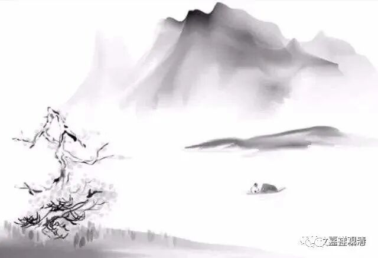

“要且无”新解

禅宗有一则公案，叫“龙牙（问）‘西来意’”：

《镇州临济慧照禅师语录》：

**“龙牙问：‘如何是祖师西来意？’**

** 师云：‘与我过禅板来。’**

** 牙便过禅板与师，师接得便打。**

** 牙云：‘打即任打，要且无祖师意。’**

** 牙后到翠微问：‘如何是祖师西来意？’**

** 微云：‘与我过蒲团来。’**

** 牙便过蒲团与翠微，翠微接得便打。**

** 牙云：‘打即任打，要且无祖师意。’”**

说龙牙禅师参访“临济义玄禅师”和“翠微无学禅师”，两度问“如何是祖师西来意”，两度被打。（这则公案有很多版本，翠微、临济次序不同，但内核基本一样。）

“祖师”，就是达摩，“西来意”，就是从印度来的目的。“祖师西来意”，问得就是禅宗的究竟宗旨。

历来对龙牙禅师最后那句话“打即任打，** 要且无**祖师意”，意思都理解为：“打你随便打，你** 要且**（终究）** 无**（没有）祖师西来意。”或者又在此上，更说临济、翠微不落言诠，而龙牙举自家风采。总之意思就是，龙牙不“肯”（认可）翠微、临济。

恐怕诸位理解有误啊！

其实通达这则公案的关键在这个“无”字上，这则公案里的“** 要且无**”，大家都理解为“终究没有”“到底没有”，其实，这样讲是不通顺的，虽然硬拗出许多葛藤，终归是强为之解。

其实，这里的“无”是一个虚词、语助词，就是“末”“么”，而不是否定。“** 要且无**”，就是“到底什么是……？”的意思。我们带进原文去解释一下看看——

……（龙牙两番被打）

龙牙说：“打你随便打，** 到底什么是**祖师西来意？（打即任打，** 要且无**祖师意。）”

这样是不是很简单地就说得通呢。

“无”“末”“么”做语气助词，在唐宋口语当中是很常见的用法。

