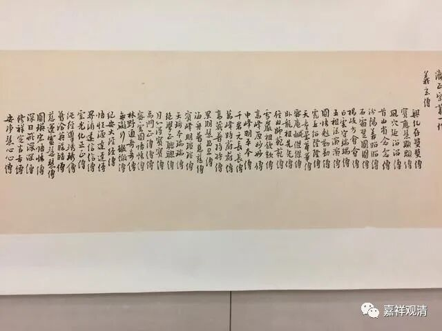

**戒牒、法卷和血脉图**

今天上课正好讲到，那就聊聊戒牒、法卷和血脉图（传承图）。

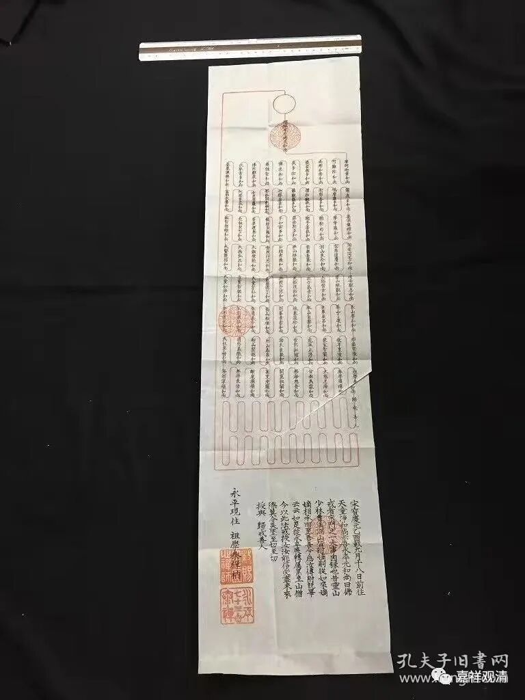

这是一份日本的“皈依戒”的“戒牒”。

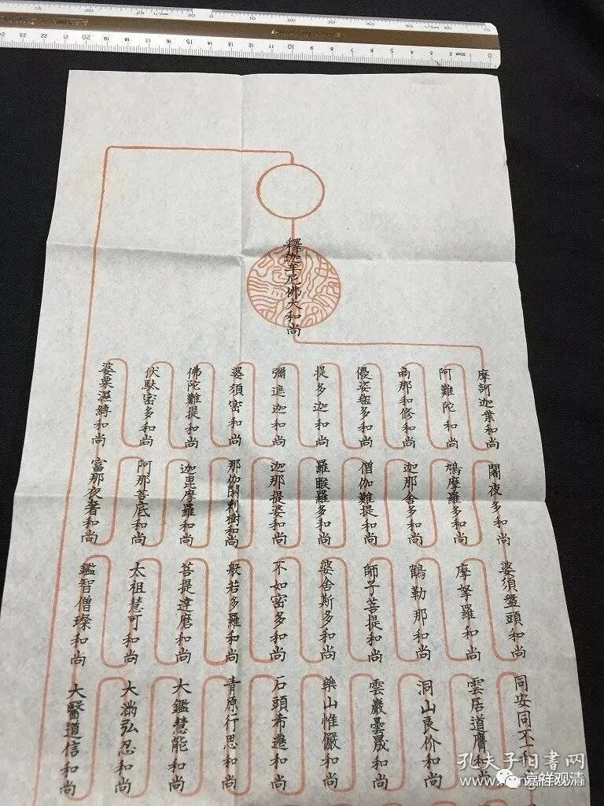

上面这段，看起来，像是禅宗的血脉图（传承祖师图）。这件“归依戒牒”是曹洞宗的。血脉传承祖师里有洞山良价禅师。

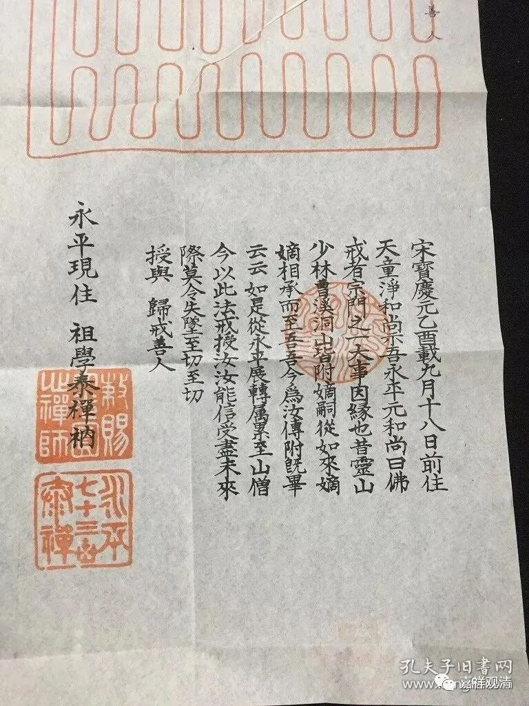

最下面这一段写的是：

“宋宝庆元乙酉载九月十八日前往天童，净和尚示吾永平元和尚曰：

佛戒者，宗门一大事因缘也。昔灵山、少林、曹溪、洞山皆嫡嗣，从如来嫡嫡相承而至吾

吾今为汝传附既毕（云云～～）

如是从永平辗转累至山僧，今以此法戒授汝，汝能信受，尽未来际莫令失坠。至切至切！

授与归戒善人。

——永平现住 祖学泰禅衲”

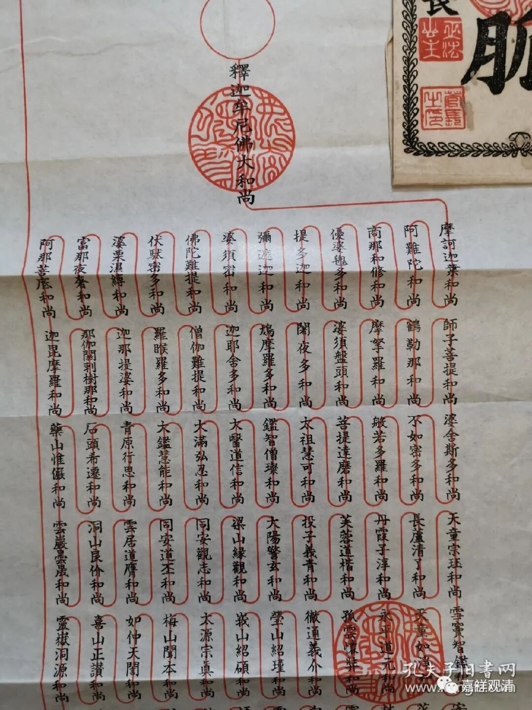

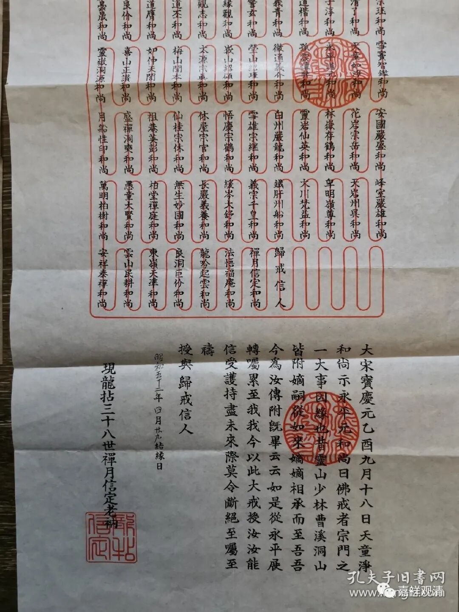

这一件类似，形制可以说完全一样，编排比上一件更紧密，也是曹洞宗的戒牒。

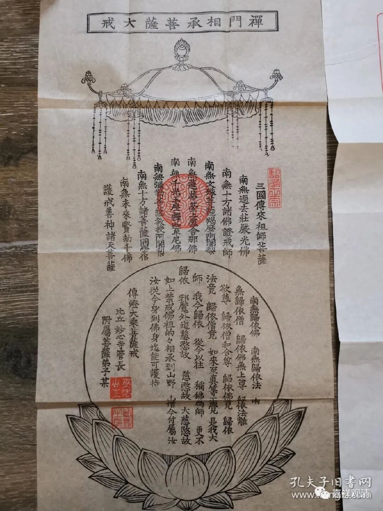

这一件是日本禅宗传下的菩萨戒的戒牒。

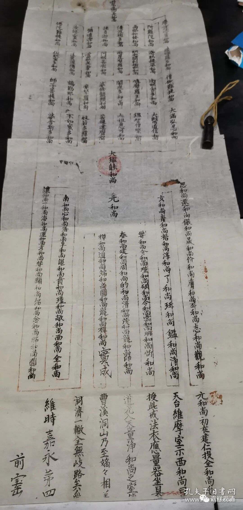

这一件也是曹洞宗的戒牒，但形制上和上两件略有不同。上面的一半是刻版印刷的，后一半是手写的。

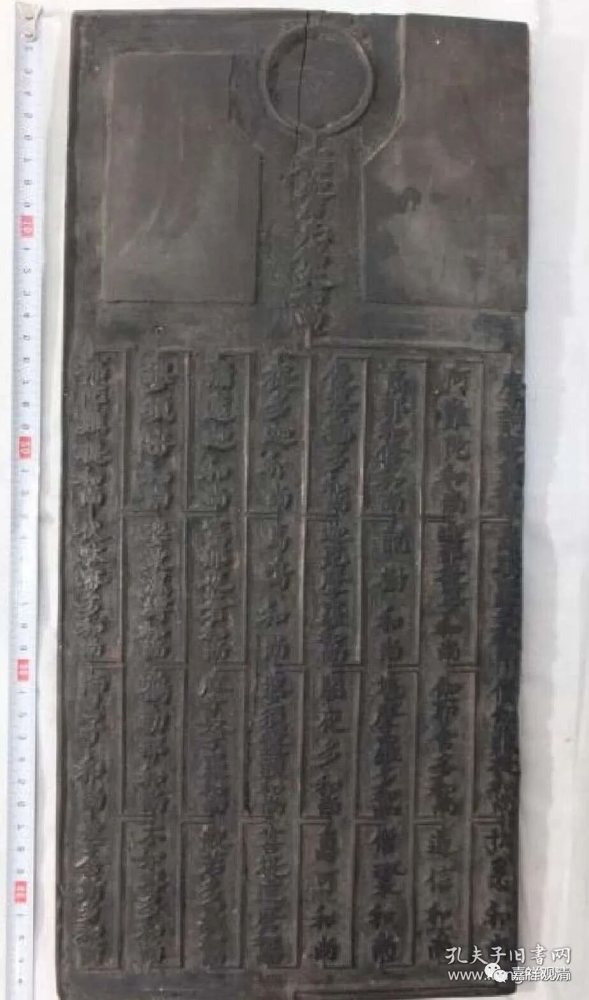

这是和上一件接近的雕版，形制基本相同。

再来看看现在汉地的禅宗法卷——

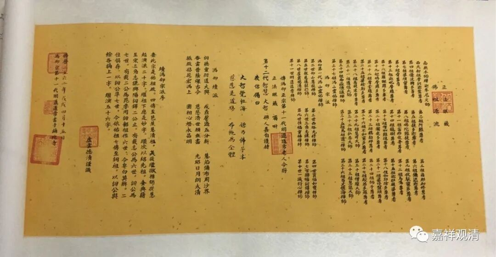

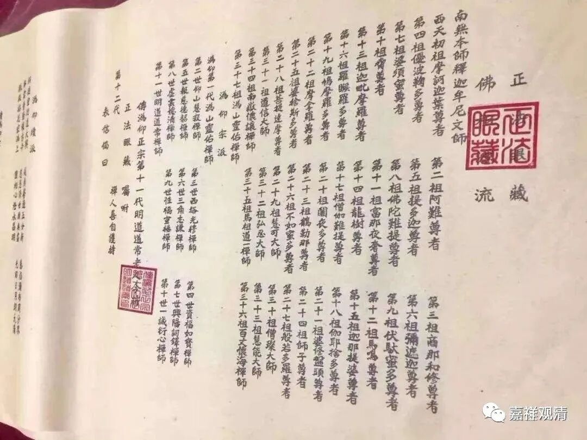

这是沩仰宗的法卷。

这是临济宗的法卷。

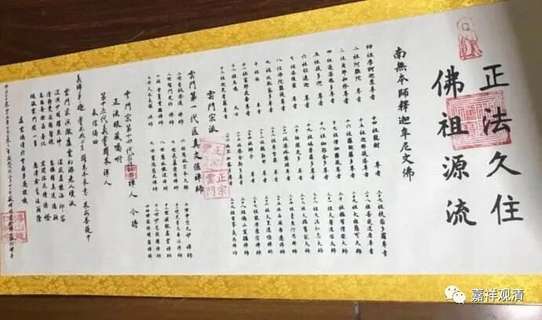

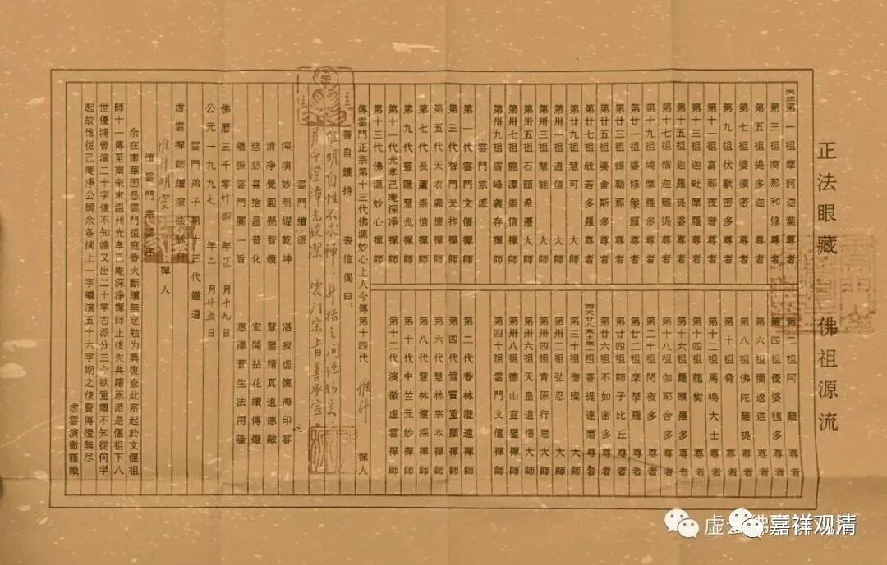

云门宗法卷。

可以看出，日本禅宗的（归依）戒牒，结合了中国的法卷的形式。

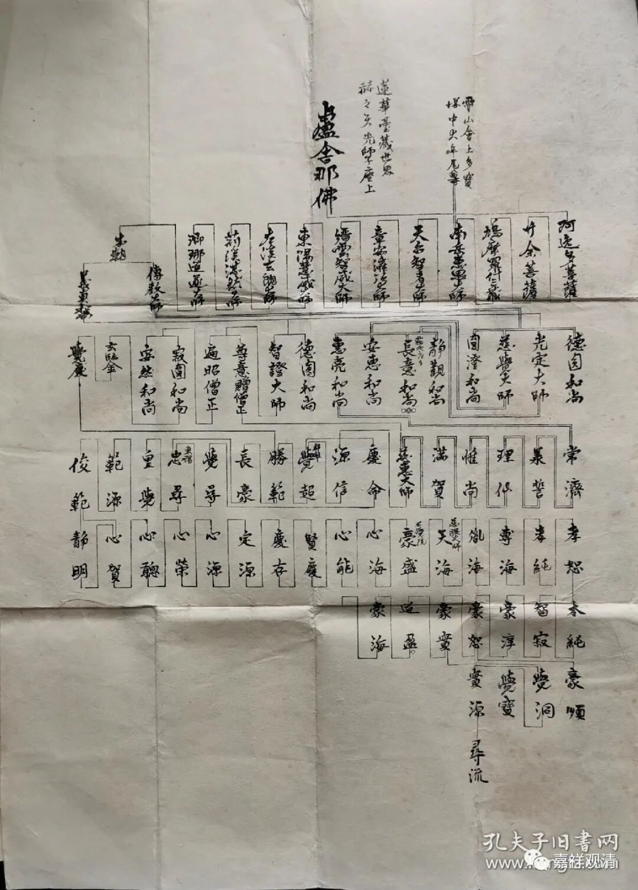

这一件日本天台宗的血脉图。

其他宗派——三论宗和真言宗的血脉图我们之前放过了，一时找不到了，下回再说吧。

今天暂时先聊到这里。下班！

