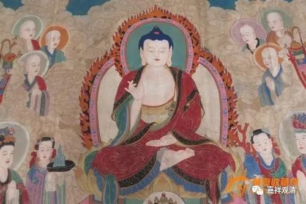

清辨释“大仙”不误

《中论·观业品》第二颂，亦即《般若灯论·观业品》第一颂：

《中论·青目释》本为：

**“大圣说二业，思与从思生，**

** 是业别相中，种种分别说。”**

《般若灯论·观业品》略异，作：

** “大仙所说业，思及思所起，**

** 于是二业中，无量差别说。”**

《青目释》之“大圣”，就是《般若灯论》的“大仙”。

在《青目释·观本际品第十一》中，青目对“大圣”做了解释——

** “大圣之所说，本际不可得，**

** 生死无有始，亦复无有终。**

** 圣人有三种：一者外道五神通；二者阿罗汉辟支佛；三者得神通大菩萨。佛于三种中最上，故言大圣……”**

这是说。本论的“大圣”，指向佛陀。

《般若灯论》也解释到：

** “释曰：云何名大仙？声闻、辟支佛、诸菩萨等亦名为‘仙’，佛于其中最尊上故，名为‘大仙’；已到一切诸波罗蜜功德善根彼岸故，名为‘大仙’。”**

也释“大仙”（大圣）为佛。

二释之差别者，《青目释》释“仙”（圣）时还算上五通的外道，《般若灯论》则未提及外道五通仙人。若就阿含及诸律，外道“五通仙人”也是经典里常见的称呼，《青目释》并无不可（不过确实译为“仙”更合适些）。

新买了本《中观——解读龙树菩萨27道题》一书，此书在《中论》17·2颂下解释说：

** “根据清辨的解释，「大圣」(Supreme Sage)所指的不只是佛陀，还包括诸声闻圣者(梵SrAvaka，由于亲闻佛陀教法而证悟的人)、辟支佛(梵pratyekabuddha)和菩萨。月称则认为「大圣」单指佛陀。……”**

这里，作者可能有误读了。清辨并没有说“大圣”（“大仙”）包括声闻、缘觉、菩萨，而只是说，“圣”（仙）包括了声闻、缘觉、菩萨，“大圣”唯独指佛。所以这里，清辨和月称的解释并无差异。

