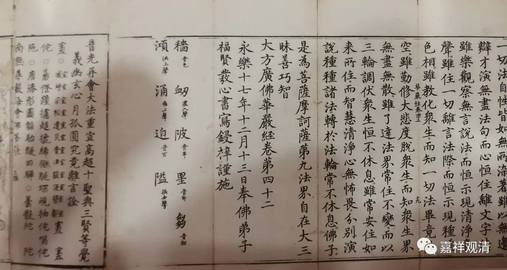
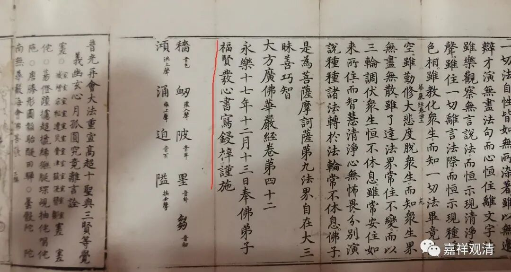
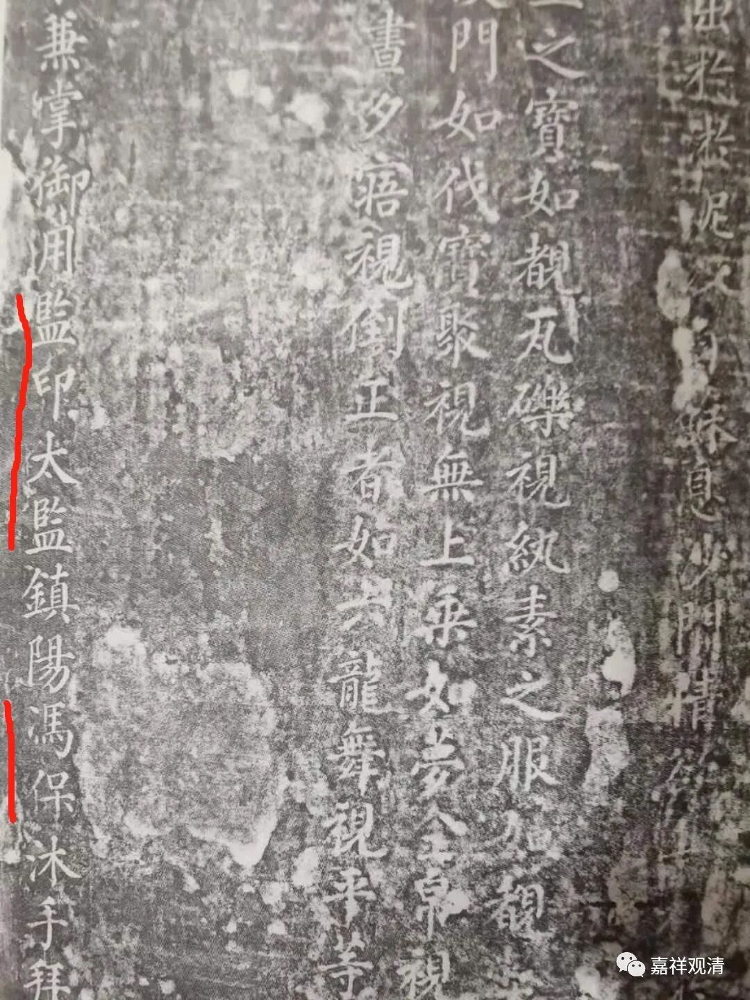

**福贤，苏州僧人or大内太监**

佛教古籍拍卖市场上，经常会见有题为“福贤”书写的《华严经》。

比如这一件：

“永乐十九年十二月十三日奉佛弟子福贤发心书写锓梓谨施”

福贤，《中国古籍版刻辞典》说他是“明永乐间苏州僧，永乐十七年（1419书写刻印过唐释实叉难陀译《大方广佛华严经》80卷……”

有人质疑福贤为“苏州僧”的身份，认为没有进一步资料可以判定他就是苏州僧人。我认为这个质疑是成立的。

而且，我还认为，“福贤”大概率不是一个“苏州僧”，而是一位工书法的太监。

首先，自称“奉佛弟子福贤”，若是僧人，一般会更精确地说“比丘福贤”，“奉佛弟子”完全是一个统称，所以，“福贤”应该并非僧人。

第二，“福贤”这个名字，一望而知就知道是法名，而且，这个词不太像汉地的法名，而很可能是藏文译名——索南桑波。བསོད་ནམས་བཟང་པ，索南桑波，汉译“福贤”。

第三，永乐时期，著名的三宝太监郑和，法名叫“福吉祥”，这也不像是汉地一般的法名，而可能是藏文བསོད་ནམས་བཀྲ་ཤིས，“索南扎西”的汉译，索南扎西，就是福吉祥。

第四，明代工于书法的太监可能有书写佛经的“传统”，如明万历朝司礼监掌印太监冯保（冯保和张居正为万历朝之“表里”）书写《佛说四十二章经》勒石刻碑存于房山上方山都率寺——

所以，我推测，“福贤”和郑和一样，是永乐朝的太监，工于书法，书写了《八十华严》，刻经祈福。