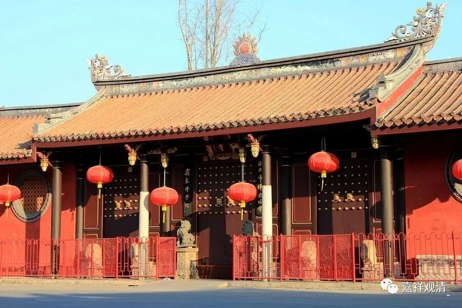
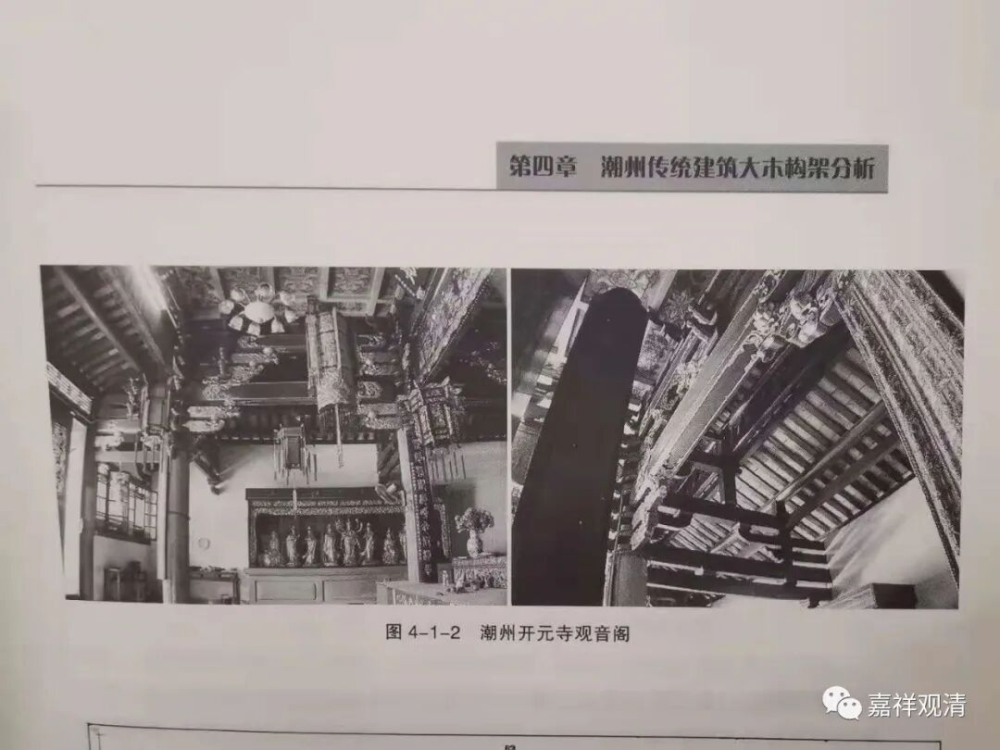
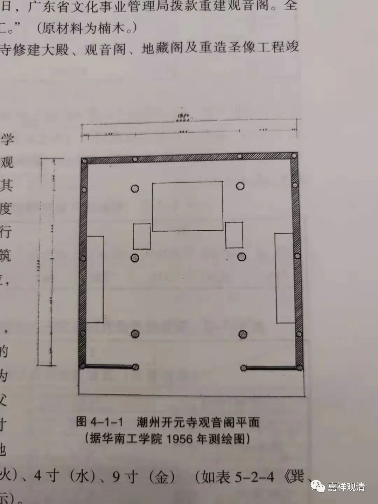
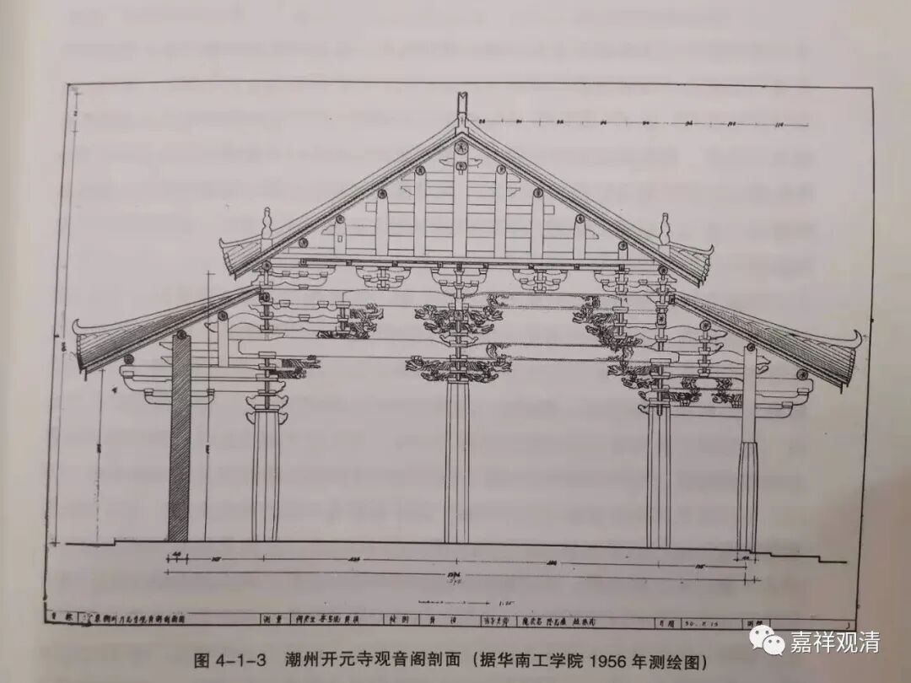
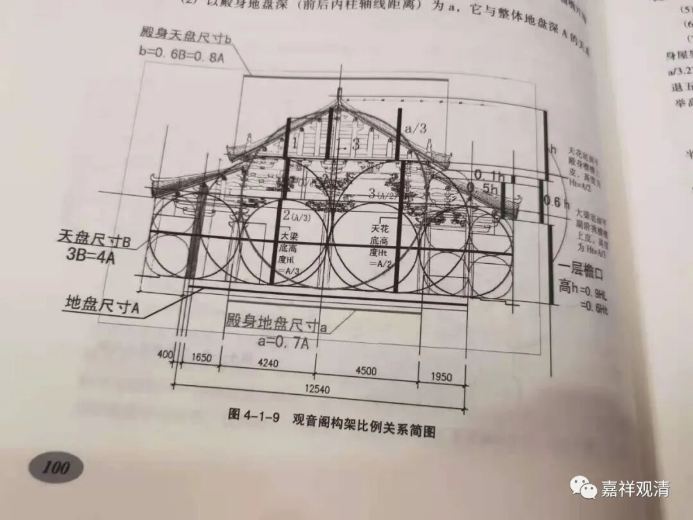
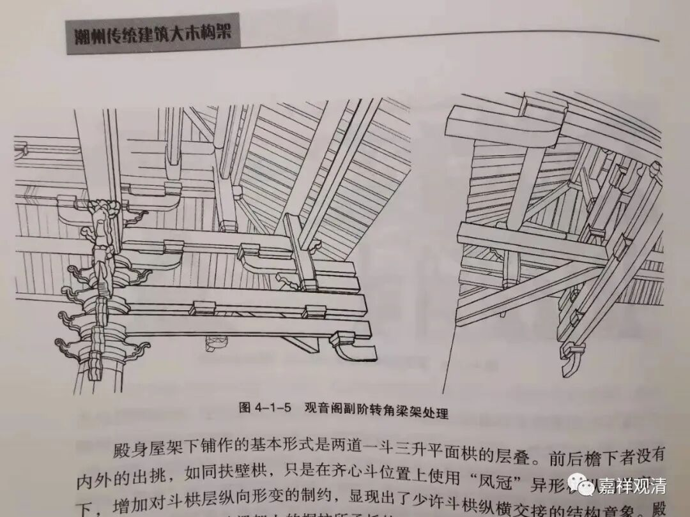
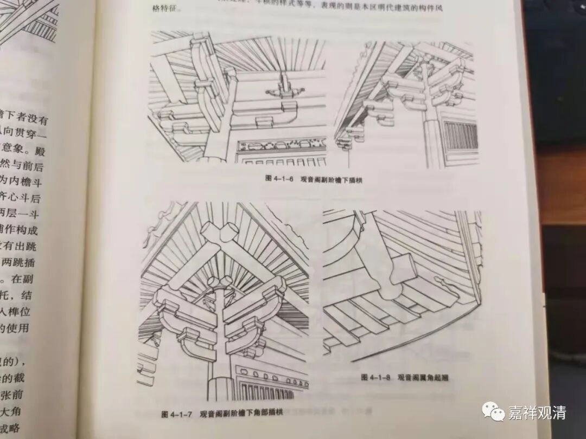

**潮州开元寺观音阁**

这两天在潮州开元寺讲课。

开元寺公众号招标通告

开元寺的观音阁要大修了，正在找专业的装修队（下午正巧碰到有人来寺院应征）。

据《潮州市佛教志·潮州开元寺志》所记载，潮州开元寺之观音阁建于唐开元二十六年（公元738年），至宋康定元年（公元040年）重修，至庆历三年（公元1043年）竣工，明弘治年间（公元1488～1505年）、万历十九年（公元1591年）又经两次大修，清康熙五十四年（公元1715年）和光绪元年（公元1875年）更复修茸，建国后之1957、1982年又经两次修竣，明年如果开始这个修竣工程的话，将是建国后的第三次修缮了。

据《潮州传统建筑——大木构架》一书研究，潮州开元寺观音阁现存的构建反映了明代的大木作建筑特色，保留了很多建筑古法和古老的制度，符合“鲁班尺法”、“压白尺法”，反映了本地工匠的技术传承和工艺水准，潮州开元寺观音阁是一件潮州传统建筑大木构架的实例，放映了他的区域性和时代性。

这次修缮潮州开元寺观音阁，将会是潮州开元寺历史上的一次“重要事件”了，也会和前几次一样“走入史册”，衷心希望能完美地（时间不是问题，日本寺院的大修常常要花十几年几十年）完成此次大修，也祝圣教久住娑婆，施主资财增盛！

