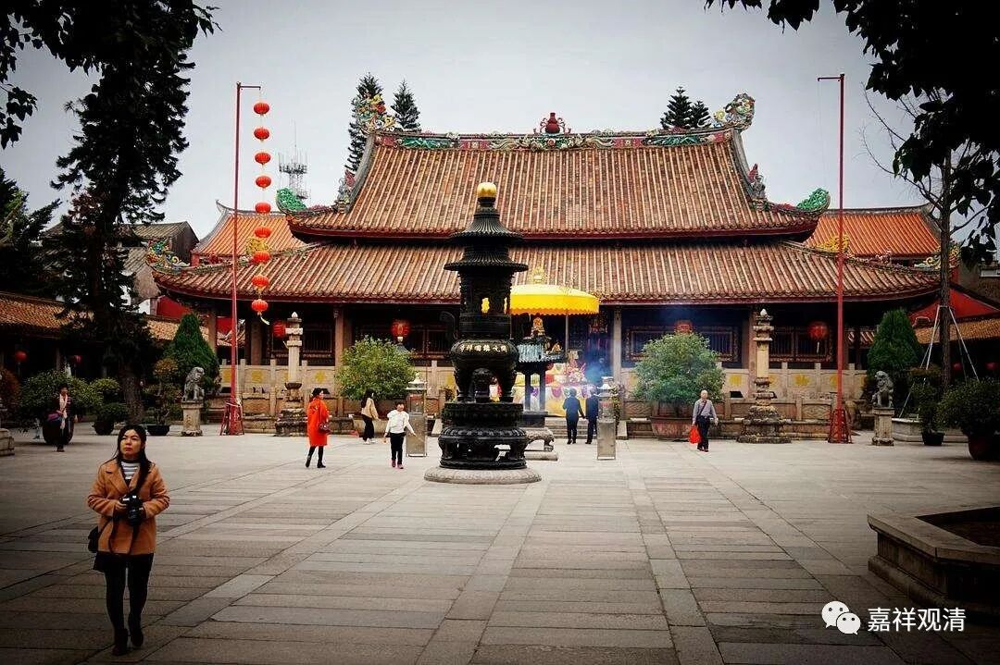
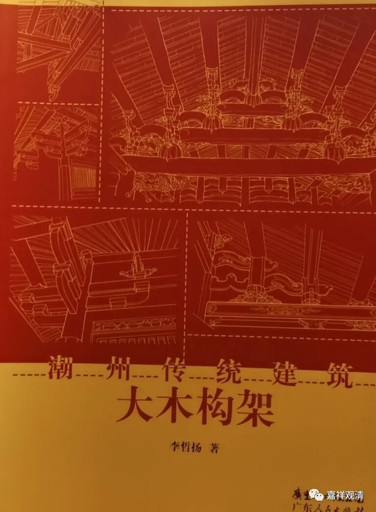
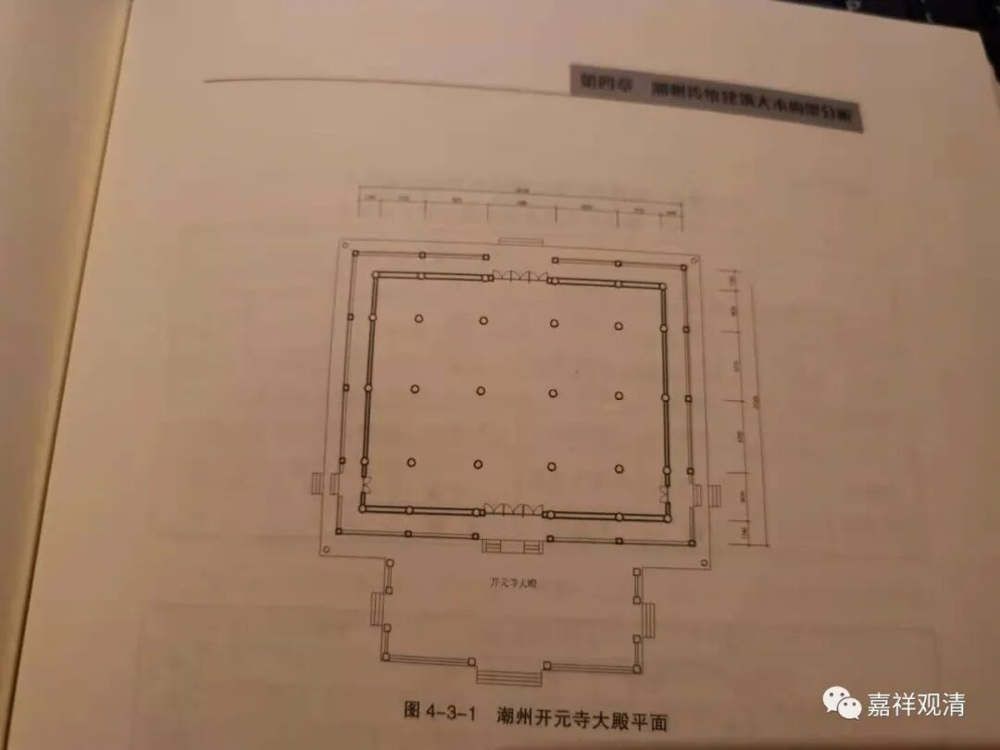
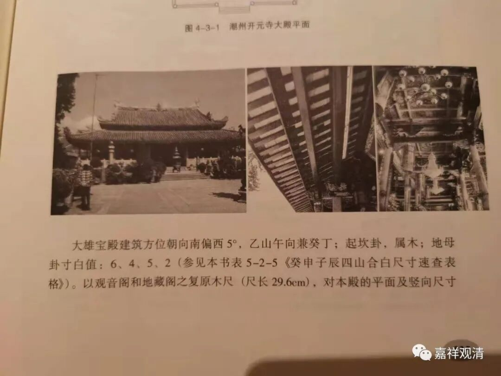

**潮州开元寺大雄宝殿大修**

前两天还在潮州开元寺讲课呢，今天已经在帝都准备拍佛经了。

前两天提到开元寺的观音阁要大修，后来发现寺院更新了通告，连大雄宝殿也要加固维修了——据说地震时受到不小的影响，有些地方已经脱隼、开裂了。

据《潮州市佛教志·潮州开元寺志》记载，潮州开元寺大雄宝殿建于唐开元二十六年（公元738年），至宋康定元年（公元040年）重修，明弘治、万历年间又经两次大修，清顺治、康熙、雍正、乾隆、咸丰、光绪再再修缮，民国时亦有翻修，建国后又数有修建，明年的加固工程，又是一个新的工程，工期好像约定十个月。

据《潮州传统建筑——大木构架》一书研究，潮州开元寺大雄宝殿现存的构件主要反映了明清的大木作建筑特色，，和观音阁的形式颇为一致甚至部分完全相同，只是更大，在“鲁班尺法”、“压白尺法”上，更接近后者。

这次翻修、加固潮州开元寺大雄宝殿也会是潮州开元寺历史上的一次“重要事件”了。

祝圣教久住娑婆，施主资财增盛！

祝寺院人才辈出，声望日隆！

