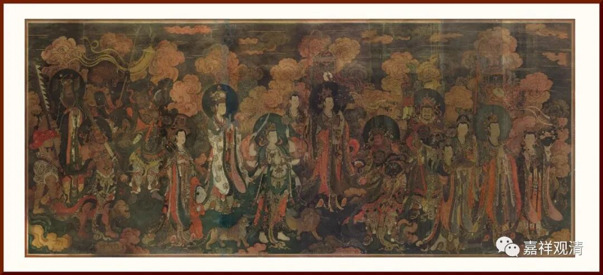

**微课堂佛教史134·1**

好，我们今天继续佛教史，还是来谈谈《集古今佛道论衡》里面的几次辩论。我们前面已经讲过两个事情，一个是玄装法师翻译《道德经》的事情，一个是慧立法师辩论的事情。

今天再讲慧立法师辩论的一个事情，应该是在唐高宗李治时期。有一天皇帝又要看大家辩论了，就让道士和和尚各七个人（上次也是七个人）进来辩论，道士在西边，和尚在东边。

皇帝先发话（先开个场子）：“** ‘佛道二教同归一善’**，对吧？就这一点大家可以互相研讨一下，** ‘可共谈名理’**，大家互相启发启发。”

于是慧立法师就站起来说了一段前文，把皇帝也捧了一下。

然后皇帝就说：“不错不错。这样吧，你们谁先** ‘上座开题’**？”

这个时候，一位清都观的道士张惠元就说话了：“周朝的时候明示天下，同宗的（和周朝的王同姓的）为尊，** ‘异姓为后’**。** ‘陛下宗承柱下，今日竖义，道士不得不先。’**”他说什么呢？就是我们的皇帝是李耳的后人，而我们是跟皇上或者说皇上跟李耳是一家的。所以我们辩论的时候应该分一下主客有不同，** “夷夏不同客主位别”**，应该分一下主客，我们是主，我们就在前面先说。

唐高宗李治沉默不语，看到李治不发话呢，慧立法师就知道有话可以说了。他就说：“你讲的这个没有道理啊！如果你说现在的国家是李姓王朝的，那么整个三千大千世界都是佛的，甚至在我们这个娑婆世界还没产生之前，佛主已经出来教化了，你说到底谁是主呢？到底谁先呢？”

他这个说法就是要把对方的观点破掉——能叫破吗？也可以叫破吧。道士不是讲我们家皇上是姓李的嘛？那么慧立法师就把皇上捧得更高一点。你说姓李的，那我捧得更高——我们皇上是** “屈初地之尊”**降诞。什么意思呢？我们的皇上是初地菩萨！

慧立法师为什么会这么说呢？是因为佛教里面讲，初地菩萨经常是表现为转轮圣王的样子，所以他说：我们皇上是初地菩萨降下来的，就是把皇上又往上推高了一点。你说皇帝是先人的后代，我们现在说皇上是初地菩萨降生。我把皇上捧得更高，只是皇上不说罢了。我们的皇上不分党类，没有亲疏，哪像你说的有亲有疏——亲的在前面，疏的在外面？如果你真要分亲疏的话，那到底是谁亲呢？到底是我们的初地菩萨应该向着我们呢，还是你们李耳的后人应该向着你们呢？

皇上听着彩虹那啥，自然很高兴，也就不多向着道士说话了，就说：“好，还是让和尚先来吧。”

