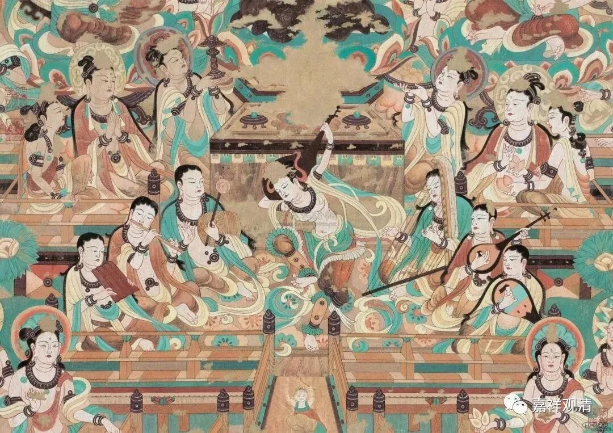

**“学问之体，要须依师承习”**

嘉祥吉藏在他的《大乘玄论》中谈到佛性的十一家说法时，提到了一个原则：“** 学问之体，要须依师承习**”——学习的核心内容，要有师承，否则即使立义不错，也算有所欠缺。

《大乘玄论》卷三：

** “得佛理為佛性者，此是零根僧正所用。此义最长，然阙无师资相传。学问之体，要须依师承习。今问，以得佛理为正因佛性者，何经所明？承习是谁？其师既以心为正因佛性，而弟子以得佛理为正因佛性者，岂非背师自作推画耶？故不可用也。”**

嘉祥吉藏说：零根僧正的“得佛理为正因佛性”之说，在前述的十一种说法里，立义最善，但师资无凭——零根僧正的师父是其上的第三家，以心为正因佛性的，所以这一对师徒之间，立义有异。吉藏认为，零根僧正的这种新说是“背师自作推画”，固然最佳，但因为缺乏师资依凭，仍然不得推崇。

零根僧正，不知为谁，僧正为其僧官的职务，是国家高层僧官了。吉藏说其师立心为正因佛性。即《大乘玄论》卷三：

** “第三师以心为正因佛性。故经云‘凡有心者，必定当得无上菩提。’以心识异乎木石无情之物，研习必得成佛，故知心是正因佛性也。”**

又，零根僧正，若据《四论玄义》，则作“灵根令正”，“零根僧正”“靈根令正”字形相近，不知何者为是。

据《大乘四论玄义记》，** “得佛之理為佛性，是望法師義也”**，而“** 第二灵根令正，执望师义，云‘一切众生本有得佛之理为正因体’，即是因中得佛之理理常也。**”则灵根令正的“得佛之理為佛性”袭自望法师，也不算是没有师承依傍。

据《四论玄义》，以“心为正因佛性”者为梁武帝，亦与《大乘玄论》所述不同。

且不论“佛性”之体为何，吉藏在立义上重视师承这点，《大乘玄论》里是表达得很明显了。

