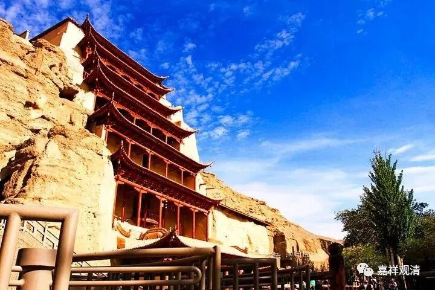

微课堂佛教史135·1

刚才手机在充电，现在我们继续佛教史。

前面我们补充了一点《集古今佛道论衡》里面的内容，就不再继续补充了。大家如果有兴趣的话呢，我们可以再专门聊聊《集古今佛道论衡》。

现在我们继续聊唯识系统。

在玄奘法师门下呢，窥基法师和圆测法师是作为两大传承的支柱。圆测法师下面的那些弟子呢，也是以新罗人为主。后来也出现了我们聊到过的太贤法师，他著有《成唯识论学记》，是属于圆测法师这一系的孙辈。关于这一支的情况呢，能够都知道的就不是很多了。

我们再看窥基法师——基大师的弟子，上次我们介绍过了慧沼法师。在慧沼法师的弟子当中，比较有名的是智周法师——智慧的智，周全的周。那么在《宋高僧传》当中是没有这个人的记载，没把智周法师写进去。而我们现在谈到智周法师是根据其他的一些资料，比如敦煌的一些资料来整理的。

我们知道在敦煌有几个人物是比较重要的，其中之一是昙旷法师，他著有《大乘二十二问》这部作品。其实在敦煌有很多唯识派的内容，可以推断后来在敦煌应该有唯识系的大师在那里讲学。敦煌好像确实没什么中观派的人在那边讲经、传法，天台华严也没有。可能汉地中观、天台的地域性还是太强了。

对了，以前说到过的《吐蕃僧诤记》里面说，北宗的摩诃衍法师和印度的莲花戒大师在拉萨进行辩论。那么这件事情呢，现在又有人质疑这两位大师“有没有直接见到”，但是历史上有这个传说，所以看来还是见到的。

摩诃衍法师（又称“大乘和尚”）呢，可以说有唯识系统的背景，所以有些人就把这一次辩论称为“中观和唯识的辩论”。因为禅宗的这一系，早期被称为“楞伽师资”，是和《楞伽经》有点关系，或者说和唯识这一系有点关系。当然，对《楞伽经》到底应该怎么判，后面有不同的说法（有人认为属于唯识系经典，有人以为属于如来藏系典籍），这个我们就不展开讨论了。

