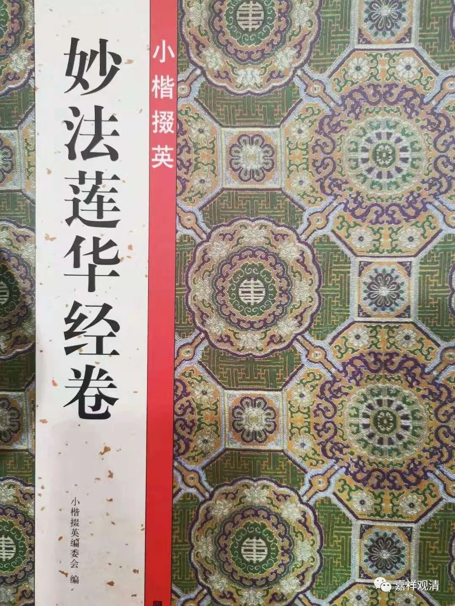
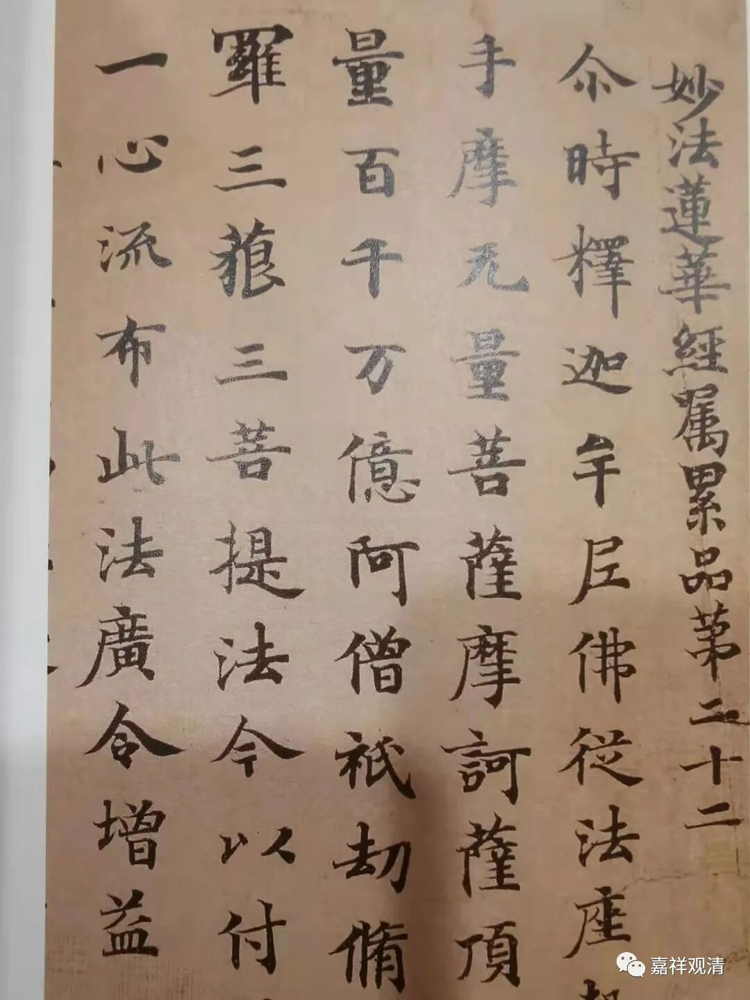
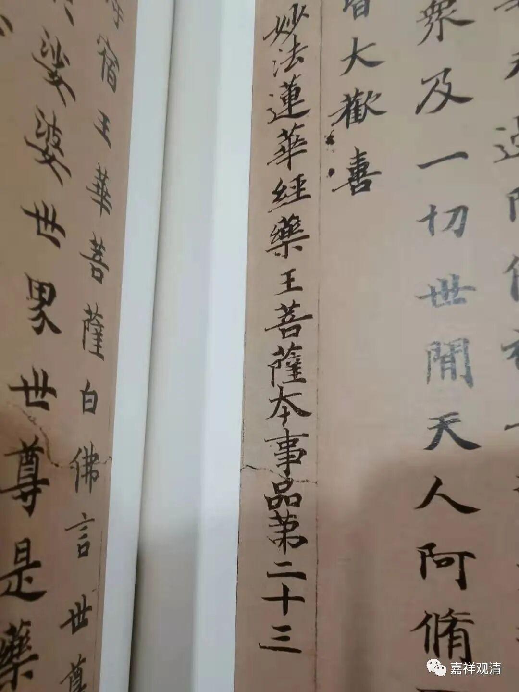
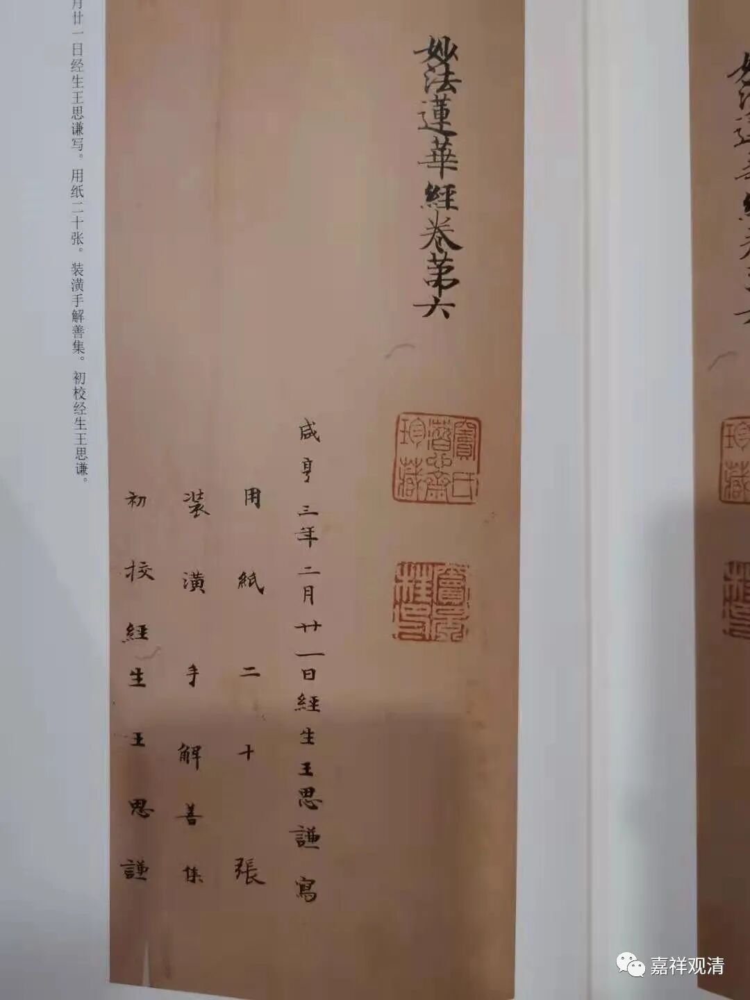
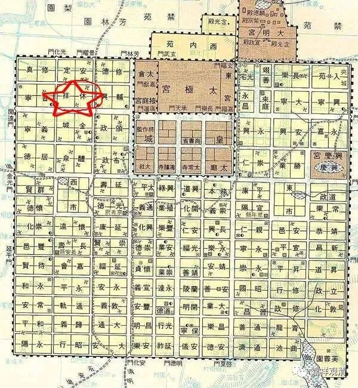
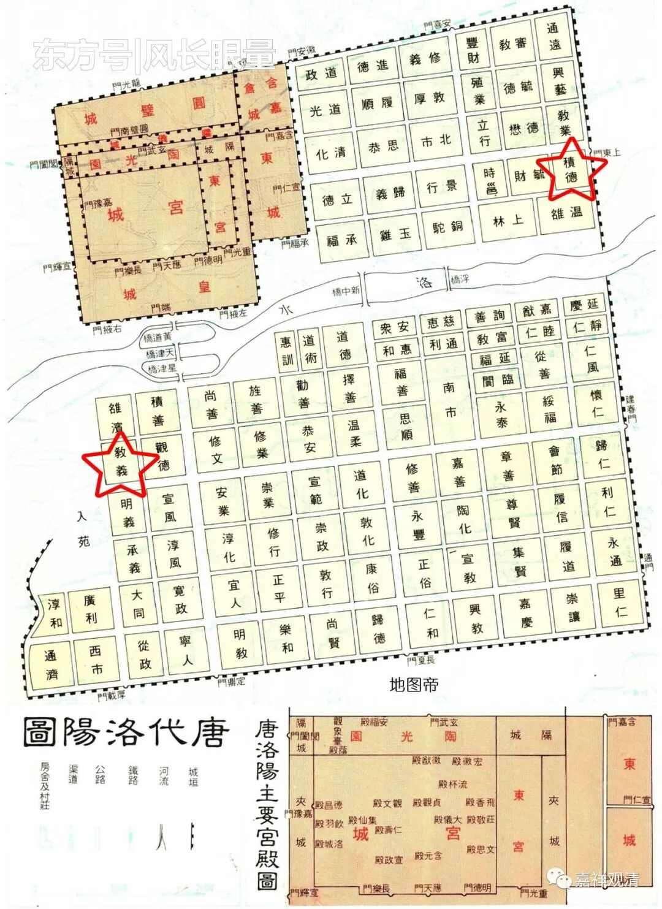

新发现的敦煌唯识史料

——甘肃敦煌博物馆藏抄本《妙法莲华经》卷六题记

新买了本字帖。

别人把他拿来当字帖用的，我是当资料用的。

《妙法莲华经卷》，实际是《妙法莲华经》的一个唐代初年的抄本……我看佛教之外很多人有一个习惯，就是会把“《某某经》卷第几”，读为“《某某经卷》第几”。这个敦煌抄本最后是“妙法莲华经卷第六”，所以就又被读作《妙法莲华经卷》了吧。

本件敦煌写经出现了至少三位唯识宗的重要人物——玄奘门下的三位弟子：嘉尚、慧立、道成。

先说嘉尚法师。

本件抄写完，嘉尚法师作为“详阅大德”出现，就是在校对以后，再“详细阅读”了一下，也就是做了一个后期校对工作。此件称他为“太原寺大德”，就是说，在抄写此经的咸亨三年（公元672年）二月二十一日，嘉尚的僧籍在长安太原寺。

据《唐五代佛寺辑考》，太原寺在长安休祥坊，唐高宗咸亨元年（公元670年），以武则天旧宅为太原寺，垂拱三年（公元687年）改为魏国寺，载初元年（公元689年）又改为崇福寺。

《阿毘達磨大毘婆沙論》卷第一的题记中，作为笔受的嘉尚出现了两次，分别是“弘法寺沙門嘉尚”和“西明寺沙門嘉尚”，鉴于《阿毘達磨大毘婆沙論》篇幅有两百卷之巨，可以认为，嘉尚最初做笔受时隶属于弘法寺，后来则系籍西明寺。

据这卷抄经的题记，则嘉尚后来僧籍在长安太原寺。由于太原寺是武后舍宅为寺，所以还是当时西京长安城比较重要的寺院了，后来又在东都洛阳也建了“太原寺”，而嘉尚都入住，参与了地婆诃罗在这两处的译场。

洛阳太原寺，最初也是武家旧宅所改建。《唐五代佛寺辑考》说最初在洛阳的教义坊，是武则天母亲的宅子，改建为太原寺，后迁于积德坊。

**图中，左下教义坊，右上积德坊**

此前关于唯识宗的著作里好像都没注意到这一件敦煌写经，而据此件之题记，似可以补唯识史传之不足。

清案：

我这里说“新发现”，其实也可能已经有人发现了，而我没读到。大家如果有人看到别人说过的话，可以告诉我。谢谢！

