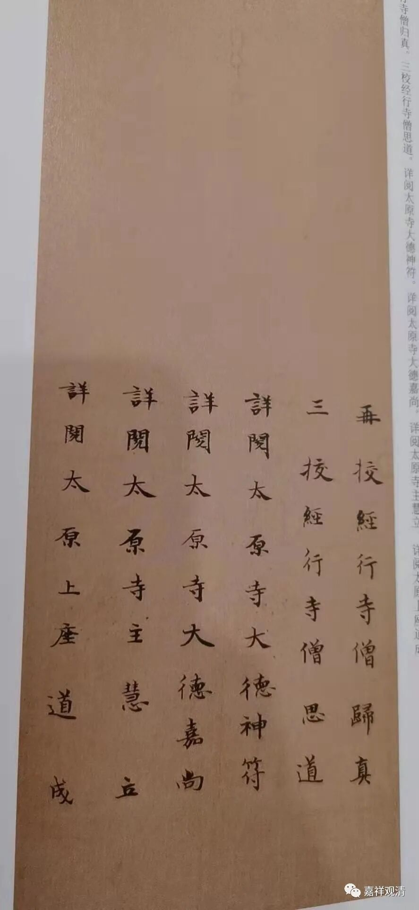

李唐武周时期东西“太原寺”更名录

前说唐代，唐高宗李治、武后在两京（长安、洛阳）各以武氏旧宅为“太原寺”。据《宋高僧传·日照传》，此二寺又称“西太原寺”（长安）和“东太原寺”（洛阳）。

《日照传》注说：

**“西太原寺后改西崇福寺，东太原寺后改大福先寺。”**

按：西太原寺改称崇福寺在载初元年（公元689年），此前垂拱三年（公元687年）则改称魏国寺——此魏国寺又称“西魏国寺”或“魏国西寺”。

《宋高僧传·魏国东寺天智传》说“** 勅令**（提云般若天智）** 就魏国东寺(**后改大周东寺)** 翻译**”，此“魏国东寺”，当即“东太原寺”，若此推测不误，则东太原寺，先改为东魏国寺（魏国东寺），复该称“大周东寺”，再改为“大福先寺”。

日照与天智都曾在洛阳翻译，日照译场在东太原寺，天智译场在东魏国寺，而长安的太原寺又叫魏国寺、魏国西寺、西魏国寺，则洛阳的东太原寺或即东魏国寺（魏国东寺）。

又，敦煌本《进新译大方广佛华严经表》，有“翻经大德大周西寺僧法藏审覆”，则，洛阳有“大周东寺”，长安复有“大周西寺”。

或者，武氏掌权时期，两京各有东西“太原寺”、“魏国寺”、“大周寺”，同时更名。可能后来由于称名不便，最终，“西太原寺后改西崇福寺，东太原寺后改大福先寺”，同时期，洛阳未见有崇福寺，长安未见有大福先寺。

