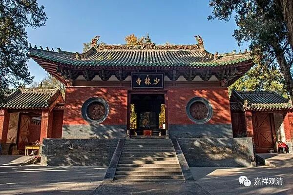

**微课堂佛教史141·1**

说实话，换了中国人也是一样的，因为是存在文化差异。中国人到了印度一看：“寺院有这样建的吗？”据冯友兰先生讲，他们到了印度看见印度的石窟，他们的感觉也是：“啊？还可以这样吗？”我去过印度，但是他说的那个地方我没去过。冯友兰先生说什么呢？说印度石窟，是把整个山都给凿空了，凿成了寺院，你的床也好，你吃饭的地方也好，包括寺院的宗教活动场所也好，全都是把山给凿空了，凿成的寺院。

我们看，中国佛教的传播路线上有什么？都有石窟，是吧？新疆，克孜尔石窟，再是敦煌石窟，然后是麦积山石窟……全国各地都有石窟：大足石窟、龙门石窟、云岗石窟，南京也有石窟……这些石窟实际上就是最早所保存的印度的建筑风格——就是把山给凿空了，凿成一个建筑，我们和尚住进去。

比如说在敦煌还有禅窟，就是专门打坐用的，它里面不是画壁画的。我们现认为有壁画的地方是一个文物保护单位，其实不是啊，当年这就是寺院。比如说洛阳的龙门石窟也是寺院，它外面是有一半建筑的。还有四川的乐山大佛，如果把它恢复的话，外面也是有建筑的，有梁、有架、有顶，也有岩窟的。你们去看龙门石窟、云冈石窟，那些佛像边上的墙上都有一个一个的洞，这些洞是什么呢？有些是用来做栈道的，有些是把横梁插在里面的，可以再往上加屋顶的，加上前面的柱子，可以建成寺院的大殿。

中国人去看印度人造庙，就觉得：“哇！还有这样造的吗？居然花几百年的时间去凿一个寺院！”而印度人看中国的是什么呢？“哇！还有这样造的吗？光是用石头和木头居然能够建造这么高广的寺院，很难想象啊！”这就是双方文化方面的差异，是吧？

后来菩提达摩祖师就去了嵩山少林寺。

如果你要问全世界最有名的寺院是哪一座？你不要跟我讲拉萨的布达拉宫，也不要跟我讲什么印度的那烂陀寺，都不可能啊！全世界最有名的寺院绝对是少林寺，而且甩开第二名不知道有多远……

我以前去藏地的时候，如果穿着汉装去那里绕寺院，小朋友们就会在旁边围着我转，然后嘴巴里不停地说：“少林寺，少林寺。”我在那里一出现，两个小和尚就开始在我面前“虎虎生风”地练拳了——当然是他们自己发明的拳，“嘿，嘿嘿”地就开始打起来了。

包括我们在世间上走动也是一样，人家一开口就是问：“你是少林寺的吗？”好像全世界的寺院就剩下一个少林寺了。一开始我还怼他们：“难道是个和尚，都是少林寺的吗？”后来我发现人家其实不是这个意思，这种问法仅仅运用了我们汉语中“赋比兴”手法中的一个“兴”。他想要跟你说话，但是他也不知道你是哪个寺院的，于是就问你：“哎，你是少林寺的吗？”

从这个角度也可以看到，真的是，全世界你啥寺院都不知道，都不可能不知道少林寺——也不能说不可能吧，就是说全世界的寺院当中，名气最大的绝对是少林寺。

