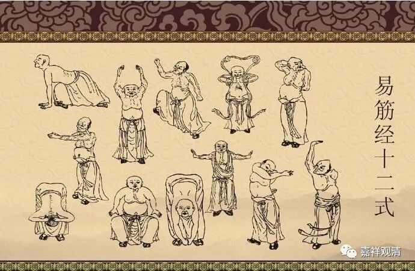
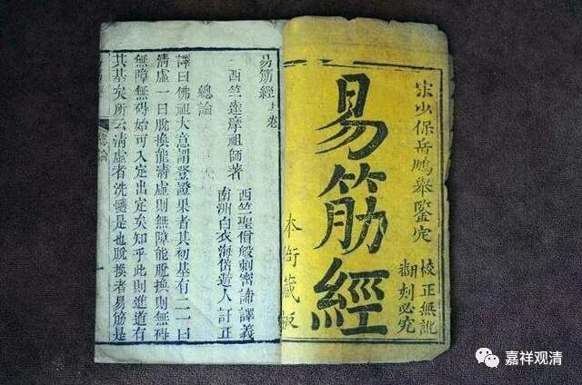
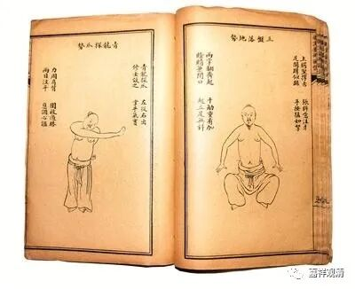
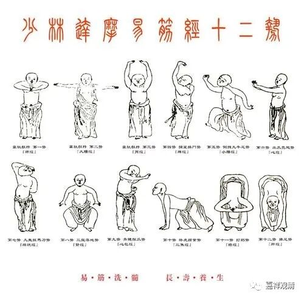
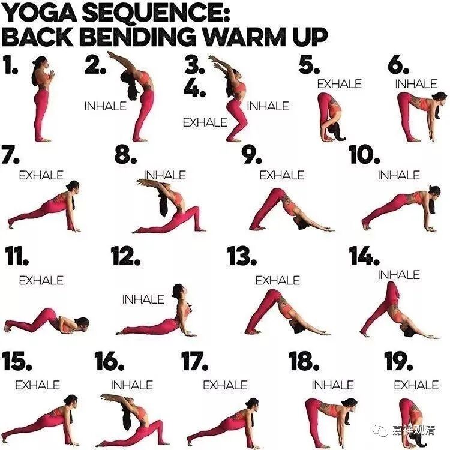

**《微课佛教史》141·2**

少林寺和武侠小说也有关，是吧？反正我们大家都知道武侠小说里面的“达摩易筋经”吧，我还练过呢，你们谁要练的话，可以来找我练，我是正宗传人啊！还说这个“达摩易筋经”是达摩祖师带过来的——武学宗师！

其实和达摩祖师有关系吗？有些人觉得没关系，但是我觉得可能有点关系，并不是因为我自己是个和尚或者因为我学过“易筋经”。不过，我学过“易筋经”，而且又有朋友是专门研究瑜伽的——你们知道王老师是专门研究瑜伽的，然后我就发现了：哎！这个“达摩易筋经”和瑜伽的“向太阳致敬式”（向太阳敬礼）非常相像。你们看“达摩易筋经”的图谱，真的很相像，只是传到后来，一方面变形越来越多，大家就开始各自地发展了，另一方面就是练法不同了，从印度的练法到中国的练法开始稍微有点不同，就有新的内容出来，这个也很正常。

那么，“达摩易筋经”到底是不是达摩传下来的呢？我个人觉得很有可能跟他有点关系。他是一个源头，他带来的不就是今天的“达摩易筋经”，而且今天的“达摩易筋经”已经发展出非常多的流派，某些流派有可能是和道教有关的。但是从源头来说，我觉得“易筋经”这种练法应该很有可能和达摩祖师有点关系，因为太接近于印度瑜伽的向太阳致敬式。

有些人认为易筋经来源于道教，某道观还专门开过研讨会来披露……实际呢，最多可以说是某一系“易筋经”和道教有点关系，或者说某些道士参与了现存某个版本易筋经的定型，从源头来说，还是可能有印度瑜伽术的背景。

这只是我自己的看法，可以当作是一种“学术争鸣”吧。当然，我不是专门研究瑜伽的，也不是专门研究“易筋经”的。不过我觉得对于“易筋经”这一块而言，我算是个小内行了，我还学过三个版本的“易筋经”，你们如果想要学的话，我可以教。

一般易筋经是十二式，但由于“韦陀献杵”第一式有两种练法，所以我们的版本是“易筋经十三式”……

因为金庸武侠，易筋经都快家喻户晓了，但实际练得人很少，我们自己实践下来，练习易筋经确实有很大好处，而且也不像“少林内功”那样刚猛。

