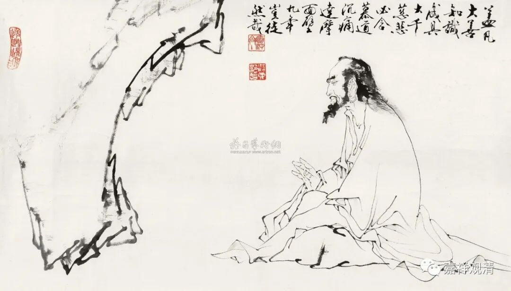
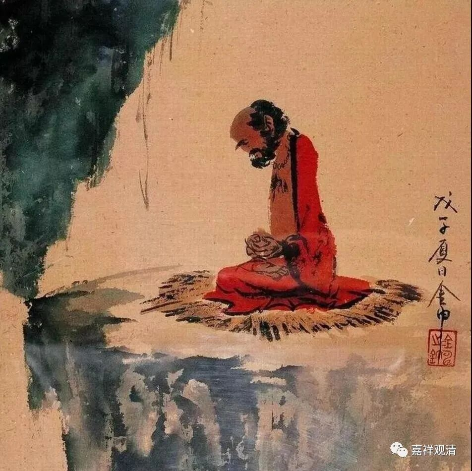
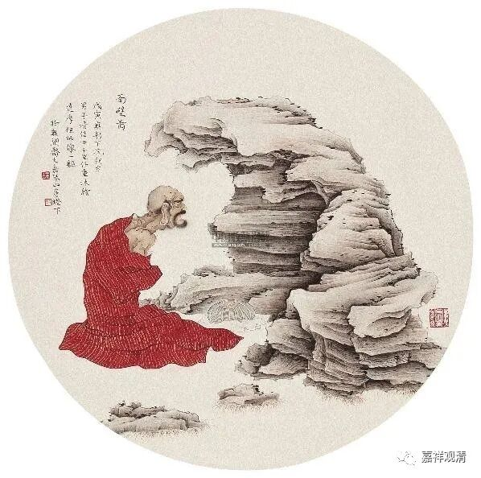
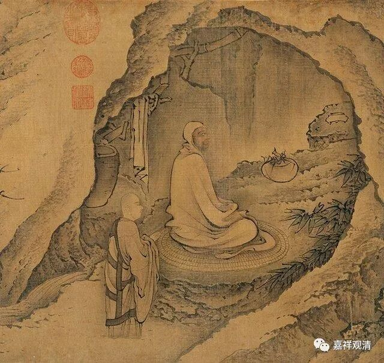

我们继续说达摩大师，他来到了嵩山，就在山洞里面住了下来。我们前面讲过，这才是印度人的本份，是吧？住禅窟。所以他一看有个洞，就在里面打坐，这是人家的习惯。这在当时被称为什么呢？闭关婆罗门。

据吕澂先生讲——我觉得这个可能性是有的，“闭关婆罗门”实际上是在修什么呢？是在修“地遍处”——土地的“地”，普遍的“遍”，处所的“处”。他的禅修功夫很好，在修“地遍处”。今天在南天竺或者天竺以南（兰卡），这个地遍处还是禅修入门的一个修法。

在达摩祖师来到中国以前，止观禅修在中国已经进行传播了，而且已经存在和达摩大师平行的其他禅修的方法或者禅修的流派——我们指的是佛教的禅修流派。当时在中国小乘的和大乘的禅修流派都有，包括鸠摩罗什法师也传过一些相关的禅法。我们称之为禅法，因为那个时候还没有形成宗派。

那么，达摩大师的这个禅法，在今天来说属于什么呢？属于大乘的禅法。少林寺的传禅，也不是从达摩祖师开始的，不是从菩提达摩开始的。在此之前有个人叫“佛陀”——这个人不是佛哦，是他的名字叫佛陀跋陀罗，就是觉贤，他已经在少林寺教学禅法。

菩提达摩在南北朝的北朝时期到了少林寺，然后在山洞里面开始打坐……

我们可以想像一下：这就类似于你在若干年前突然到了法国，没地方去，就找个地方待下来，然后就每天早上在那里练练太极拳。时间长了，就会有人来找你练拳，是吧？这个很有可能吧？菩提达摩的情况也差不多，作为一个印度人，跑到了中国，从南走到北，到了接近北方的政治经济中心的地方，然后到了河南少林寺，在山里面打坐。周围的人知道了以后呢，就有人去请教一些问题，他就开始有机会对大家教学，这是很有可能的事情，是吧？把自己禅修的内容教学给大家，我们想这个也是挺正常的。比如说，我教一下太极拳的姿势，还是比较容易的，对吧？但是你让我刚到法国就讲太极拳的理论，那有点难了，因为语言还没学好呢，是吧？

好，这个《达摩传》先讲到这里吧。

实际上我们讲的是比较正式一点的达摩大师的传记，不是那种传奇性质的。我们讲的还是传记，历史上的达摩大师应该是什么样的，我们不敢说能够完全恢复出来一定是怎么样的，但是我们尽量地按照现在能够找到的可信的资料恢复出来，然后再踢掉一些明显是假的故事。我们来看看历史上的达摩大师到底是怎么回事，历史上的禅宗，包括历史上的六祖大师，到底是怎么回事。

好，今天我们先讲到这里，谢谢大家！

