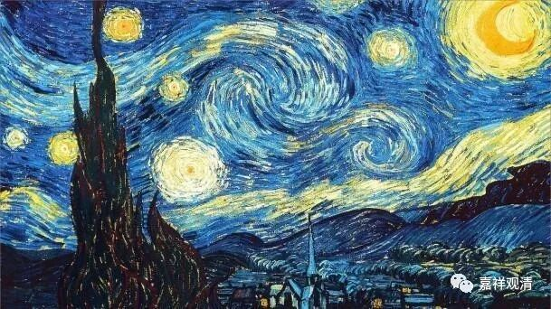

**微课堂佛教史142上**

好，我们今天继续禅宗史——达摩祖师。

昨天我们讲到达摩大师来到了少林寺，找到了一个山洞，在里面打坐，大家就称他为“壁观婆罗门”（注意，“壁观”不是“闭关”）。吕澂先生就讲，这个“壁观婆罗门”当中“壁观”的意思就是在修“地遍处观”。一直到现在的南传佛教，禅修也是以地遍处作为开头来修的。我也觉得这个可能性是比较大的。至于说他在里面壁九年，还在墙上留下了影子，像我们这么科学的群应该不会相信这个故事。但是达摩大师一直在里面修行打坐，这是有可能的。

我以前去少林寺的时候还没出家，来到了少林寺后面的少室山，那里有一个栈道（现在不知道情况怎么样了），当时都没什么人走，我一个人走下来的。在路上有一个小的佛殿，碰到了一位和尚，应该出家时间不是很长。他就建议我去那个达摩洞帮他们守着，说他们师父也需要人——他们的师父就是我们现在知道的永信法师。江湖上对他有很多的看法，实际上他还是一个比较正统的出家人，外面的江湖传闻更类似于小道消息。

我们讲达摩大师就在山上打坐——接近我们今天的闭关，这也是印度修禅的习惯。那么，肯定就有人开始聚集在他的身边，这个时候呢，他就开始讲一些禅修的方法，现在我们叫禅法。

大家要记住啊，这里说的“禅”还没有到后期六祖大师以后的程度，更没有到马祖大师以后的“分灯禅”、“机锋禅”、“话头禅”等等的程度，这里的“禅”还是比较早期的禅修、静虑的禅那。在禅宗当中呢，是把它称为叫“如来禅”的，这和“祖师禅”的说法又是不一样的，所以是从“如来禅”到“祖师禅”，再到“分灯禅”、“机锋禅”……禅宗也是一个世间的存在，它也是变化的存在，不变化的禅宗不存在。

“如来禅”的这个说法是出自《楞伽经》，而达摩大师在给大家教学的时候，就是以四卷的《楞伽经》为主的，说是“以《楞伽》印心”。这个大家要记住啊，《楞伽经》在禅宗当中是非常重要的，今天的禅宗门下基本上是不讲这部经了，但是在以前，禅宗被称为什么呢？被称为“楞伽师”——“楞伽”就是《楞伽经》的那个“楞伽”，“师资”就是师资相承，一代一代的祖师传承下来叫“师资”。在敦煌有一本文献叫《楞伽师资记》，就是从达摩开始一代一代地讲（其实是从求那跋陀罗开始，然后是达摩……），哪一代以哪个人为主，或者哪个人更有名气——差不多是这个意思。

示童蒙

所以早期禅宗是称为“楞伽师”的，按《宗义书》的说法，某某宗和某某师同义。另外，宗义书系统和禅宗都认为，“宗”这个词的出处就是《楞伽经》，《楞伽经》说：

** “谓我二种通,宗通及言说，**

** 说者授童蒙,宗为修行者。”**

（后期的版本是：

** “我说二种法，言教及如实。**

** 教法示凡夫，实为修行者。”）**

禅宗后来说的“宗通”与“说通”就来源于此，《宗义书》解释“宗”的时候，给出的原始出处也指向这里。不过，《宗义书》和后世禅宗对这里的“宗”的意思的解读还是有很大差别的……

