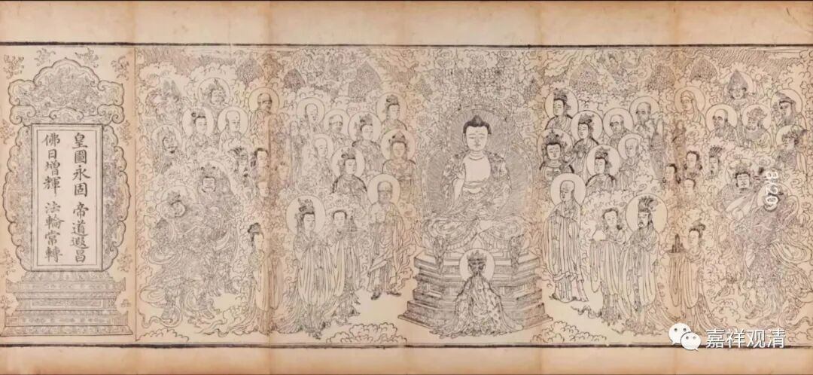
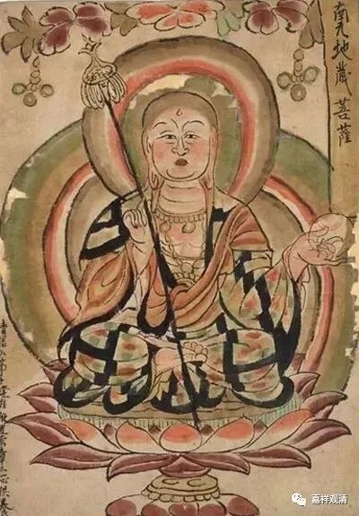
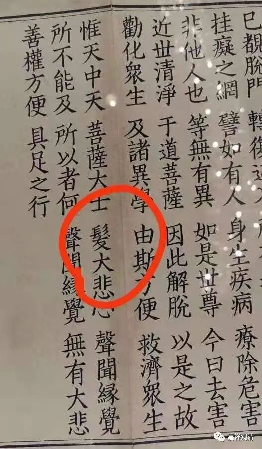
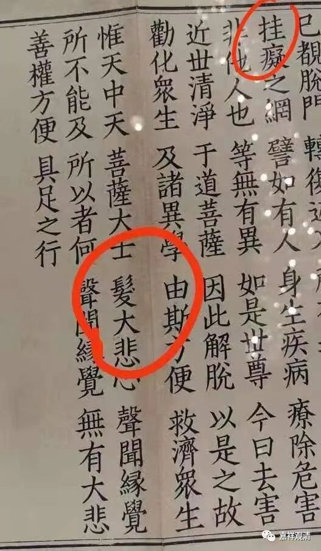

**“南无”和“南無”**

一、“南无”和“南無”

这是伯希和掠走的一件敦煌的佛画，一眼我就觉得～诶。

“南无地藏菩萨”……

“南无”，为什么不是“南無”？

检索一下，发现，“南无”和“南無”，藏经里面基本通用，但是，“南無”出现的次数多，“南无”出现的次数略少，大概不少于3：1的比率。在《一切经音义》中“南无”和“南無”两种都出现了，意思自然是一样的——归依、敬礼。

《一切经音义》：

** “南无：正言納慕，亦言納莫，此云敬禮**

** ……**

** 南無：正云萳忙，此曰敬禮……”**

“无”和“無”，很早就通用了。《一切经音义》“互无”（原作“互無”，当作“互无”）条注释说：

** “【‘无’】，古文奇字中‘無’字也，古译經多用此‘无’字也。”**

说“无”是“無”的奇字。

所以，“南无”或者“南無”在简化以前也都可以出现，都不错。

二

简化字出现有两个字简化为一个字的问题，如“麵”“面”，“髮”“發”。最近看到有一个案例——

这里的“發大悲心”，不能做“髮大悲心”，后面这个，一看就是简化字转为繁体出现的问题。一般这样的错误大家也能理解，但有的错误就很值钱了……（不要问，不要说，一切尽在不言中……）

另外，“挂癡”还是“罣礙”，也是一个问题呢。（“癡”和“礙”虽然是正误，但确实也有其他版本的不同，不谈；但，“挂”和“罣”，恐怕还是有点不太正常呢……）

