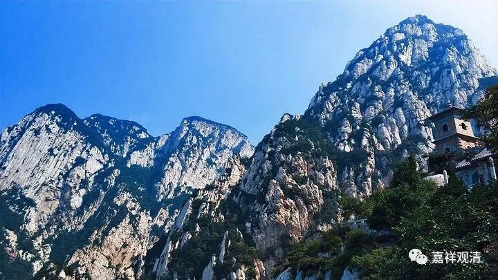

**《微课佛教史》142·2**

我们知道，中国佛教的很多宗派是以某一部佛经为传教核心——法华宗《法华经》为传播的核心，涅槃师以《涅槃经》为传播的核心，华严宗是以《华严经》为传播的核心，是吧？禅宗这一支——“楞伽师”，实际上那个时候就是以《楞伽经》为传播的核心。

刚才我们讲到了“壁观婆罗门”——达摩大师，他在修地遍处。那么，地遍处是什么呢？

按照传统的说法，就是你先找一块地方，然后把它搞平整了。就像我们练武的时候一样，要找一块比较平整的地。在平整了以后呢，地上都是黄土，不要有草木之类的，全部都给它铺上黄土。你就坐在这块地的中间，这个时候呢，就进入禅修，开始观想：你坐在土地的中央，土是黄颜色的，或者说土黄色吧。然后就慢慢地扩展，想到最大的——比如说四天下，然后再收回来，想到自己的面前，等到你睁眼闭眼都能够想出来你坐着的这个大地，那你就可以不用坐在外面了，在什么地方都可以修了。

吕澂先生就讲了“壁观婆罗门”的意思，就是达摩大师在他自己面前对着一个墙壁，是吧？禅宗后来说“心如墙壁，可以入道”，不是这里“壁观”这个意思啊，“心如墙壁”这是后人的意思。那个墙壁也涂上土黄色，就有类似修“地遍处”观的效果。

修了这个地遍处以后，等到你的禅定功夫更深了，你到什么地方都可以缘这个地的观想而入定，然后从初禅慢慢地修到四禅。修到四禅以后，你就可以在上面修神通。比如说，你的面前是水，但是你可以把它想象成地，在你的功夫足够高的时候，也就是你的定力足够强的时候，就出现了一种神通——你可以从水上走过去，如履平地。或者想象在空中也可以的，就是把空中想象成地面，在空当中这样走过去，这就是“地遍处”成功以后引发的神通。

“地遍处”修成功了以后，可以再修水遍处。也是一样的，你坐在水的前面，然后观想自己在水的中央……修了水遍处以后，你在空气当中，或者在地里面，都可以游泳了。然后是火遍处，你就可以随时点着火，是吧？风遍处呢，你就可以御风而行……

