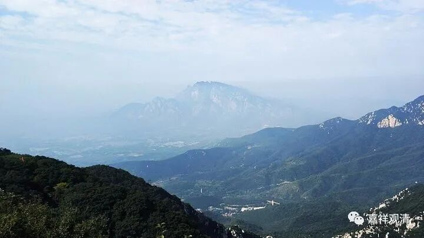
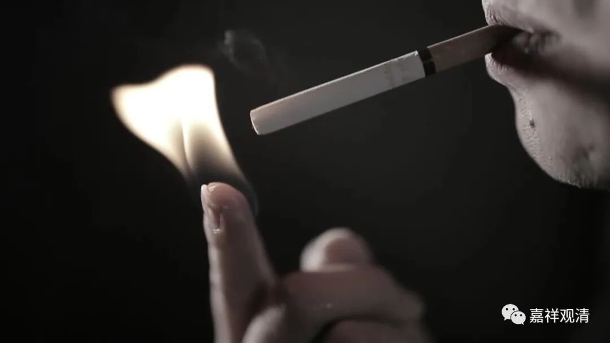

**微课佛教史142·3**

我的一位格西老师给我讲过一个故事，是他亲身经历的。他和一位活f，请另外一位老活f在理塘街上吃饭。他们两个年轻的就在那里辩论，那位老活f呢，就在边上听着。

老活f就有点郁闷，因为他的年纪比较大，在wg的时候没学过经教，他就说：“哎，你们俩是不是存心的啊？是不是存心恶心我啊？是不是觉得我水平不行，是吧？就这样在我面前辩论（，我懂，就是欺负我不懂呗）。”这两个“年轻人”就用手指在嘴上一摆，意思就是以后不说了。

这个意思是说，他们都很尊重这位老和尚，为什么呢？于是我师父就给我讲了下面这个故事。

那位老活f小的时候呢，当时有什么工作组之类的，把那些小活f组织在一起学习，当时大概是五、六十年代的时候，工作组的组长在考虑这批人将来怎么办，怎么去处理这些小和尚。

那个工作组的组长在那里想着，就准备点个烟。他把烟掏出来的时候，一个小和尚——就是我师父请吃饭的那位老活F，就把一个手指伸了出来，结果那个工作组的组长把烟凑过去，就把烟给点着了。

点着了以后呢，他就在那里抽着抽着……抽着……突然之间反应过来！

“哎，刚才在干嘛？刚才是这个小朋友在玩儿，点火的是一个手指啊。哦哟！”他想想佛教好像还是有点道理的嘛，自己就有点害怕。“哎，看样子佛教还是有点道行啊。”这个组长好像是个复员军人，本来就这些小和尚的未来去向、当地F教的未来等等等这些事还在纠结之中，这支烟被点着以后，就没有去执行某些负面的操作。

所以后来，当地的人都很尊敬这位小和尚……

当时那个小hf（就是现在的老和尚）年纪还很小，就能够伸个手指出去点火，这个恐怕有点接近于“火遍处”。当然，他可能不是修“火遍处”的，修的方法不一样。

地水火风遍处都可以修，吕澄先生就说“壁观婆罗门”达摩大师在修的就是地遍处……

