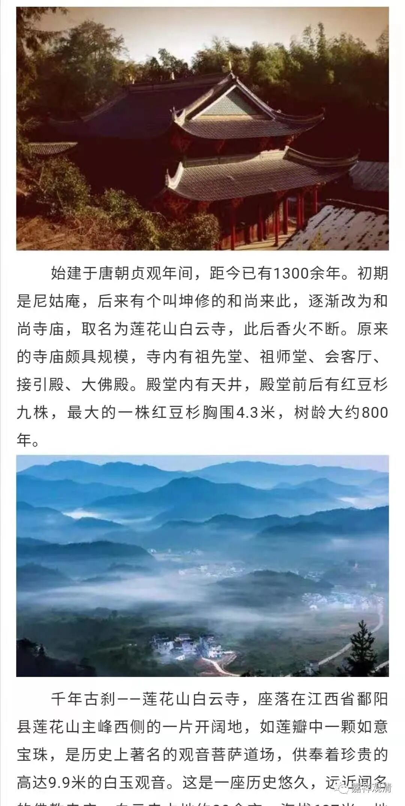
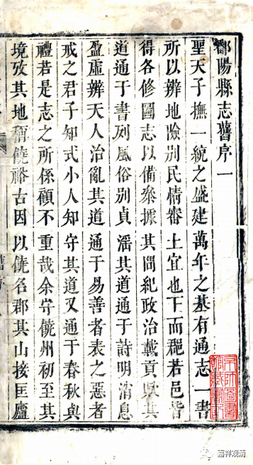
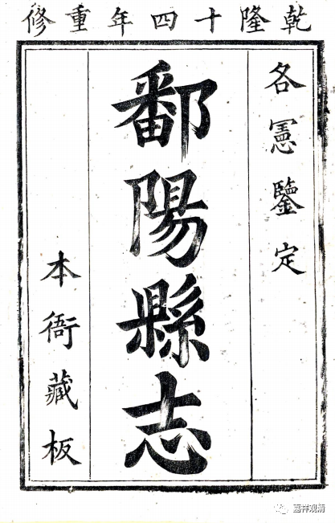
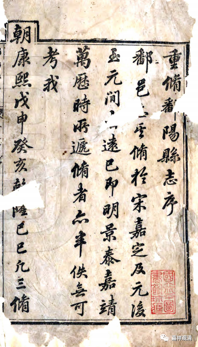
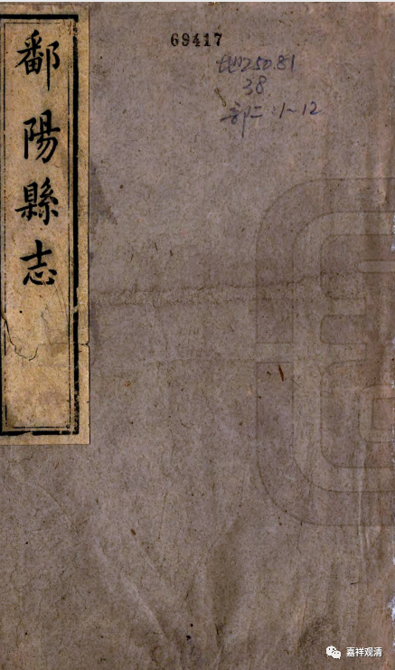

**《鄱阳县志》记载的莲花寺**

同学发来这个——

说起来，咱寺院历史的有些内容我还真不知道，也不敢确定真伪。

从寺院现存的几块碑读起来，寺院以前叫莲花山白云寺，也叫莲荷山，莲花、莲荷在当地人的口音里基本上也是很接近的。

寺院最早创建于哪一年确实不太清楚，有说武德年间，有说贞观年间，但我没找到具体的文献记载。现在既然提到了，不妨找一下……

鄱阳县以前是饶州府的府制，所以应该查《饶州府志》或者《鄱阳县志》。《饶州府志》太大了，先看《鄱阳县志》。

《鄱阳县志》有四，分别为康熙、乾隆、道光、同治年编纂。

康熙《鄱阳县志》

乾隆《鄱阳县志》

道光《鄱阳县志》

同治《鄱阳县志》

所有这些《鄱阳县志》在我们寺院的记载上都完全一致，全无差别：

《鄱阳县志》：

** “莲花寺，唐贞观九年剏。”**

剏，即创。就是说，县志记载我们寺院以前叫“莲花寺”，创建于“贞观九年”。其实平时有很多人嘴一瓢，经常管“莲花山白云寺”叫“白云山莲花寺”，hoho，说不定还真有可能叫对了。

至于其他的记载，需要另外再找了……

