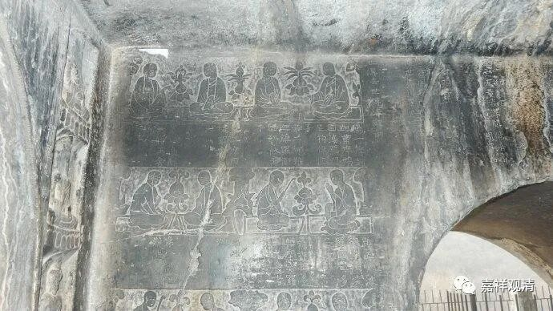
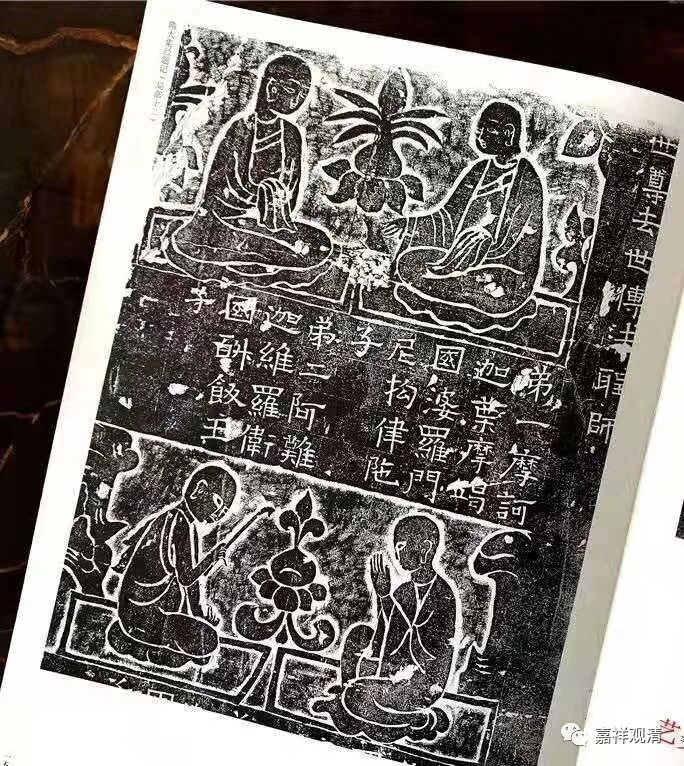
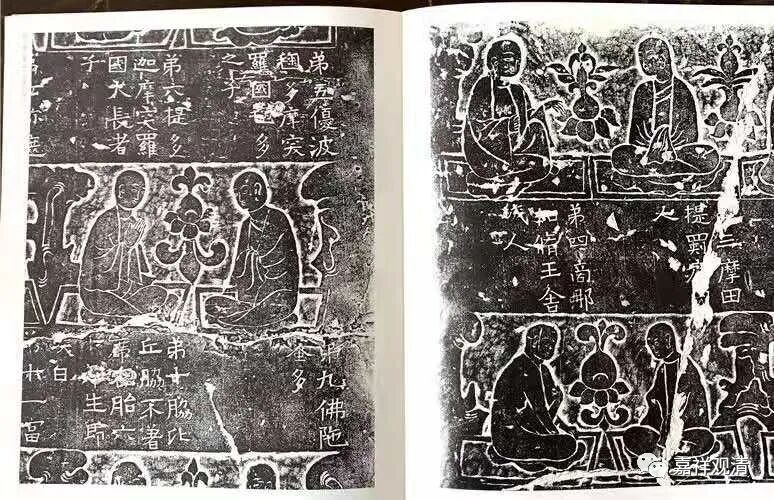
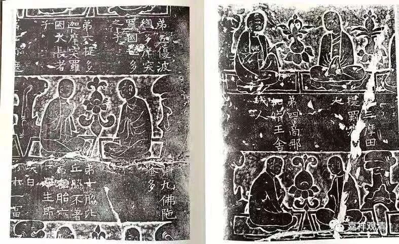
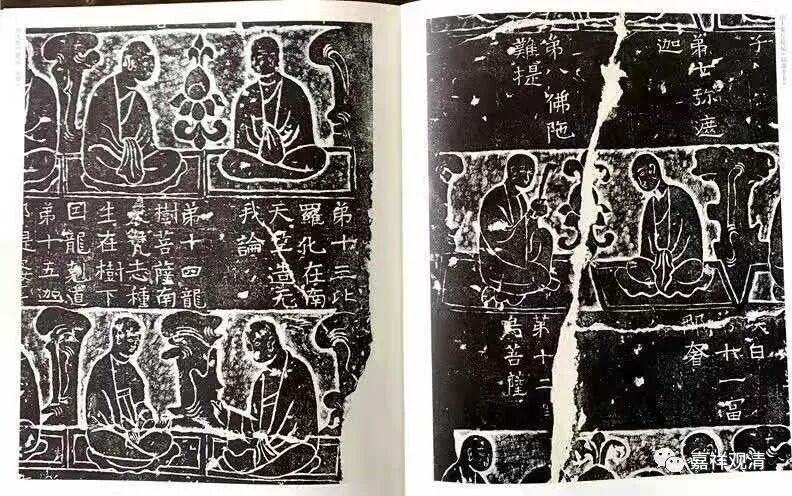
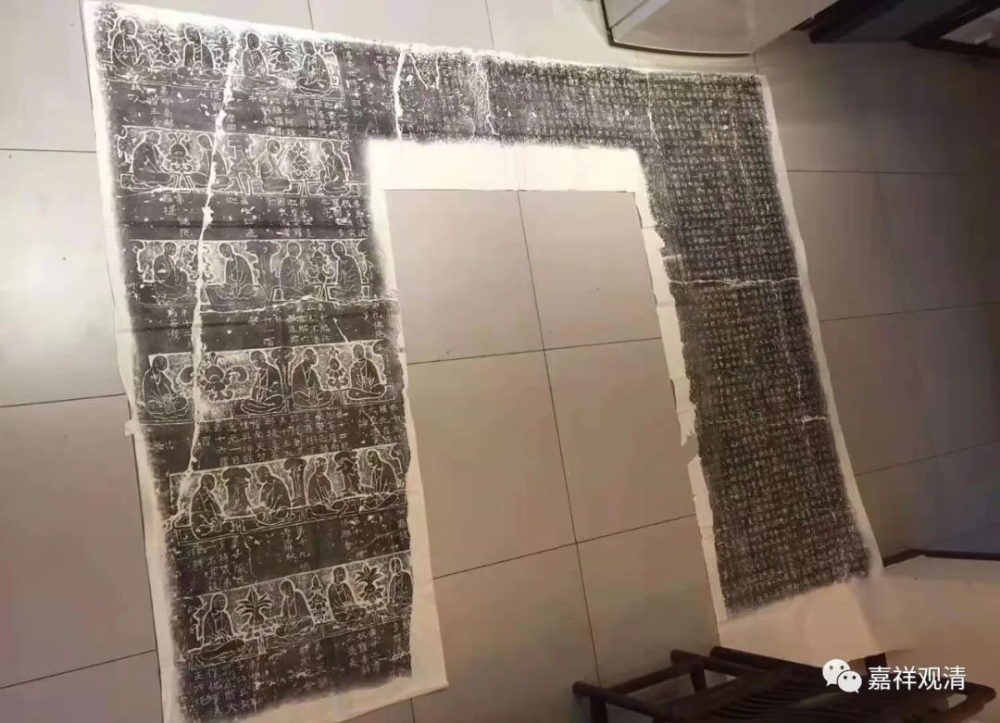

**《微课佛教史》147·2**

包括接下来我们要讲的禅宗后面的祖师，其实也是这个情况。为什么我本来准备从四祖、五祖开始讲起呢？禅宗的初祖和二祖在传记当中是比较明确的，其实到了三祖，在早期的传记当中是不明确的，具体是谁，最初不是很明确。

最初，三祖上面接二祖慧可大师、下面开四祖道信禅师，这里面的关系没有那么明确。但是后来慢慢地，随着禅宗的传承越来越长，三祖僧璨禅师就越来越被固定下来，包括他的作品《信心铭》也是一样。据现在的考证，《信心铭》的作者到底是谁呢？很可能源头是是牛头法融禅师，他著有《心铭》。

在这里我还是应该抱着科学的唯物史观的观点，来考察佛教的历史。其实就我而言，它的历史梳理得越清楚，越不会影响我在这方面的信仰，因为我的信仰并不建构在这些传说上。如果把这些传说去掉，那个真实的背景反而更加让我有兴趣，就是要把它传说的部分剃得干净一点。

下面这是安阳灵泉寺的二十四传法造像。

整张的拓片如下——

隋大集经和二十四传法高僧图有单独出版的，大家可以买一本看看。

这是找到的洞窟石壁的原样。有机会还是想去看一看呢。

要不今天就讲到这里吧，本来今天想讲慧可大师的，没想到一下子又讲到这里了。我知道其实关于达摩祖师是有很多内容可以讲的，只是不知道有哪些需要提出来。

很多佛教相关的碑帖值得我们去读一读的，有兴趣可以买来练练字也好。

今天就先讲到这里吧。

