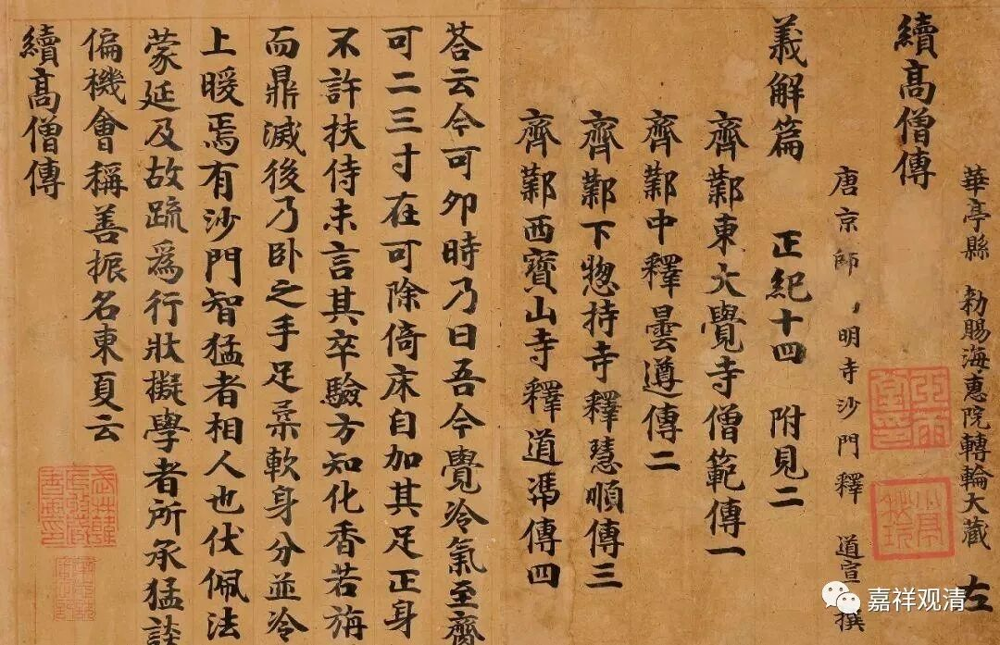

**微课堂佛教史148**

好，我们继续禅宗史。前面我们讲到达摩祖师，本来昨天已经准备讲二祖了，初祖讲得太多了，我们现在要讲讲二祖了。

二祖在《续高僧传》当中的名字叫僧可禅师，又叫慧可禅师。他原先俗家姓姬——姬发的那个姬，女字旁。他在家的时候儒学、中医都懂一点，据说水平还是不错的。后来出家了呢，他的內典和世间的学问都是不错的。那个时候——南北朝时期的出家人，基本上都是这样。

出家了以后呢，到了差不多四十岁左右——《续高僧传》当中说的，慧可禅师听说达摩祖师在洛阳嵩山一带，就去拜见。一见到达摩祖师，就觉得他水平很高，于是就跟着他学习了。这样跟着达摩祖师差不多学习了六年，这中间就发生了一些故事。

有一个故事说慧可大师在去拜见达摩之前做了个梦，说是天神让他去的，所以他就改名叫“神光”——这个故事也是后来才有的，这个故事不是真的。在早期的故事当中从来没有一个名字叫神光的人，没有。但是，怎么说呢？丛林里面的多数人，或者文化水平比较低的人，更愿意记住这些故事性的东西。但实际上这些故事性的东西反而是后期才出现的，说他在梦里面梦到了，然后就叫“神光”，后来大家更知道“神光”这个名字了。

上次我还讲到一个故事，是吧？就是在民间宗教当中，是把“神光”作为二祖，把“慧可”大师作为三祖，这就更乱了，先不说了。甚至还说达摩祖师是唐太宗李世民的转世，这个就不谈了，连时间都不对。（禅宗祖师在民间宗教里很有地位，很大一部分原因是，明以后兴起的民间宗教，他们接触的佛教主要是禅宗。）

关于慧可大师，还有一个很著名的故事，就是断臂立雪。

说慧可大师去到嵩山找达摩祖师，达摩就在那里打坐。慧可大师说我要求法，达摩不理他，还是在那里打坐，慧可就跪在雪地里——那时候在下大雪，雪都积得很厚了，达摩还是没睬他。

后来又出现了一个叫“程门立雪”的故事（民国时代还有个名中医，叫“程门雪”），程门立雪跟这个二祖求法的故事有点接近，谁影响谁，再说了（其实从故事流传的年代来看也知道谁在前面了）。

慧可大师看到达摩不肯传法，就拿出随身的刀，咔嚓，把自己的胳膊给砍了。

达摩祖师看到了，就觉得：“哟，这个是真心要求法的。”达摩就开始给他讲课：“你有什么？你来找我干嘛？要求心安，是吧？** ‘将心来**，** 与汝安。’**你把心找出来，我来给你安心。”说是慧可大师找了半天，** “觅心了，不可得”**，找过了，心找不到。然后达摩祖师就说：“吾与汝安心竟。”于是慧可大师言下大悟，就有这样一个故事。

这个故事一看就是后期编的，因为很明显是禅宗成熟以后，中国化以后的一种风格，早期的禅宗风格不是这样的。首先你用一把刀把手砍掉，这个很不容易啊！你拿把刀就可以把手砍掉，这把刀，大概是锯子吧？电锯还稍微有点可能。这把刀，是玄铁剑吗？这个不可能哦。然后你把手砍成这样子，不得晕过去吗？难道学杨过点穴止血？所以也不可能啊。

达摩看了这个样子，不害怕吗？——这哪是和尚，这不是黑社会吗？太吓人了吧。如果这个时候晕过去了，你还给他传法吗？先得给他包扎呀，是吧？这个时候还安心呢，不可能啊，应该蹭，飞过去，点穴止血……

这个故事当中，实际上有几个元素是有的，应该是后来的人看书不认真，或者是记忆出了差错。首先，关于“雪”这个元素，是有的。这是谁的故事呢？是慧可大师的传记当中说，后来有他的一些弟子，去见同学，去见其他的朋友，然后在雪地里面站了很久——雪深三尺，或者雪深五尺，这个事情是有的。但是这个事情和慧可大师没关系，属于在慧可大师的传记里面附带他弟子的故事。而且也不是求法，是去见一个朋友，这个故事就不讲了。所以“雪”这个元素的故事，在慧可大师的传记里有，但不是自己站在达摩洞前。

还有“断臂”的故事。断臂的故事是什么呢？断臂的故事也是在《慧可传》当中的，说什么呢？说那个时候——南北朝时期，佛教有过一些灭法运动等等，慧可大师和他的师兄弟昙林法师——算是师兄弟吧，因为上次我们讲过昙林法师介绍过达摩祖师的“二入四行”，他们一起往南逃。最后他们碰到了一些贼，估计又是造反的——怎么说？说造反的，好不好呢？反正就是碰到了贼——可能用“贼”这个字还是不好，那就说碰到了一些江湖人士吧。这么说吧，可能不知道用哪个词好，也许还是那个“贼”字更好。

然后呢，昙林法师就被砍断了一只手臂，那是真疼啊！慧可大师就服侍他。昙林法师被砍了手臂很痛苦，就在那里叫，说自己刚被贼人砍了手。后来一看，发现什么呢？发现慧可大师的手也被砍掉了。就是说，慧可大师的手臂不是在达摩那里砍的，是在路上被贼人所砍的。故事里说慧可大师遇到了贼人，被贼人把手给砍了，砍了以后呢，慧可大师自己把断臂的地方用火烤了——或者怎么说？用今天的话来讲，就是消毒，是吧？然后再用布把断臂裹上，平时照样像一个禅僧一样生活，照样乞食、禅修等等。

在《续高僧传》当中说什么呢？说他** “遭贼斫臂,以法御心,不觉痛苦”**，说他禅定功夫很高，没有觉得很痛苦。那么和他做对比的是什么呢？就是他的那个师兄弟昙林法师，也是被贼人砍了手臂，就一晚上都在那里叫，很痛苦。然后慧可大师还帮他治疗，也是一样，先消毒然后包扎，再帮他乞食，服侍他。

