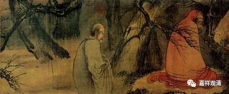
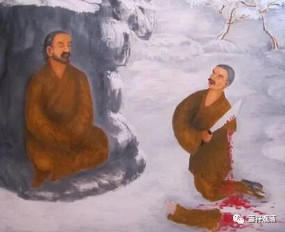

**微课堂佛教史149上**

慧可禅师在照料师兄弟昙林法师，但昙林法师就觉得好像慧可禅师这个人——该怎么说？不讲究，或者说不礼貌、不尊重他，为什么呢？因为他发现慧可禅师在给他递东西的时候都是单手给的。昙林法师就说：“你这是存心嘲笑我吗？”差不多有这个意思。

“你不知道吗？”慧可禅师告诉他：“我也是独臂呀！你不要发怒了。”昙林法师问了情况以后才知道，就感谢他——这里面用了“感谢”这个词，按照古文里面的意思，是感动+对不起——昙林法师自知误会了师兄弟，也感到了自己的修行不够……

在《续高僧传》里记载了慧可断臂这件事情，实际上是想用来证明慧可禅师的禅定功夫非常好，手臂被砍断了以后还能够自己包扎，再通过禅定功夫来忍住疼，然后还很慈悲地去服侍自己的同学，是这样一个故事。

也就是说，今天江湖上说的所谓“立雪”、“断臂”这两个故事，在《慧可传》当中都有，但并不是后来被戏剧化了的这个故事。实际是什么呢？慧可禅师的手臂是在当年的乱世中碰到了贼人，被砍掉了。而“立雪”这件事情是慧可禅师的弟子的另外一个故事。

所以，怎么说呢？中国还是有个好处，就是中国的历史记载比较丰富，只要你留得下来，很多事情都可以找到原文。如果光靠口传文学（特别是禅宗当中，口传比较多），很多东西就很容易失真。其实我们自己也是一样的，如果不去查原文，很多东西都很容易出错的。所以我们一直讲，讲课的水平大概比写作要差两三个段位，写作可以有时间去核对资料，讲课的时候很多东西靠记忆，而记忆有时候则不那么靠谱。

那么这里又要讲到达摩祖师，很多地方都说他是“只履西归”，这个事情至少在《慧可传》或者《达摩传》里面是没有的，他应该也是在中原一带圆寂的。也有可能“西归”的意思是有的，因为“西归”本来的意思就是人走了嘛。可能达摩大师就是圆寂了，然后被人家理解为回到西天竺去。

我们刚才讲了，禅宗当中口头化或者口头传教比较多一点，像“西方”这种词，哪怕是在禅宗正式的经典当中也会出现两种理解的意思，一种就是把“西方”理解为西域或者天竺。比如说“归西”，可能就是回到西天竺的意思。禅宗有这个情况，这里的故事，你们有些人有机会也会知道，我就不多讲了。

如果你们要去查的话，是可以查得到的，稍微讲两句——禅宗的某重要文献里有理解错的情况，就有把“西天”（西方极乐世界）理解为“西天竺”，又把“西天竺”理解为“西域”……走在基层的宗教徒中这应该是并不罕见的误读。

所以达摩祖师的圆寂，说他提了一只鞋子去了西域……这个事情也是后来的传说。口头的传说当中会有很多失真的地方，我们大家要注意一下。

