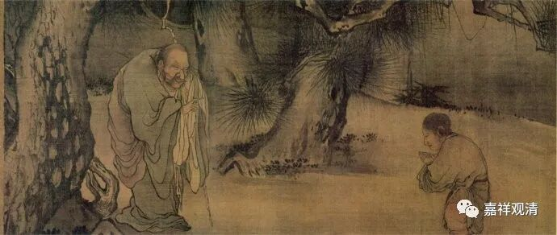

**《微课佛教史》149·2**

我们继续讲慧可禅师，他后来也有讲课的。在北朝的后期呢，修禅法的比较多，而慧可禅师的禅法和当时其他人的禅法有一些不同，因为他所传的是达摩祖师的禅法。当时的禅法有很多——大乘禅法、小乘禅法，还有些说如来藏禅法等等，我这里先不管了。

慧可禅师讲的禅法就和别人的不一样，而且他不滞文辞，不主要在文句上解释。当时有些人就觉得这个有问题，在《续高僧传》当中就说，当时一些成名的大师，比如道恒禅师，就觉得有问题，然后就派出了弟子去挑战，或者说是去踢场子。结果呢，踢场子的人去听了慧可禅师讲法以后，都觉得：“哎，讲得很好啊！”派出去的人就一去不回了。

那道恒禅师也挺伤心的，后来又碰到了自己派出去踢场子的人，然后就问他：“你们怎么跟他学习了？怎么跟魔学习了？”差不多是这个意思，就是口气上不是很友善。他派出去的这个弟子，就是后来跟了慧可禅师的这个弟子，回答的时候也不是很友善：“哎呀，我本来有好好的眼睛，就在跟你学习的时候就把眼睛学瞎了，现在总算找到师父了。”所以有时候说话还得注意，这么说就把之前的师父给得罪了。

这样就得罪人了，行走江湖，不能太刚啊（我自己得记着这句话）。据说，慧可禅师就被打压了。我们之前讲过，慧可禅师其实跟三论宗的慧布禅师是遇到过的，双方还进行过辩论。应该那个时候慧布禅师在北方的名气还不大，而慧可禅师的名气已经挺大了。两个人有过交流，慧可禅师也非常地赞叹慧布禅师，或者说是三论宗，说你这个方法断烦恼是非常好的（这个方法主要是指龙树菩萨的“八不”的内容）。

关于慧可禅师的弟子，在传记当中就提到了几个人，比如说有个向居士，很多人就把向居士当作禅宗的三祖，但是早期的传记当中并没有确定说向居士就是禅宗的三祖。其他的弟子还有法林法师、僧那法师、慧满法师等等，这些都是慧可禅师的弟子，说明当时达摩禅的禅法，通过慧可禅师在北方还是进行了相当广大的弘扬。

那么前面也讲了，因为慧可禅师受到了当时其他禅师的打压——至少传记当中是这么说的，所以造成了他的弟子相对比较少。刚刚我们讲了他还算是有弟子的，在传记里面说“卒无荣嗣”，就是没有非常有名的弟子。

今天我们还在讲二祖，那后面就要开始讲三祖了。但是这个三祖应该说是后人往前推出来的，当然和这一系肯定是有关系的。三祖的故事我明天再讲吧，总的来说，佛法的传播也确实不容易——既要注意所讲法的正确，也要注意不要得罪江湖大佬们。

