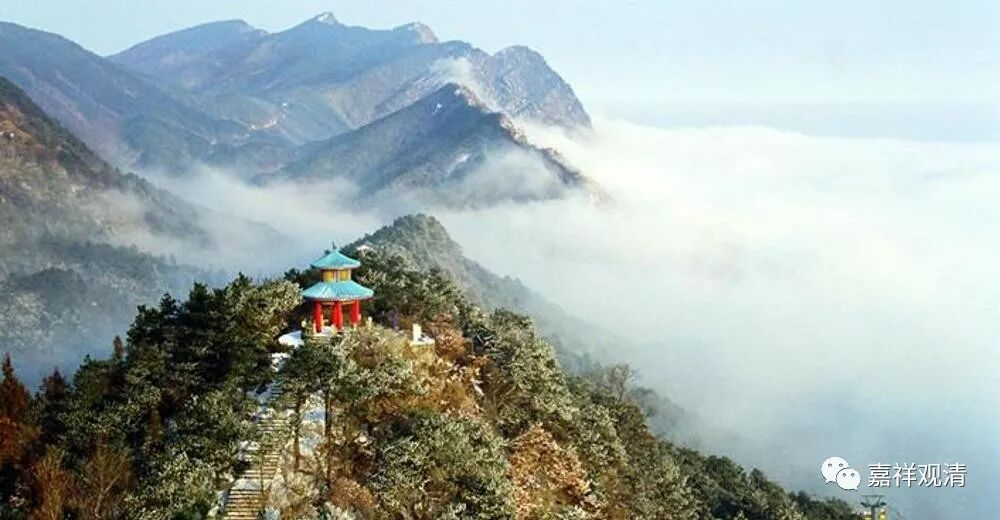

**《微课佛教史》152·1**

好，今天继续禅宗的历史。三祖已经讲完了，我们开始讲四祖——道信禅师。

我们讲在禅宗历史上，到了道信禅师又开始发生了一个变化。道信禅师的师父是谁呢？现在来说，毋庸置疑，大家都说是三祖僧璨禅师，对吧？但是在《宋高僧传》当中并没有说他师父的名字，所以造成了后来的一些争议（这叫争议吗？），就是大家会发现，有一些地方不算很讲得清楚。当然，这是我们今天的说法，如果你放在一千多年前，一千三、四百年前，当时的人已经这么接受了，估计也没有什么人提出异议。

那么，道信禅师是哪里人呢？这个也不知道。只知道什么呢？只知道他俗家是姓司马的，七岁的时候拜了一个师父，那个师父的戒律不太好，有点问题，然后道信小和尚还去规劝这个师父。（不知道是怎么回事，规劝师父这个事情是怎么会传出来的。）但是他的师父也不听，于是他就自己管好自己了。

这时有两位僧人，应该是从北方过来的，“入舒州皖公山，静修禅业”，就是打坐。道信禅师就跑过去跟这两位师父学习了，总共学了十年，应该就是学的“静修禅业”，就是学打坐。有些人就说这两位僧人当中有一位就是僧璨禅师，那么到底是不是呢？不知道。早期传记当中就说这是他的两位师父，连名字也没说。

然后这两位师父要去罗浮山，罗浮山在哪儿呢？罗浮山在广东。师父走的时候对道信禅师说不带他走，那他就得在那里留下来。那个时候应该是隋代，允许有出家的，但因为之前有过法难，佛教被打压，就有一批僧人长期（躲）在山里面修禅。接着道信禅师就正式受度出家了（有执照了），然后去了江西的吉州，应该就是今天的吉安。

后来吉州被贼所围，大家非常着急，不知道怎么办。这个贼也不知道是谁，倒是可以考证一下。当地的刺史来找道信禅师帮忙，为什么呢？因为据说他有神迹。当时城里被围，没有水，道信禅师从外面入城以后，井水就冒出来了。围城的话，如果没水会很麻烦，这就等于出现了神迹。“修禅的和尚”和“神迹”，这是基层信众普遍认为有关联性的……

出现了神迹以后呢，刺史、太守等等就来拜访道信禅师，问他求什么呢？这等于是问卦一样，问贼人什么时候走，能不能给个消息。道信禅师就告诉他们念“摩诃般若波罗蜜”。传记里面就说道信禅师是修“一行三昧”的，修文殊般若的，就念“摩诃般若波罗蜜”。所以今天我们的早晚课当中，就单独有一句念“摩诃般若波罗蜜”的。

