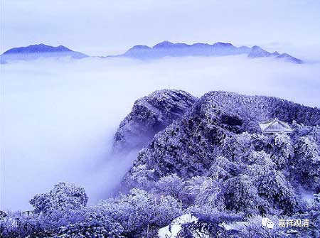

**《微课佛教史》152·3**

后来道信禅师看到了双峰山，觉得这个地方不错，就留下来。据说当天还碰到了猛虎，然后给猛虎授了归依戒。在禅师当中呢，经常有这种讲法，说是碰到了猛虎，之后降伏猛虎——这也说明是一位住山的禅师。（关于伏虎的事情，我有话要说，但是这里写不下……）

道信禅师住山以后呢，基本上就闲逛了，所以这是禅师的一个风格，和三论系的风格也确实挺像的，三论系真实的风格是“无使出者有教授”，是吧？好好地在山里面待着。

道信禅师也是一样，在山里面待了三十多年。他的名气比较大，怎么说呢？说“闻名全国”可能有点过，反正是大家听到有这样一位禅师，在这里专修禅法的，就都聚拢过来。大概有多少人呢？大概有五百多人。

五百个人聚在一个山里，很有可能在经济方面还是稍微成点问题的。也就是说，大概在这座山里面或者山的附近有几个“群”。如果我们住过山的话，就会大概知道住山的一些问题。首先就是水源的问题，比如有的地方水源太小，是没有办法住很多人的。五百人实在太多了，水源要很大才行。

还需要有大的能住的地方，不能都是露天的，所以从前的人要住山洞，也有这个原因。得找个山洞，哪怕有一块石头突出来都可以。我们在九华山也看到过，哪怕有一块石头稍微突出来一点，这里就是一个叫什么什么“洞”的，谁谁谁在边上打两块石头就开始在里面修行了。

那么在这个地方，道信禅师就讲课三十多年，或者是带大家禅修，还收了弟子弘忍禅师，这个大家都知道了。在他圆寂之前，大家还问他：“你要咐嘱谁呢？你这个法传给谁呢？”道信禅师说：“我已经咐嘱很多了，我弟子传了很多了。”

这个就是四祖道信禅师。

