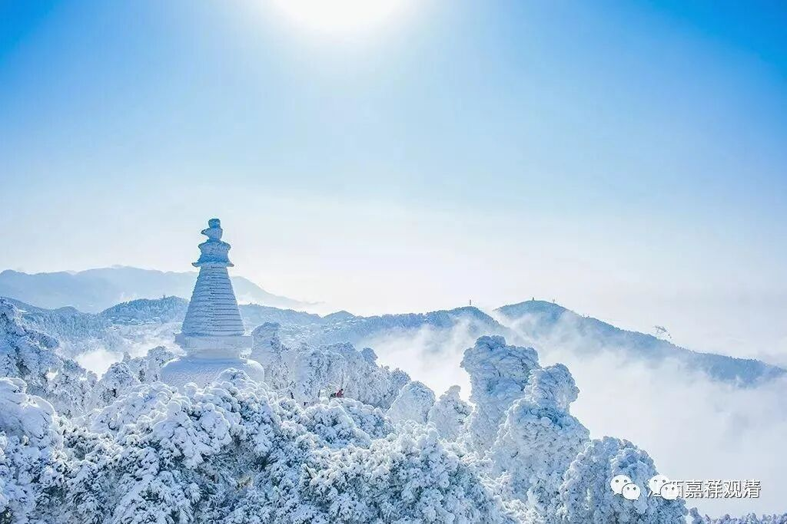

**《微课佛教史》153·3**

我们先脱离五祖、六祖的事情，把这段内容多讲一点吧。到了宋代的时候呢，中国佛教基本上就是以禅宗为主了，特别是禅宗的丛林制度基本上就确立了下来。与此同时，禅宗的丛林制度基本上就代替了原先从印度传播过来的律寺制度，从而影响到其他的一些中国佛教宗派，比如后来又重新崛起的天台宗，都跟着禅宗学习，也建立了类似的丛林制度。

这种丛林制度产生以后，经过口碑的积累，经过宋代、元代、明代的政治引导，产生了一种新的寺院组织制度，和此前的“双轨制”有点接近，但是它的宗派性已经基本上确定了，就是他的大寺院的方丈在禅宗内部的流动，是任期制度，而寺院本身的日常管理照常延续。天台宗的丛林也类似地在宗派内部选贤能做“方丈”。说起来，这有点像英国的内阁大臣和文官系统的两条平行路径——内阁轮换，文官系统则基本不受内阁换届影响……（有兴趣的，推荐看英剧《是，大臣！》+《是，首相！》）

大概是在南宋时期，基本上就确立了“五山十刹”的信仰，这里面包含了“五山十刹”的“僧迁”制度。也就是说，假如一个和尚要做住持、做方丈，在他具备一定的实力以后，首先要经过诸山长老（也可以是官府）的推荐，先出山——国家同意让他先在某个地方性的小寺院做住持，此后就开启了他的“僧迁”之路。

一任或者数任之后，此谓大师便可以被升至地方性的大寺院做住持。就是原先是在某个寺院当中做主持或者做方丈，管理比较好或者是教学比较好（应该说这个时候是教学和管理都有一点，但是还是以教学为主）。他教学、管理寺院的情况得到了诸山长老的认同，得到了政府方面的认同，就会让他当地的首刹（类似于今天的某地佛协所在寺院）——比较重要的寺院去担任方丈。

经过大概五年左右，再升至更高一级的地方性的首刹，比如说前面是县，接下去就可能是州府，到州府一级的首刹去当方丈。这种州府一级的首刹仍旧具有管理职能的，就是它要管理（或者协助管理）一个县或者一个州府的寺院，所以，此位大师在他的“僧迁”过程中是积累了一定的管理能力的。

