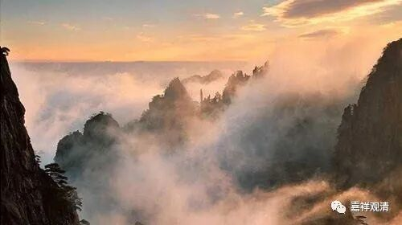

**《微课佛教史》153·4**

州府首刹再往上是什么呢？就是十刹了。哪些寺院呢？比如国清寺、南京大报恩寺等等。

我们先来看一下具体的“五山十刹”是哪些。

五山十刹：

五山：1、临安（西天目山）径山寺；2、杭州灵隐寺；3、杭州净慈寺；4、宁波天童寺；5、宁波阿育王寺。

十刹：1、杭州中天竺；2、湖州道场寺；3、南京灵谷寺；4、苏州光孝寺（今不存）；5、宁波雪窦寺；6、温州江心寺；7、福州雪峰寺；8、婺州双林寺；9、苏州虎丘灵岩寺；10、天台山国清寺。

禅师在诸省级的首刹“历练”了以后，再往上，就先进入“五山十刹”当中的“十刹”做方丈，这就是进入佛教禅宗顶尖大师行列了，这时候，名望、实力都必须是一等一的时代高僧了。然后再往上就进入“五山”做方丈，这时候就是超一流名僧了。

“五山十刹”是有排名的，前前胜于后后，所以方丈大师的升级是从后后而至前前。最上面的是径山寺，就是五山的第一名。第二名是灵隐寺，第三名净慈寺，就是《晓出净慈寺送林子方》的那个净慈寺……十刹的第十位是天台山国清寺。

升级的时候，不是每个寺院都要过一遍，可以跳的。其中，五山是一个级别，十刹是一个级别。

元代的后期呢，又把南京的天界寺加进去了，就是把天界寺放在五山十刹的上面，这个寺院在南宋末年还没有的，到了元代初年才有的，是拿皇上宅子改的，所以把它级别放在最上面。关于五山十刹我写过一篇文章，到时候找出来给大家看一下。（径山寺现在已经建得很好了，准备什么时候去看看……）

这就是当时高僧或者名僧的一种上升通道……

