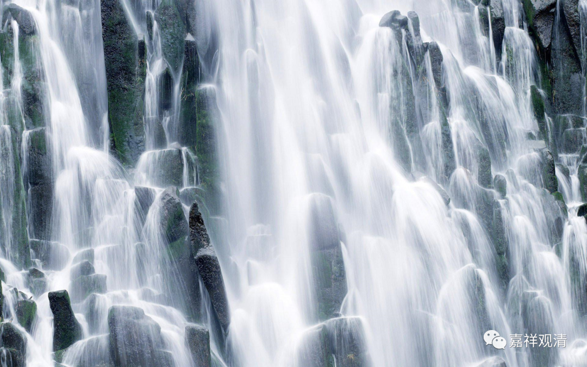

**《微课佛教史》155·1**

再举个例子，在佛教传统上很有名的一本书——《法苑珠林》。我是非常不愿意看这本书，可以说很讨厌这本书，虽然它的名气非常庞大，为什么呢？这本书里面有太多的传说，太多的怪力乱神。但是如果你放到那个时代去，就是不一样的，那个时代的人们会认为这就是事实：哪个人到地狱去走了一圈，回来告诉大家应该念“若人欲了知……”；哪个人生病又去了一回阎王殿等等。这种故事，在那个时代是把它当作真事来看待的，而且几乎所有人都不会把它当作传说，而是当作真事的（大概除了特别唯物的人）。只有今天我们受过唯物主义教育的人，才会认为这里面可能大部分都是一些传说。

讲到这里呢，我想说的就是，在那个时代——就是一百年往前的一两千年当中，这些传说成为一些人的历史记忆，实际上也是当时的一个历史背景。我们也不要全部以我们今天的观点去看人家：“怎么都是迷信胚子啊？”虽然我自己很长一段时间里是这么理解的，但是现在可能是因为我年纪大了，慢慢地对那个时代的人的想法有点了解。

比如说刚才我讲的那本《法苑珠林》，我以前对《法苑珠林》真是一点都不感兴趣，但是最近这一年，我觉得：“嗯，这里面可能有点其他的原因。”我如果没记错的话，《法苑珠林》是道世法师写的，他在当时也算是高僧，是吧？我一直以来是有点看不起他的：“这种人怎么还能当高僧啊？”但是最近一年呢我就想了一想，他是处在那个时代的，有那个时代的局限，我们是不能够离开那个时代去观察这个人的，是吧？

如果我这样的人带着今天的思想出生在那个时代，混宗教圈，估计早就被杀了，应该是早就被喷死了：“居然这么科学唯物！”被杀的可能性没那么大（当然佛教史上因为义理辩论下黑手的也不是没有）——我估计也没这个胆子“胡说”啊。实际上，一个人发表的观点，是不可能太出格于你所处的那个时代的。你把我放在那个时代，大概率我估计也不会有今天的“历史唯物主义”的这些想法。

今天还是多少要讲一点禅宗史吧。当然，前面也是讲了，说达摩祖师到了中国，在《景德传灯录》里面记载了具体的日期。说他从海路过来，而且是当时的南天竺（南印度）的国王送他过来的，这一路上走了三年，到达梁代的时候说是“普通八年九月二十一日”。连具体日子都有，我也不知道这日子是怎么找出来的。后来他什么时候到的南京呢？说是十月一号到的金陵。这个速度也太快了吧？十天之内，九天就到了金陵，这速度太快了！

