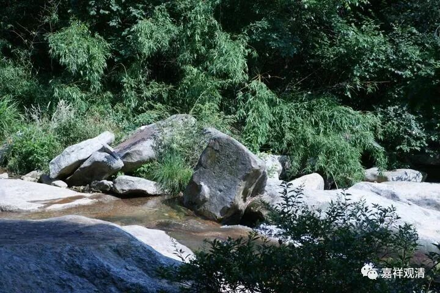

**《微课佛教史》156·1**

好，我们现在继续“科学的佛教史”，哈哈哈，“唯物的佛教史”。这一段讲的内容应该不太“科学”和“唯物”啊，但是我们可以让它“科学”和“唯物”起来，到时候再说。

现在我们是讲到禅宗里面通常所讲的从初祖达摩到五祖弘忍的这一段“故事”。我们是不是可以直接一刀把这部分切掉，说这个就不是真正禅宗的呢？这样说可能也不太好，应该怎么说呢？实际上我们应该把它放在那个时代来看，也就是说，如果把这些故事放在唐代末期或者放在宋代，我们大概就可以理解了，很多的故事应该是宋代的故事。

至于里面的一些佛教道理呢，至少在宋代佛教的禅宗当中，大家认为就是这个样子的，而且有些内容呢，也确实可以谈出点什么的。怎么说呢？只要你的学习是正确的，那么你还是可以对它加以解释的，这个是没有问题的，并不是说像以前“疑古派”那样直接就把它剔掉了。其实就我们来说，我们是比较接近于“释古派”的，我们认为，这些故事固然是假的，或者说固然有一些故事并不是达摩的，但是把它放到宋代，禅宗就是这个样子理解的、认识的，宋代的禅宗就是这个样子的。

那么，在《景德传灯录》当中就提到了达摩和二祖的故事。

今天蔡志忠去了少林寺，是吧？他的《禅说》等作品，基本上就是按照这个传统的来创作的，我们以前看的也是这样的。

我们昨天讲达摩给二祖大师改了个名字，说“可”，就取了个名字叫慧可。你看，这也是很纯正的中国人的做法。中国的老和尚就是这样：“嗯，这个也可以啊，你的名字就叫可吧。”现在有些寺院的老和尚也是这个风格……你到老和尚那里，老和尚就问：“嗯，好。你叫什么名字？”然后直接给名字——“一清，字二白”，“你姓邵啊！那就叫‘来邵’！（师父，我不要叫‘来一勺’！）什么不行！就叫‘来邵’！带走！（呜呜呜呜～哭）”……

就这样。真的啊，这不是开玩笑，确实有些老和尚也有点小调皮，也是比较天真的。（呃，我也给人取名叫“龙树”，哈哈，人家没敢要，我就，换了一个……看来我比较好说话）

禅宗故事当中，从此就把这个“神光”改名叫“慧可”，其实历史上他本来就叫“慧可”，根本就没叫过“神光”。

