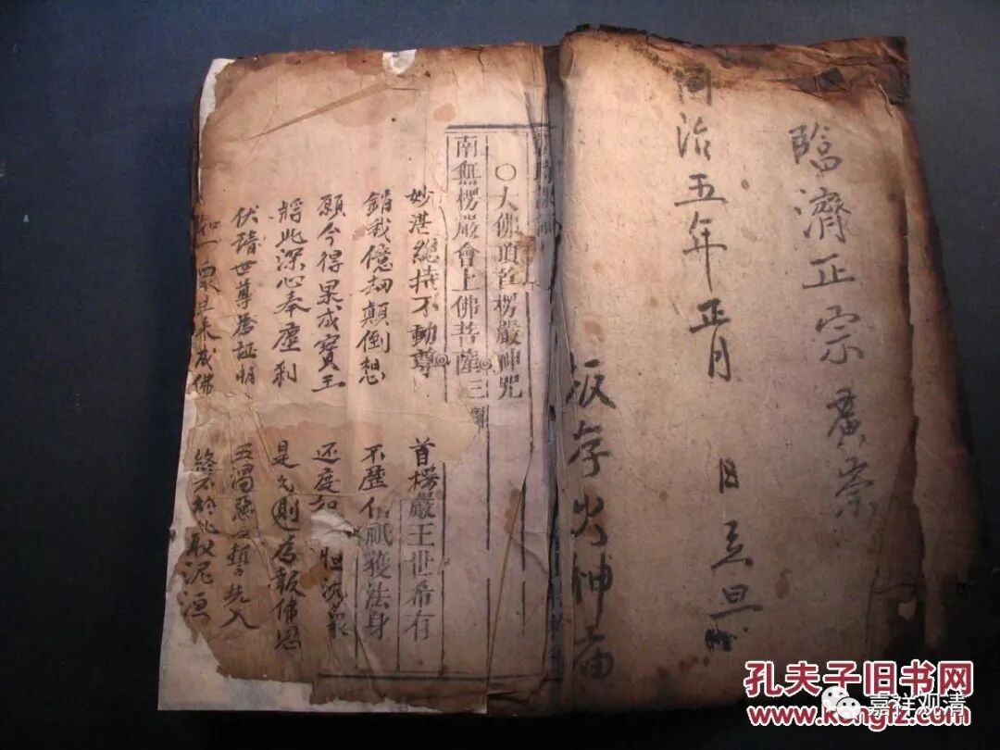
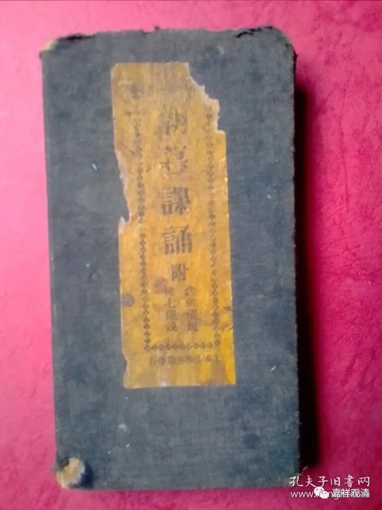
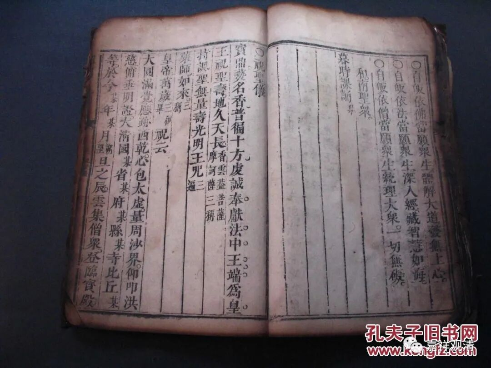

**《微课佛教史》157·1**

好，我们继续科学唯物地来讲禅宗史。

因为最近好几个人刚刚进群，所以先介绍一下，前面的五祖我们已经讲过了，现在是回到禅宗通常的说法，最多吐吐槽，讲讲禅宗一向的传说是什么样的。

我们昨天是讲到了达摩祖师，今天又说是达摩祖师的生日。其实不仅达摩祖师的生日，汉传佛教里面现在还流行有很多其他佛菩萨的生日，都是一个很有趣的事情。我们在这里不妨也讲一讲，到最后是否整理成文字再说。

这些佛菩萨的生日，在明代中期以前是没有见到的。你去看禅宗的一些语录等等，从来不会出现这些在佛菩萨的生日上堂、讲法等等，这些都没有出现。那么，是什么时候开始出现的呢？大概是在明代的末期、清代的初期，才慢慢地开始出现。而且这个出现的方式也是非常的民间，你说佛菩萨比如观音菩萨，到底是哪一天生日呢？怎么会有哪一天生日呢，是吧？只有你说他是什么妙善公主，那才有所谓的生日，对吧？但是妙善公主和楚成王，这就纯粹是小说、戏曲、宝卷了。

现在流行的这个“佛菩萨生日表”多半是扶乩搞出来的东西，特别是观音菩萨生日这个事，可能是民间影响到道教，道教再影响到佛教。有些东西就算了，不多讲了，说多了得罪人（不过能被得罪的也不是我的菜，不理ta们）。

达摩祖师的生日也是一样，谁知道他什么时候生日啊？可信的历史传记当中从来没有出现过他的生日，但是如果选一天作为某人、某佛菩萨的一个纪念日，我觉得倒也不妨，作为一个纪念日这可以。看看我们什么佛菩萨生日表，这里面还有什么王灵官啊、太上老君、玉皇大帝啊这一类的，根本不纯是佛教的。可以看出来，来源很民间。

另外，我们也可以聊一下我们的早晚课（我这是不怕死啊……）。其实我们现在的早晚课（《朝暮课诵》）的定型时间，到现在也就三、五十年，我们现在看到的《佛教念诵集》大概是文革以后最终定型的。

我看到最早的版本也是在清代的中期或者末期，还不是今天这种定型形式的，叫《朝暮课诵集》，或者叫《朝时课诵集》、《暮时课诵集》。而当时的这些《朝时课诵集》和《暮时课诵集》还不像今天这样是统一和固定的。今天这种统一和固定的是念诵集是在建国以后，特别是文革以后进行定型的一个产物。在文革以前或者民国时期，可以说它只是大致的定型，所以它的是有一个完整的定型史。

相对来说，《禅门日诵》就要出现、定型地更早一点。那么，现在的佛教当中我们所看到的这些佛菩萨的生日等等，其实很有可能就是在《禅门日诵》当中最早被记录下来、被固定下来的，至少在这之前我没见过。《禅门日诵》呢，也有它的演进，慢慢地变化，同样的，应该不会早于明代末年，最多最多出现于明代的中期。但是我个人觉得明代中期出现的可能性不大，大概最早也是在明代末年才能出现这样的禅宗的《禅门日诵》。

