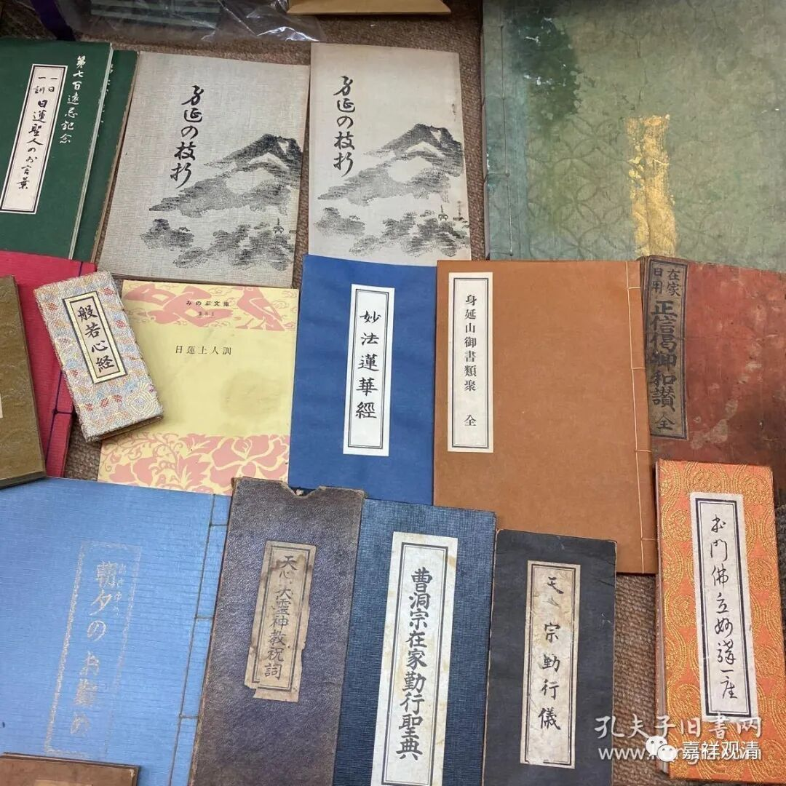
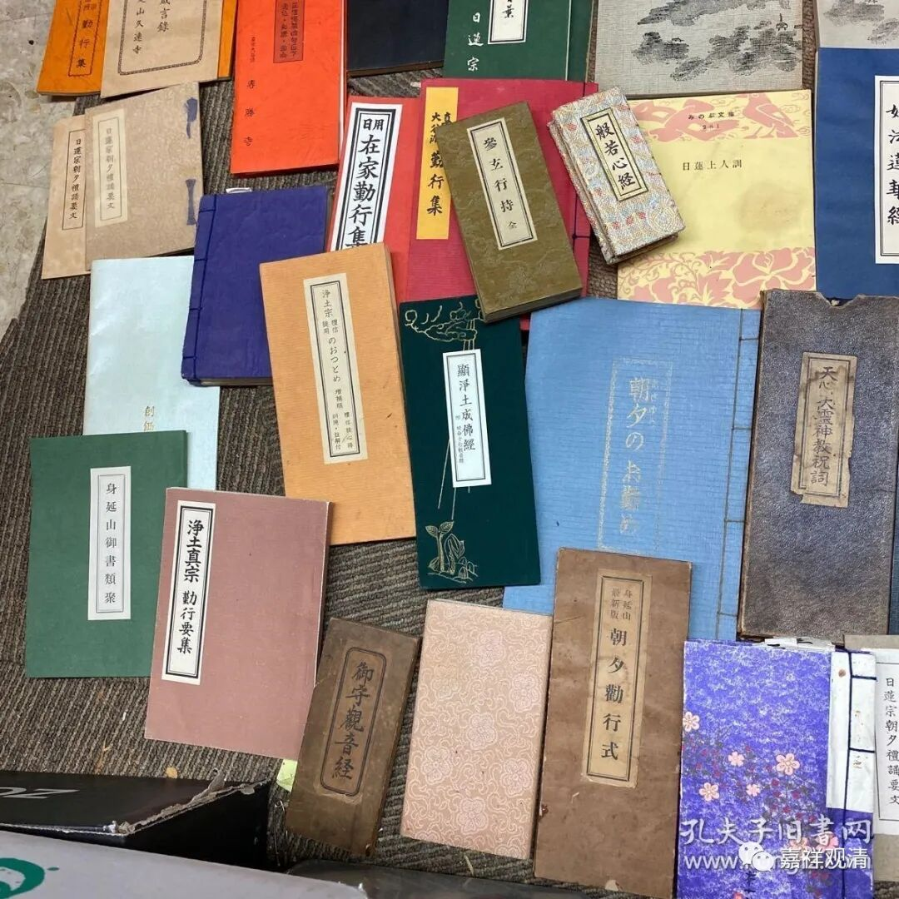

**《微课佛教史》157·3**

至于其他的，比如说今天日本也有很多的宗派，在这很多的宗派当中，每个宗派都有自己的功课，而实际上他们这些功课大多是和汉地佛教直接有关的。有些汉传佛教的内容在明代至清代初年传到日本以后，他们的“功课”也传了过去，慢慢地，日本也借鉴了汉地佛教的早晚功课（不是今天这个版本的朝暮课诵）——因为从汉地过去了一些佛教大师，慢慢地日本就借鉴了汉地佛教的这些功课的形式。

而你们看，实际上日本的这种情况才是比较正常的，就是每个宗派，比如禅宗里面，临济宗，曹洞宗，或者黄檗宗，每个流派它们都有自己不同的功课。净土宗、真宗、天台宗，乃至东本愿寺、西本愿寺，都有不同的早晚课诵……我收了一点，大家有兴趣也可以到日本旅游的时候收一点看看……

而我们今天全中国汉传佛教的仪轨已经“迷失了宗派”（黄元申的霍元甲的台词），被统一成一本《朝暮课诵集》了，这是一个很丢人的东西，这种功课完全不是正统佛教或者讲经教的佛教所应该出现的。这个只能说是什么呢？是“瑜伽宗”的功课。

什么是瑜伽宗呢？就是明代的开国皇帝朱元璋，他曾经做过和尚，他非常看不起天台宗、华严宗、禅宗等等这些和尚，他看不起他们，为什么呢？他自己是底层和尚，他就说底层的和尚好，好什么呢？他说佛教是要度众生的，底层和尚天天在超度的，那才是度众生，你们这种天天念经学习的，这个是自度，不是度众生。他给这些在社会底层到处赶经忏、做瑜伽焰口的真真假假的和尚一个很耀眼的名字——瑜伽宗！朱元璋对佛教的破坏是致命的！正统佛教被压制，民间佛教被吹捧，如果说之前的佛教在汉地是在走下坡路的话，那汉地佛教到了明代则是瞬间垮塌了！

有明一代对佛教的打压是非常重磅而全面的，另一面又明显地拔高了道教。但是今天我们基本都不知道明代佛教受到过如此大的摧残（不逊于几次法难），因为我们对明代的佛教已经不太了解了，写佛教史基本上也不写明代的，而实际上明代的佛教是被整得非常惨的。

