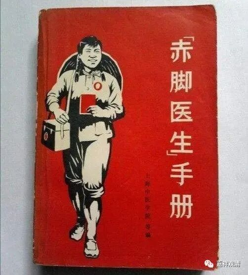
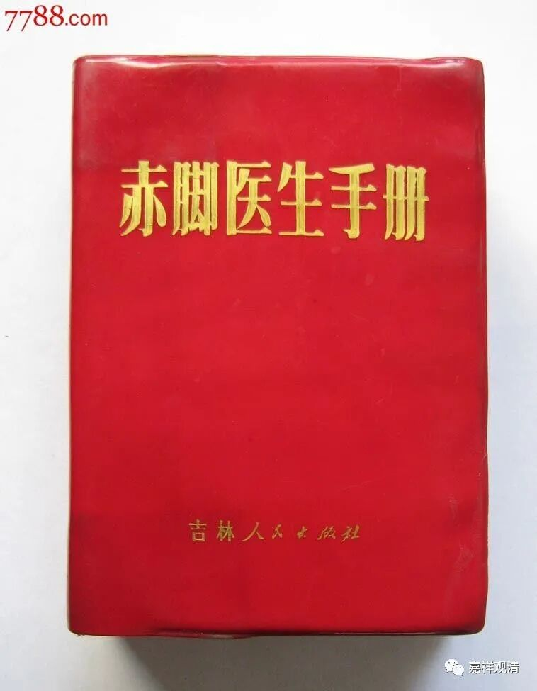
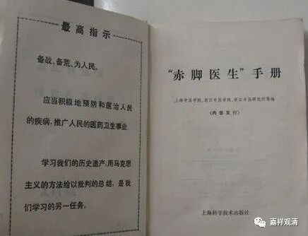
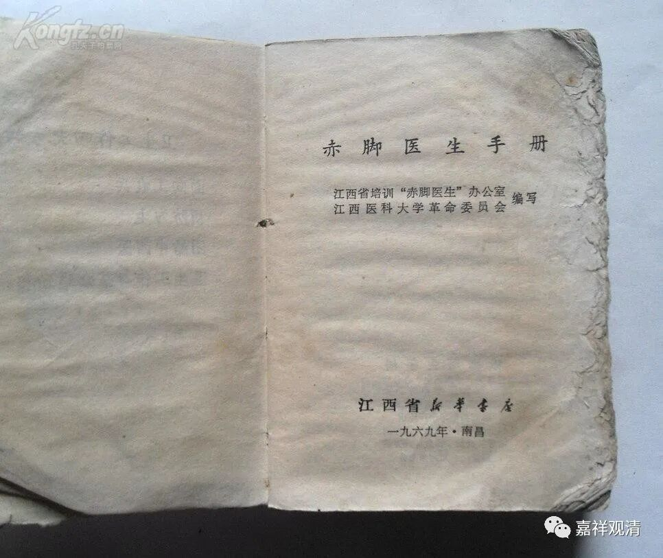

**《微课佛教史》158·1**

那么，瑜伽宗是怎么来的呢？是朱元璋把佛教分成这样几个宗派：一个叫讲宗，是讲经的，比如天台宗、华严宗，这些都称为叫讲宗；然后是禅宗；然后是律宗。通常分成这三个宗派，有时候会再加一个教，这个教是什么呢？这个教就是指的瑜伽宗。瑜伽宗的意思就是赶经忏的——天天念咒，给别人回向（包括现在的什么水陆法会、梁皇忏、瑜伽焰口等等），这些民间到处走的经忏僧，就是被称为瑜伽宗的人。朱元璋实际上是扶植这些人的，扶植那些我们今天看起来属于比较底层的民间佛教信仰。我们甚至不能说它比较接地气，因为它本来就不是用来接地气的，他就是地气！

可以说佛教自宋代一直到元代，至少在一般知识分子当中所形成的固有概念里，高僧仍然属于文化人。但是到了明代却完全改变了这个“刻板印象”，明代的整个社会，从上至下对佛教都是看不起的，这个最初的原因其实就和朱元璋有关。

朱元璋还扶植道教。他建立了封藩制度，大量地封王，是吧？明朝的每一个藩王，都是信道教的，特别是后来的有些藩王，进京以后做了皇帝的，特别相信道教，所以就对佛教进行打压。

那么我们今天这些所谓的《朝暮课诵》，这是谁的课诵呢？实际上是瑜伽宗的功课，并不是禅宗的。禅宗的功课应该是《禅门日诵》，但是今天禅宗也开始念这个功课了，为什么呢？是因为文革（还可以再往前推十年）对佛教产生了非常大的负面影响，这以后重新恢复的时候，把底层的东西带上庙堂了，这就造成了今天的用《朝暮课诵》来统一佛教了。这是令人痛心的，举个不恰当的比方，就类似各门各派的传统、现代医学全部被清空，最后都奉《赤脚医生手册》为诊疗规范……

如果说佛教的几个宗派各有各的功课，然后再加上这个瑜伽宗的早晚功课，我觉得就很正常。但是现在的情况是，你用比较底层的东西去把整个中国佛教给统一了，真的是太丢人了！

我都不知道要对我们的后人怎么交代，太难交代了！在历史上都没出现过这种事情哦，中国任何一个朝代都没有出现过这种事情，我们却迎头撞上了。在天竺没有出现过这个事情，在泰国也不会有这个事情，日本更是不可能了，我们说过日本的每个宗派都有自己的功课，对吧？

唉，这个事情就不谈了。

但是如果一定要说，一定要把这些日子作为佛菩萨们的纪念日，这个是可以理解的，纪念佛菩萨们总得挑个日子，是吧？“纪念日”可以理解，“生日”则不知其可。

