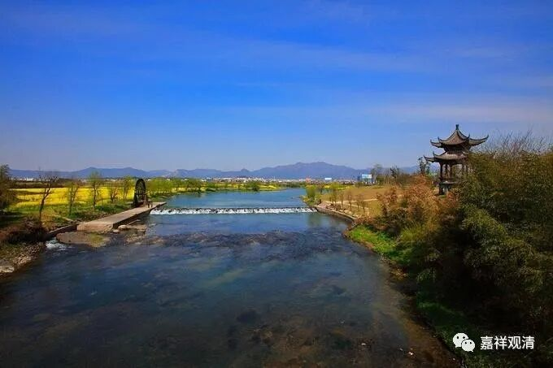

**《微课佛教史》159·2**

其实我们前面没讲，从七佛的心印传下来，禅宗里面的那些七佛传法的偈颂故事，版本都是非常非常接近的。就是每一个人都不太具备原创性，后面那个人传法的偈子和前面那个人传法的偈子差不了多少。

贤劫七佛传法偈

毗婆尸佛

身从无相中受生，犹如幻出诸形象，

幻人心识本来无，罪福皆空无所住。

尸弃佛

起诸善业本是幻，造诸恶业亦是幻，

身如聚沫心如风，幻出无根无实性。

毗舍浮佛

假借四大以为身，心本无生因境有，

前境若无心亦无，罪福如幻起亦灭。

拘留孙佛

见身无实是佛见，了心如幻是佛了，

了得身心本性空，斯人与佛何殊别。

拘那含佛

佛不见身知是佛，若实有知别无佛，

智者能知罪性空，坦然不惧于生死。

迦叶佛

一切众生性清净，从本无生无可灭，

即此身心是幻生，幻化之中无罪福。

释迦牟尼佛

法本法无法，无法法亦法，

今付无法时，法法何曾法。

到了禅宗的后期，如果你要接一个法的话，你至少要会写几首打油诗，你要是做不来偈颂，连死都不让你死，徒弟们会逼着你交卷的。

如果你是一位方丈的话，你到外面去主法的时候经常要晒几首偈子出来。所以说实话，即使中国历史上的学问僧并不是那么多，或者说特别是到了明清的时候僧人的整体素质下降了，但是那些名僧——就是有名的寺院的那些住持，还是必须要有文化的，因为你还得跟社会上层交往，得跟士大夫阶层交往。但是到了清代或者说清末的时候，基本上你只要有点文化，认字稍微多一点，可以写家信，可以当半个或者四分之一个知识分子，当大庙住持就不成问题了。

清末民初，金山寺是当时禅宗的四大丛林（四川宝光寺、扬州高旻寺、镇江金山寺、常州天宁寺），后来太虚法师和他的一个同学——仁山法师，一起“大闹金山寺”。两个人那时也是小年轻，就胆敢在大庭广众之下，在开会的时候说：“金山寺现在有一千几百个和尚，如果有人能够写一封通顺的三百字的家信，我就把脑袋砍下来。”这句话一说出来，金山寺的住持就直接大喊一声：“上去打！”然后就打起来了，好像还死了人。

        修改于