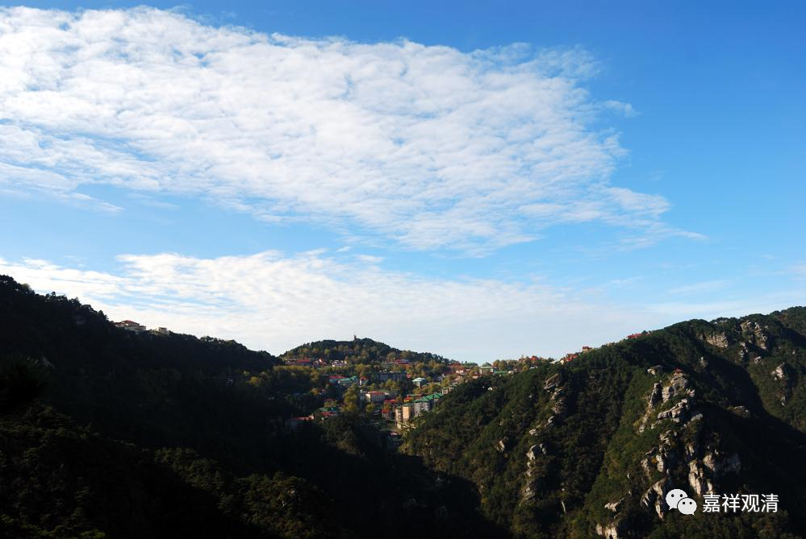

**《微课佛教史》160·3**

禅宗的后期对二祖故事的演绎、解读，我们还是要稍微提一下的。后期的禅宗会专门提到这个事情，说二祖大师也曾经在人群当中练心。但是从历史的角度来说，这种可能性没那么大，为什么呢？这种混迹江湖“借境调心”的情况更有点像宋代的情况，所谓“淫坊酒肆，随处自在，手把猪头，口诵净戒”……

而在二祖所处的那个年代——南北朝时期，那个时候北朝还挺乱的呢，让他混迹于贩夫走卒，“变易仪相，或入諸酒肆，或过于屠门，或习街谈，或随厮役”这类情况出现的可能性不是很大（假如真是这样，律宗大师道宣也不可能给他在《续高僧传》中立传）。所以实际应该发生在宋代的这种“街头高僧”形象、这种故事，可能只是后期出现的（当时是有些人为了搏眼球、选择以另类的方式“出道”）。

但是后期的这种说法实际上又是有所本的。我们已经讲过好几件事情了，就是这些后期的传记可能有点和历史的真相不符，但是在它们的背后都有一些和文字记载有联系的地方。在二祖慧可大师的这个故事当中，联系的地方就是在《续高僧传》当中提到的“可乃纵容（“从容”）顺俗”。

“可乃纵容（“从容”）顺俗”怎么解释呢？我觉得可以有几种解释：一种解释就等于是混迹于江湖，“惹不起我还躲不起嘛我”……还有一种解释就是宋代灯录理解的“变易仪相，或入諸酒肆，或过于屠门，或习街谈，或随厮役”，其实这只是“淫坊酒肆，随处自在，手把猪头，口诵净戒”的另一个版本而已，也就是说，宋人编纂的《灯录》呈现的是宋人脑袋里的“顺俗”，反映的是宋代禅宗的现实，而不是南北朝时期的慧可。

克罗齐说的“一切历史都是当代史”，表现在禅宗史传里也是如此。

好，今天我们就先讲到这里，谢谢大家！

