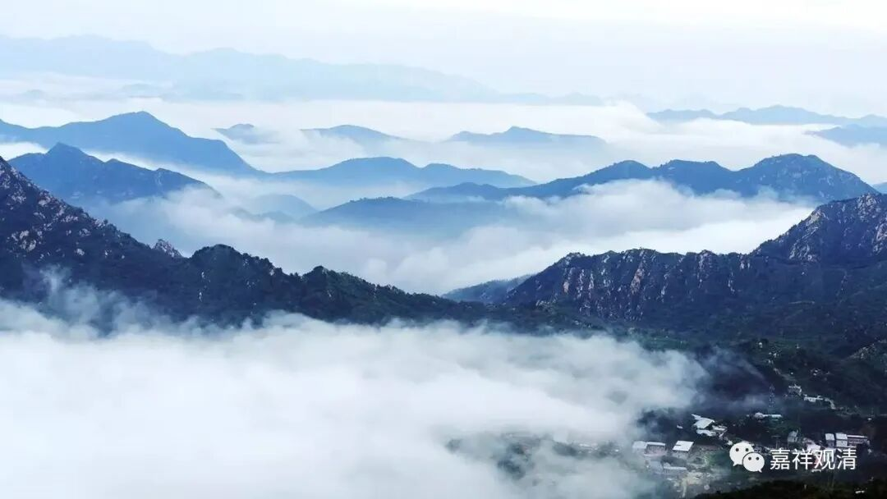

**《微课佛教史》166·1**

好，我们继续科学唯物地讲禅宗史。

大家也听了有一段时间了，不知道听得怎么样哦。现在讲到《坛经》这里，因为正好是在讲六祖大师的故事，就不妨采用他自己的说法。

我们上回书说到，六祖大师到了湖北黄梅的东山，就在那里住下了。过了一段时间——按照《坛经》里面的说法，时间并不长，反正是过了一段时间，弘忍大师就对大家讲了：“你们来的时间也挺长了，光是做一些培福报的事情呢，和解脱也没什么关系。你们都是有水平的人，每个人呈一首偈子上来（偈子就相当于诗，但是不一定要押韵的）。如果写得好呢，你就可以接我的衣钵，你就是下一代的掌门人、祖师（就是第六代祖师），如果我看你是明白的人，是开悟的人，我就把家业交给你啦。好，每个人都回去写吧，不要想半天去写什么文章，这不是写论文。”就这样，弘忍大师就把这个事情安排下去了。

对于这个事情，绝大部分人是怎么想的呢？绝大部分人都说，这个事情跟我们没关系，这个事情肯定是谁的呢？肯定是神秀大师的。因为当时神秀大师在黄梅的东山已经带徒弟了，或者有时候代师父讲经或者传法等等，大家就认定肯定是他了。而且其他人心想：“我们这些人的水平又不够，我们去浪费这些心思干嘛呢，是吧？等到时候神秀大师把他写的偈子一呈，得个法，我们再跟他学习就是了。其实现在我们都已经在跟他学了，大家就不操这个心了。”（大家记住啊，这段算是一个伏笔。）

神秀大师呢，当时的年纪也不轻了，他在想什么呢？他在想：“这个偈子到底是交呢，还是不交呢？如果交了这个偈子，好像显得我就是为了要做祖师一样。但是如果不交这个偈子，大家也不知道水平怎么样，对吧？如果我不交这个偈子（就等于说不交论文，意思差不多），那我的水平到底够不够？老和尚到底肯不肯传法给我？就是他承不承认我的见地呢？这个我也不知道，所以这个偈子我应该要交上去的。但是，我是为了什么呢？对，我是为了求法，不是为了抢祖师的位子。如果现在这样送上去的话，又好像有点为了祖师的位子，好像不太好，怎么办呢？”

他想了很久，不知道怎么办。

最后想到了一个办法：我也不交上去了。我们寺院里正好要作经变画——就相当于我们今天的佛经内容的壁画，既然正好要作壁画，那我就在作壁画的地方把我的偈子誊上去。如果师父说这个写得好，那我就站出来承认说这是我写的；如果师父说写得不好，那我就收拾收拾走人吧，水平太差了，太丢人了……

