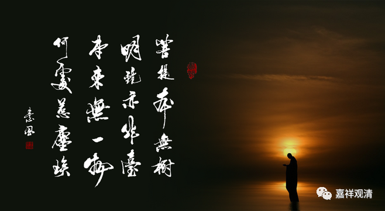

**微课堂佛教史167·1**

其实那个时候神秀大师已经是算是大弟子了，就是他在五祖大师门下代课，都已经开始讲法了。如果再交一篇，写得好的话就是嫡传大弟子了，就有一个正式的说法了，用现在的话来说就是给你传法卷了，不过当时还没有“传法卷”的做法。

那么神秀大师回去以后呢，琢磨了半天，也呈不出或者想不出特别好的偈子来。见地这个东西就是这样，不是可以突击出来的。如果是知识，一般来说我今天看了一本书，我知道了一堆新的知识，那没有问题，但见地这个东西确实很难说，往往是一下子就蹦出来的。很多东西，就是这样，开窍没开窍完全不一样……

举个例子，学武术。有些人，他就没有那个天赋，也没有开窍，那你再多站一个月桩，多练上百个小时拳也没什么大的进步；但是一旦你是有那个天赋，或者某天突然飞花落叶忽地开窍了，那师傅一看就知道，对了！

五祖大师也给其他的一些弟子传话说这首偈子（身是菩提树……）还是不错的，大家可以诵习，可以背出来，学一学，挺好的。于是大家都在背诵这首偈子……之后就有人跑到后院干活的时候也在背诵这首偈子，正好被卢居士听到了——也就是慧能大师，他那个时候还是卢居士。

他听到了以后就问：“哎，你念的这是什么啊？”“哦，我念的这是神秀大师写的偈子，balabala……有这些事情，现在大师说我们念这首偈子的话也可以，按照这个修行的话也可以得些受用。”

那么卢居士就和这个人说：“要不您也带我去看看？我也去这个地方礼拜一下？”然后那人就带他去了写着诗颂的墙壁，去到那里以后，卢居士就说：“您帮我再念一念吧，我不识字。”

我觉得呢，像我们前面讲过的，说他不识字可能有点过……我怀疑会不会是神秀大师写的草书，（或者写的行书、篆书？）是吧？如果像神秀大师这样的风格地位，在当时的背景下，可能是有点像今天的写经体——隶当中带点楷，楷当中带点隶的情况。

反正那人就把卢居士带过去，又给他念了一遍：“身是菩提树，心如明镜台；时时勤拂拭，勿使惹尘埃。”然后卢居士就说：“这个不行，水平不够啊！我也写一个吧。你们谁帮我写一下？”正好这个时候边上有一个士大夫阶层的知识分子，说：“诶？你也能写吗？”卢居士就说：“谁有见地谁写，你就帮我写一下。（差不多是这个意思）”那人说：“好，我帮你写。”

写了什么呢？写了——

“菩提本无树，

明镜亦非台。

本来无一物，

何处惹尘埃！”

！！！

（这首偈子其实有两个版本，在敦煌本当中也有两个版本：有一个是“本来无一物，何处惹尘埃”；还有一个是“佛性常清净，何处惹尘埃”。）

