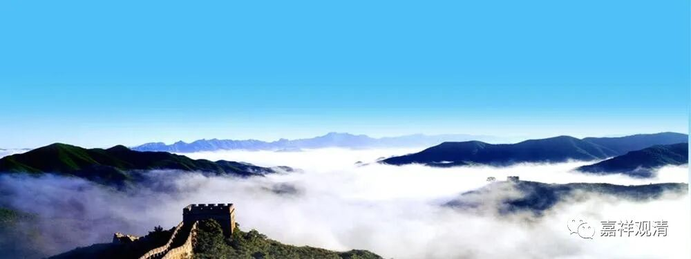

**《微课佛教史》167·2**

这首偈子一出，大家就轰动了。其实就一般人而言，也可以看得出来，后面那首的境界要比前面的高。后面那首，就是卢居士写的，确实是境界的表达。前面的这首呢，它还是一般的修行，在见地方面谈不上什么特别的。

当然，我们不知道原来的情况到底怎么样，但是仅就这个故事而言，后面这个偈子的境界确实比前面的境界要高，甚至可以说这两个偈子完全是两个层次的，高一点可能都不止。

但是，这个偈子表达的内容一定正确吗？——这就需要师父出场了！

有个净人（准备出家的人）又做了诗这个事情这就被大家传开了，五祖大师马上知道了，他亲自过来看，看了以后呢，就用鞋子把这首（“本来无一物”）偈子给擦掉了，还说了一句什么话呢？他说：“此亦未见性！”意思说这个偈子也没见性，就把它擦了。（一般人认为这是为了保护六祖大师才这么做的。）那么，这个五祖大师下的定论“此亦未见性”说法有没有道理呢？有道理！

我估计今天整个事情全部是讲不完的，我们先把它整理一下。这个偈子——“菩提本无树，明镜亦非台。本来无一物，何处惹尘埃”，有没有问题呢？我们讲，五祖大师并没说错——“亦未见性”，这个偈子是有问题的！

“本来无一物”，如果单纯按照文字来理解，至少从文字面上来讲的话，这个其实是落空的。如果说按照另外一个版本，是“佛性常清净”，那就变成有了，是伐？一般来说，大家总觉得五祖大师这么说是为了要保护六祖大师。但是，我们可以顺着五祖大师的意思，理解为“本来无一物”这个是落空的。

为什么呢？大家想一想，一直要到后面，五祖大师给六祖大师在房间里面讲课的时候，讲了《金刚经》以后，六祖大师才开悟的。“何期自性，本自具足，何期自性，能生万法……”直到这个时候才开悟的。前面写这个“本来无一物”偈子的时候，他还没有开悟呢。

那六祖这是什么呢？他是呈一个偈子！还记得吗，我在前面买了一个伏笔……

