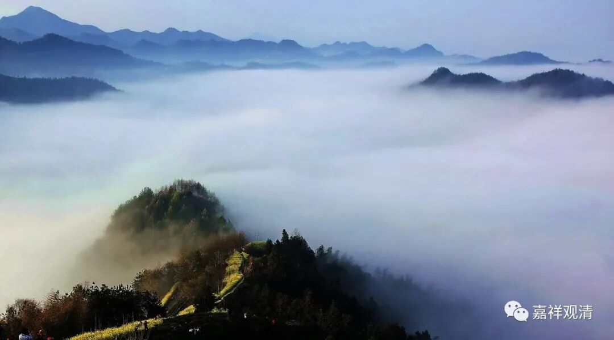

**《微课佛教史》169·1**

好，我们继续科学地讲佛教史。

现在讲到禅宗史，讲到中国禅宗最重要的一位人物——六祖大师，关于他的故事基本上在《坛经》里面都有，所以我们就照着《坛经》来讲。但是，我们之前也已经提过，《坛经》其实是有好几个版本的，敦煌里面有个法宝本，对吧？后期又有什么宗宝本，其实后期的和前期的已经发生了很大的变化。哪怕都是前期的，在中唐时期就已经有些祖师（南阳慧忠？）说“把他禅宗主旨更换”，那么也是有人觉得这里面有问题的。我们反正有空，那就每天聊一点，看看哪里有问题的，正好拿出来聊一聊。

前面我们讲到五祖大师送六祖大师下山，渡他到九江。这个故事是后来才出现的，在宋代的《坛经》版本当中开始出现的，而在敦煌本的《法宝坛经》当中是没有这一段的。

这一段是不合常理的，是不太可能的事情，一晚上就从黄梅到了九江，而且还是三更天以后，那就等于是四个小时就从现在的五祖寺都过江到了九江。哪怕放在今天，晚上开车都有点困难啊。这个实在是有点……不能叫搞笑，只能说编撰的人地理知识不太丰富。这一段是在敦煌本里面没有的。

前面我们还讲过，五祖大师晚上给六祖大师讲课，用袈裟把门窗遮起来，对吧？这种细节在早先的敦煌版本的《坛经》当中都是没有的。还有什么有人给他十两银子把母亲给安顿好，这些全都是后面加出来的。有时候看到这些好事者真的很麻烦，他们觉得不太合理就擅自往里面添东西，其实根本不需要的。

那么《六祖坛经》的敦煌本还挺平实的，就说六祖大师晚上到五祖大师那里去学习，听闻《金刚经》，然后“言下大悟”，也没有说“何期自性，本自具足……”这些词，都没有的。要是说他不认识字的话，那“何期自性，本自具足……”这些也不是一个不认识字的人能够说得出来的啊。后面也是一样，他能够道什么“无相颂”、“三十六对法”等等，应该不是完全不识字的啊。

有一个很有趣的现象，后期出现的六祖部分故事和玄奘法师的事迹有重叠，比如玄奘法师跟人学正量部经论的时候曾经是晚上遮住门窗，而“如人饮水，冷暖自知”这个故事，也有套在玄奘法师头上的——两位大师的传记被后人在记忆中重构了……

