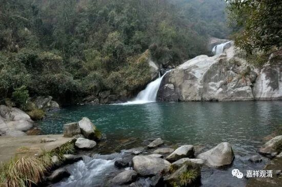

**《微课佛教史》172·1**

好，上次我们讲到过慧能大师在印宗法师座下出家受戒，这个故事应该是有原型的，但是把这个故事放到《坛经》里面，应该是比较后面的事情。

慧能大师出家了以后呢，他就去了一个地方。大家知道现在禅宗又被称为叫什么吗？“又有问如何是‘曹溪一滴水’”，对吧？慧能大师是去了曹溪——曹操的曹，溪水的溪。昨天我在公众号推送的那篇文章里面也提到了，韩国的禅宗叫什么呢？就叫“曹溪宗”。慧能大师就去了曹溪的一个寺院，当时叫宝林寺，现在叫南华寺。

南华寺具体在哪里呢？在广东的韶关，广州北面，靠近江西和广东的交界处。广东人都到那儿去上香，他们还有个说法，我当时听了也觉得很有趣。说“为什么广东人都要去韶关烧香呢？”因为他们说：“上香，上香，就是要往上面跑，哪有往下面跑的？”因为韶关在北边，而且南华寺又是在山上，所以要到南华寺去上香。

南华寺在广东的名气很大，还有就是六祖大师的原因，因为六祖大师的真身也在那里，全身都在那里，这个事情后面再讲。

那么六祖大师就到了韶关曹溪的宝林寺，所以大家如果看到禅宗语录里面和曹溪有关的内容就知道了，就是讲的今天的南华寺。其实六祖大师到了曹溪以后，未见得是住在寺院里的，可能就是住在山里面。他是一个禅师嘛，还是大家跟着他去修禅的可能性比较大。

广东还有一个很搞笑的事情，反正我就在这里讲一讲，大家知道就可以了。估计文字稿整理出来以后，我也会保留的，反正我是不怕得罪人的。现在广东出现了一个很有趣的寺院，叫作六祖寺，这是抢市场抢得有点过分了啊！大家一听六祖寺，就觉得应该是六祖大师在那里，其实这个寺院跟六祖大师一点关系都没有，只是觉得六祖这个名气比较响，就挂了这个名字。他们方丈私下里跟yh法师说，“因为寺院在广东，六祖大师就可能来过嘛，所以就叫六祖寺”……这都是根本没有的事情，莫名其妙的。

