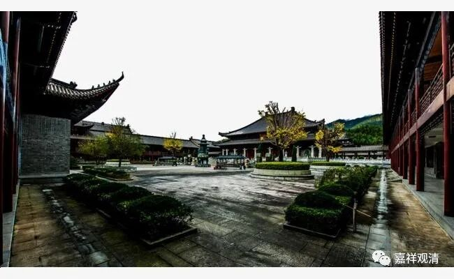

**《集论选讲》005·2**

从清辨论师开始，他作为中观派的代表人物，而安慧论师作为唯识派的代表人物，大乘这两大宗派的名字就彻底地确立了。也就是说，在此之前有《中论》，也有“中观”，但是“中观派”这个名词还没有出现。（唯识派的情况我不是很清楚，但估计也是这样。）

也就是说，“中观”这个词是出现过的（之前是被龙树菩萨使用过），但是那个时候还没有出现“中观派”这个词。一直要到清辨论师的时候才出现了“中观派”这个词，同时“唯识派”这个词应该也是在出现在相对应的安慧论师的时期。所以说安慧论师是一位很重要的唯识派代表人物。

在中国目前所保留的翻译的文献当中，有大量的唯识作品是署名坚慧论师或者安慧论师的，但是在藏传的有些地方却是署名无著论师的，这是有原因的。

在《南海寄归内法传》当中，义净法师就谈到过这个问题。比如说无著论师的“无著之理穷八支”（如果我没记错的话），意思是说无著论师著有八部论典，但实际上这些作品当中不都是无著论师的作品。由于无著论师是唯识系当中比较重要的一位人物，那么大家都公推作者为无著论师。

再比如后来的《入菩萨行论》，在汉地翻译的时候也说这部论著的作者是龙树菩萨，是吧？实际上作者是寂天菩萨。由于这部论典是属于中观系的，大家就公推龙树菩萨，所以后来就变成作者是龙树菩萨了。再加上印度本身的历史记载又不太清楚，往往就会出现后人的作品被冠以先人的名字，这种情况在印度属于很正常。

其实这个问题一直到藏地后期，甚至到现在都还存在，就是后人在增补前人的著作的时候，根本不进行说明，不打招呼的。举个例子，可能我师父的作品他只写了两页，我拿过来一看，觉得这部作品真的不错，但是有些地方可能我要给予注解。然后我自己就写了二十页，最后发表的时候我直接就说这是我师父的作品，就这样出版了。这种情况在印度和藏地都是很常见的，一直到现在还存在这种情况。

我们汉地的情况要稍微好一点，不是说完全没有，也有这种现象（比如说《列子》、《庄子·外篇》等等），不过相比印度没那么严重。在印度和藏地这种现象太常见了，所以就造成著作权、署名权经常不清晰，这也造成了一定的历史回溯的困难。

如果说单纯只看义理，而不看是谁的义理的话，作者问题可能并不大。但是真的要去追究著作权的话，就会大量地出现这种著作权不清晰的情况。我们也碰到过这种事情，就是给你第一稿的时候和最后给你定稿的时候，已经完全不是同一本书了，但是作者还是一百年前那个人。哈哈，现在还有这种情况哦。

应该说，藏地也不是没有人注意到这个事情。比如喜饶嘉措大师那个时候他就直接改正了，因为他在当时的佛教界是属于数一数二的人物。我曾经问过我的师父，他说喜饶嘉措大师在当时差不多可以排第二、第三的样子，是一位实力非常强的大师。那个时候是请他来校勘《大藏经》的，而他的习惯就是西藏的习惯——觉得不对的地方就直接改掉了。

改了以后呢，让他校勘《大藏经》的这位老大（大家都知道是谁）就不满意了，也更厉害，直接把他关起来了，略示薄惩，说是让他消消业——“你的胆子太大了！”……实际也正是说明，这种现象是常见的。所以，实际从文献整理的角度来说，藏地一直没有出现独立的版本学、校勘学，现在可以说刚刚又有了一点萌芽。版本和校勘，到现在都是天竺和藏地佛教研究的两块短板……

