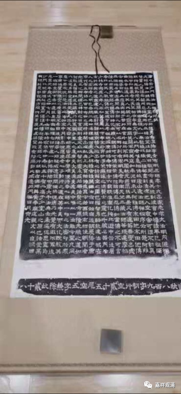

**《微课堂佛教史》173·1**

好，今天我们继续。

我刚刚发了一张图，这是一块碑文的拓片。

这个拓片是哪里来的呢？是少林寺的。这块碑文也是非常重要的，是在禅宗史上非常重要的一块碑，是什么内容呢？是《唐中岳沙门释法如禅师行状》。这位法如禅师，他的老师是谁呢？就是五祖弘忍大师。

我们看碑文的第八行， “南天竺三藏法师菩提达摩绍隆此宗”，这个“此宗”，就是指禅宗，是吧？“武步东邻之国，传曰神话幽迹。入魏传可”，到了北魏传给慧可禅师。“可传粲”，就是僧璨法师，这个“粲”也不是后来的那个“璨”。“粲传信”，“信”就是道信禅师。“信传忍”，这个“忍”是弘忍禅师。“忍传如”，这个“如”就是法如禅师。这里面也没有专门提到六祖大师。

昨天我们讲了，今天我们讲到六祖差不多就是指慧能大师一个人，但是在当年，包括这位法如禅师也曾经被追封为六祖，就是后人追认他为六祖。还有谁呢？还有我们上次讲到的北宗的神秀大师，他也被追认为六祖。

六祖以后呢，就是要定七祖，其实历史的现实是先定下“七祖”，然后再定“六祖”的。就是你把第七个祖师定了，那么第六个就定了。第七个是普寂禅师，是吧？普寂禅师定了以后，就定了前面两位祖师---法如禅师和北宗的神秀大师。一直到菏泽神会禅师把慧能大师的六祖的名位定下来之后，等到他圆寂以后，他就变成七祖了，是吧？

这种事情我们现在还有人在做，近代也有人在，某某大师就一下子把某某宗的祖师从一祖一直“封”到十二祖，那么接下去他自己就不得不成为十三祖了，是吧？其实这几代祖师前后之间根本都没什么关系，是吧？大家有本事也是可以去抢个祖师来当当。中国人很有祖师情结的。

