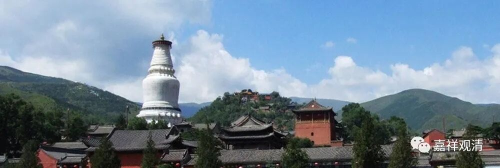

**《微课佛教史》173·2**

比如说我们今天看到的这个《唐中岳沙门释法如禅师行状》，也是专门刻碑的。大家要知道，刻碑是什么意思呢？除了墓志铭等等是要刻碑的，刻碑还有一个意思就是把这个事情固定下来，相当于是官方文件。那么，刻碑的时候要找谁呢？为了让这个碑的可信度强或者传抄度强，就要找名人，找当时的大官或者大书法家。其实我们现在和以前也差不多，要找重要的文人来写，一般的文人恐怕还不行。

后来六祖慧能大师的弟子是找了谁给他写碑呢？找了很多很重要的名人。王维（王摩诘）给六祖大师写过《六祖能禅师碑铭》，柳宗元也给六祖大师写过碑，他写的是《赐谥大鉴禅师碑》。我看看还有谁，哦，还有兵部侍郎宋鼎也为六祖大师作了《唐曹溪能大师碑》。

那时候南宗和北宗都在各自修订宗谱，北宗开始修订祖师是哪几代，是哪几个人，南宗的菏泽神会大师也在做这个事情。其实南宗在野的一些其他人没太把这个当回事儿，菏泽神会大师在这方面出力比较大。北宗呢，也是大力在做这个事情。

南北的情况也基本上可以分得出来，慧能大师在广东，肯定算是南了，对吧？在以前的话差不多算是边地了，我们前面讲过的大庾岭，你要翻越的话也不是那么容易啦。不过以前这条路，也算是中国古代比较重要的商路了。从江西的赣江一直上去，然后翻越大庾岭到达广东，这也是当时比较重要的一条商路。

所以你们看，说实话江西对禅宗是蛮重要的，一方面江西本身是南北走向的，另一方面在以前来说江西属于交通要道。比如说洪州禅，是谁呢？马祖道一禅师。洪州在哪里呢？南昌。所以洪州禅也是在江西。再比如百丈怀海禅师，百丈山也在江西。所以有一种说法，说什么呢？禅宗主要集中在江西和两湖——湖北、湖南。我们现在看禅宗的大寺院、大祖师，确实早期在这一带的人比较多一点。

如果从佛教人文地理上来说，这也是很有特色的。像三论宗和唯识宗，一开始占据的是大城市，但是禅宗呢，你们看，主要集中在江西和湖北，那里有什么特色呢？都是一些丘陵。江西的革命老区都是在山里面，湖北的黄梅也是在山里面，还有百丈山……

应该说，“江湖”一带对于禅修的人驻山比较方便。但是在北边呢，冬天太冷……说实话北方的冬天是很冷的，在古代住在山里面会比较麻烦一点，是吧？稍微南方一点的地方，在山里面相对来说比较容易一点。

另外，你驻山禅修的话还有很重要的一点，就是要有水源。我以前曾经在九华山的后山待过，也和他们驻山的人专门聊过，他们住山的位置，和水源有关。我自己当时也看了一些《美军野外生存手册》、《特种部队野外生存手册》等等，讲了野外生存需要的一些知识……你们现在到我们图书馆去看，还有几本书呢，都是当时专门买的。

