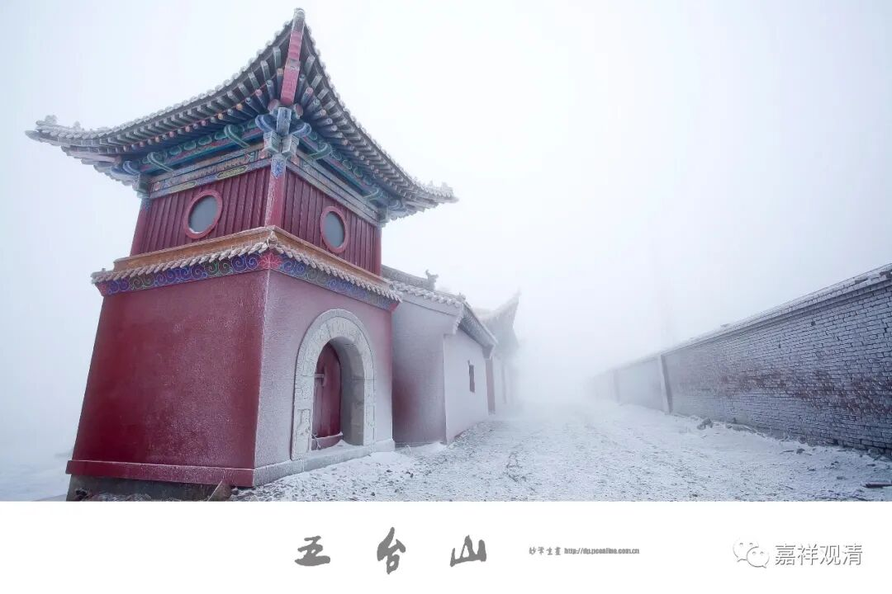

**《集论选讲》006·2**

我们来看《集论》的译者，“大唐三藏法师玄奘奉诏译”。玄奘法师，我们还用多谈吗？在整个中国佛教界，大家对玄奘法师应该是没问题，都应该了解的。不过，好像这还真难讲呢，可能现在知道玄奘法师的人稍微多一点了。

我想起宝僧法师的那个故事了。当年宝僧法师去申请奖学金的时候，别人没理他。他说：“我去学因明。”人家照旧不理他。他又说：“我是去学习玄奘法师翻译的论著。”人家仍然不理他。最后他说：“我是去学习唐三藏的译作。”人家就听懂了，拨了若干万元给他学习。可见“玄奘法师”的名气不够，还是“唐三藏”的名气更响啊！那还是一个专业的什么佛教慈善基金会呢，居然连玄奘法师都不知道，也挺丢人的，可能是办事员水平不够啊。

现在我们一讲唐三藏，大家就知道是谁了。不过《西游记》小说里面的唐三藏是很懦弱的，而实际的唐三藏——玄奘法师是一个非常坚强的人。如果他不是那么坚强，那么远的路他不可能走得过去，这是需要非常强大的心理建设。

接下来，“奉诏译”，说明这是皇帝让他翻译的。这有点像什么呢？有点像皇帝是出钱、出资源的老大，然后建立了一个国家译场。这是一个正式的国家机构，而且是一个面子工程，由国家译场去开展佛经的翻译工作。在宋以后，这个面子工程就不再担当翻译的任务了，而是刻印《大藏经》。

每个朝代的政局稳定以后，就开展了这方面的国家工程。在唐代的时候主要是翻译佛经，宋代也有译经院进行翻译，但宋代这个时候是最早开始刻印《大藏经》的，宋代的《开宝藏》，是吧？

宋代自己刻印了之后，再分赐给其他地方，然后契丹也开始了，刻印了《契丹藏》，也被称为《辽藏》。后来金朝或者金国也刻印了《赵城金藏》，是吧？一开始是民间的，最后把它官方化了，就变成了《金藏》。当时的朝鲜——高丽也有《高丽藏》，包括后来的再雕本。后期的日本也开始出现了好几部藏经……这些就变成了国家形象工程。

现在发现元代也有官版藏经，就是《元官藏》。以前是不知道的，这几十年来也发现了，元代也有它的官藏——《元官藏》。

明代也是一样，在建文帝的时候就已经开始印藏经了，就是《建文南藏》。现在市面上印的都叫《洪武南藏》，实际上应该是《建文南藏》。本来《建文南藏》完成以后，早期的刻藏可以结束了，但是由于永乐帝这个皇位来得有点不太正（相关的其他故事我就不讲了啊），所以他为了证明自己的正统身份，自然得否认建文帝的正统身份，所以他就把《建文南藏》当中的“建文”两个字给挖掉了……所以“建文藏”就变成了“洪武藏”……

