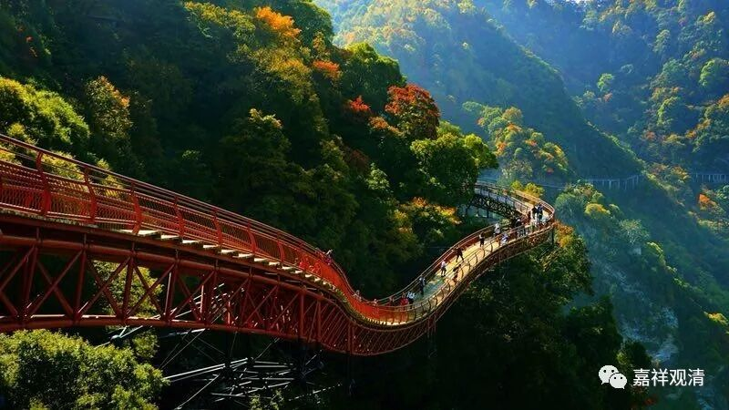

**《微课佛教史》174·1**

就是如果要在野外生存的话，那你肯定要考虑水源的问题。在北方呢，水源的问题是有点困难的，不太容易解决。而南方的话，相对来说更容易解决。

当然有时候有些地方也会有问题，比如说我们以前在九华山的那一年就特别干旱。我们白云寺在莲花山上也是一样，在特别干旱的时候确实会有问题。但是一般来说，在南方的山上，水的问题不是那么严重。以前的人是不用抽水马桶的，所以对水的要求就是，有水源就可以了。那么在南方这一点会比较容易，相对来说在北方就可能真的要严格地“逐水而居”了。

我们前面讲过，禅宗是属于“行门”，与此相对应的则是“教下”。教下的弘法就需要在经济发达的地区，佛经和各种书籍的抄写、印刷、流通都要比较顺畅，所以它基本上是在大城市发展的。而禅宗呢？则离开大城市去到农村，然后农村包围城市。你们看毛主席当年就是农村包围城市……

其实在我们佛教里面也是这样的。从城市出发的，基本上都失败了，比如三论宗和唯识宗，都是从城市出发的，都失败了。天台宗呢，本来是城市中出现的（但是它的基因当中也有住山的部分），因此它在四明山（在宁波的南面）、天台山等地能够保留下来。所以说呢，佛教也是需要农村包围城市的。那些以精英佛教为基础的宗派，比如说三论宗（就是中观宗）、唯识宗（法相宗）等等，用今天的话来说，就是它们所需要的社会资源会比较多，而以农村为背景的佛教宗派不需要消耗那么多的社会资源就可以活下来。

这块碑文的拓片（“法如禅师碑”）是我两三年前专门收藏的，因为听说过这块碑文蛮重要的，就收藏了这样一块禅宗史上很重要的拓片。它的字体应该说是隶书当中带点楷书、楷书当中带点隶书的感觉，或者你说就是隶书也可以，反正隶书的味道很浓。实际上书法在时代呈现上有一种滞后性，这是相对于它所处的时代来说的。

那么我们在读这块碑文的时候就可以读到一种（新的）情况，这个情况至少在书写这块碑文的时候就已经出现了，是什么情况呢？碑文里面说达摩祖师“入魏传可，可传粲，粲传信，信传忍，忍传如”，明确了一代只传一个。而如果我们看《续高僧传》的话，它完全不是这么写的，是吧？达摩祖师有好几个弟子，慧可大师也有好几个弟子，名气都不是很响，但都不是说一代传一个的。但是我们可以看到，到了法如禅师这个时候，或者说给法如禅师写行状的这个时候，大家已经开始争地位了，都是很明显地写着一代只传一人。宗派的实力上去了，祖师地位的附加值起来了……

