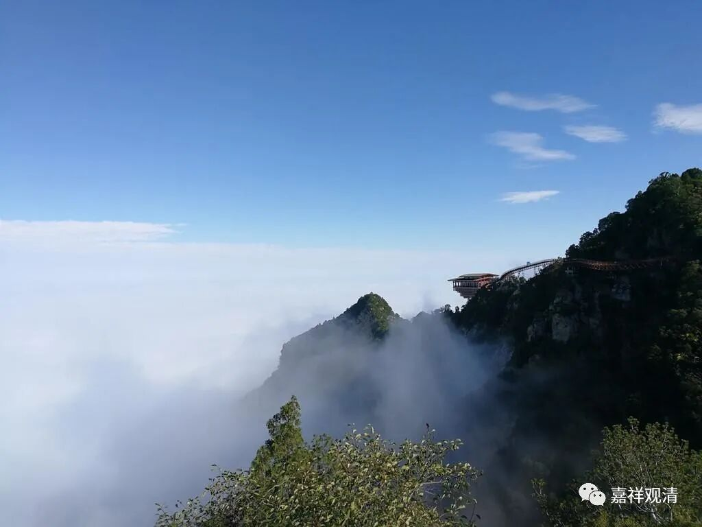

**《集论》讲记·007·1**

随后永乐帝就自己刻印了两部藏经：一个是《永乐南藏》，一个是《永乐北藏》。他也是企图通过这个国家工程来证明自己的地位是正统的，同时,把《建文藏》当中的“建文”两个字挖掉、不让《建文藏》流行，就等于是在否定建文帝的正统身份。

到了清代的时候也是一样，等到政局安定下来以后，雍正皇帝当政的这个时候就开始刻印《龙藏》了，现在被称为《乾隆藏》。始刻的时间是雍正十一年，完成的时候是在乾隆时期，所以我们今天称之为《乾隆藏》。

我们可以看到，在后期的时候就是以刻印藏经作为国家工程的主要内容，而早期的国家工程是翻译藏经或者翻译经典，相当于国家的译经院，那么后期就相当于国家的印经院。这两种不同的国家工程，都是一个面子工程，都是皇帝为了要证明自己所获得的皇位的正统性。

很有趣吧，中国皇帝的“正统性”要借国家大型宗教活动（译经、刻经）来给自己背书、赋能（从北朝至大唐，甚至到辽金时期，还有一个证明自己是“天选之子”的方式，就是造“等身佛像”……这个问题太劲爆，私下讨论即可），这种方式虽不是唯一的“证明”，但绝对是打击政治对手的一件武器——“我做成了，所以，该我执政！”

玄奘法师是参与了唐代早期的译场。在唐代以前，在姚秦的时候鸠摩罗什法师也是参加了当时的一个国家译场，是吧？包括在玄奘法师以后，义净三藏法师、实叉难陀法师等等，都是参加了由国家来牵头的大译场。但是呢，这一类的国家译场也有点“一期一会”的意思，一个大译场就依靠一位高水平的大译师，如果译经做得比较好的，就做一段时间，如果这位大师圆寂了或者有其他事情了，那这个译场的工程基本上就停止了。

玄奘法师圆寂以后呢，这项译经的工程事情也就停止了（因为，王朝最初的第一二代以后，皇家再支持译经的意义已经不大）。当然这里面还有一个问题，因为玄奘法师的译场在后来其实是涉及了一些和政治有关的瓜葛，玄奘法师在他的晚年“站错队”了，所以他圆寂以后，他的译场也就停止了，和政治因素也有点关系，这个问题我们就不发挥了。

武后执政乃至武周开创，译经的意义又出现了……

