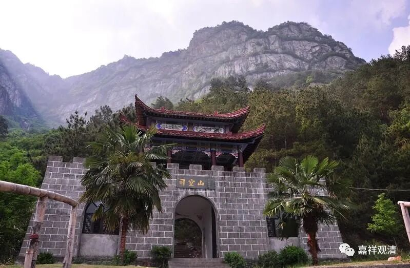

**《微课佛教史》175·2**

在《楞伽师资记》当中说僧璨禅师是在哪里呢？在思空山。《楞伽师资记》里面用的字是思维的“思”，而现在我们一般都说司空山——司马懿的那个“司”。这个主要是和道信禅师的故事有关，因为说道信禅师碰到他的两位老师是在司空山，是吧？但是《道信禅师传》里面并没有提到他老师的名字。而在《楞伽师资记》和法如禅师的碑文当中都提到了他的名字叫粲禅师，后来被称为僧璨禅师（另一位，禅宗后来的传记中说是宝志禅师）。在禅宗的祖师排位里面说他是第三祖，那么在《楞伽师资记》里面是排在第四，因为前面多了个求那跋陀罗译师。

《楞伽师资记》当中排第五位的是湖北双峰山的道信禅师，他也是楞伽师，这里面关于他的一些内容我们就不讲了。

第六位就是通常我们讲的五祖大师，这里说也被称为双峰山幽居寺大师弘忍。今天我们是讲叫“东山法门”，是吧？说弘忍大师是在东山，为什么呢？他早先是在双峰山学习的，是吧？后来双峰山的人实在太多了，他就跑到双峰山的东面——现在我们称之为东山，在那里又建了一个寺院，或者说又带着大众修习，所以我们今天讲是“东山法门”，在这本书里面叫双峰山幽居寺大师弘忍。

弘忍大师在禅宗当中是五祖，对吧？在《楞伽师资记》当中是把他排在第六位的。那么实际上也可以称得上五祖，因为求那跋陀罗译师和菩提达摩祖师应该是没有直接的师承关系，或者说在《楞伽师资记》当中看不到他们之间有特别的师承关系。当然，也有人考证说是有师承关系的，但我们一般都认为没有，在《楞伽师资记》当中也没有看见他们有直接的师承关系。

接下来六祖是谁呢？就是自达摩祖师以下的第六代祖师，在《楞伽师资记》当中记载的是谁呢？是神秀大师，而不是慧能大师。其实在这本书里面他提到了弘忍禅师说过“后传吾道者，只可十耳”，意思是说将来差不多有十个人传我的法。这里的“可”字呢，可以理解为只有的意思，也可以解释为差不多的意思，但是很多人就按照“只有”十个人来理解了，其实应该理解为“十个左右”。

