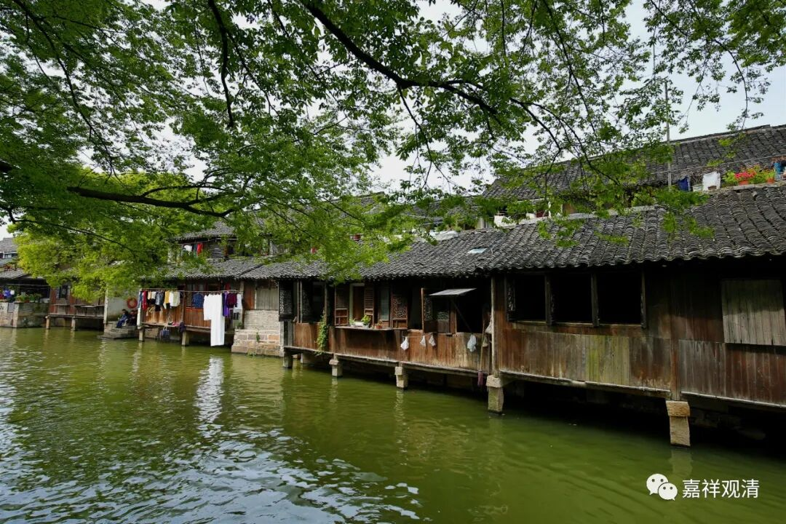

**《微课佛教史》176·2**

在《楞伽师资记》当中就提到了第七代是神秀大师、玄赜禅师和老安禅师，因为这里面楞伽师资是从求那跋陀罗译师开始算的。

那么，第八代主要是谁呢？基本上写的就是神秀大师的门下，所以《楞伽师资记》应该就是神秀大师门下的。第八代首推普济禅师，他在当时是被称为“第七祖”的，就是早期的六祖是神秀大师，七祖就是普济禅师。神秀大师的门下除了普济禅师呢，还有：敬贤禅师——尊敬的敬，圣贤的贤；义福禅师——一点一撇一捺的那个义，福德的福；惠福禅师——恩惠的惠，福德的福。《楞伽师资记》里面的第八代实际上是禅宗的第七代，或者说是自达摩祖师往下传的第七代，就是上面说的这些人。

实际上神秀大师和普济禅师是最早被朝廷认证、江湖上传为禅宗第六、第七代的，而慧能大师被封为“六祖”则应该是更晚一点。这里面有几个原因：一方面呢，慧能大师的年纪比较轻。前面我们讲过的，就是神秀大师在五祖弘忍大师门下的时候，他的年纪算是相对来说比较大的。而慧能大师去到湖北去到东山的时候，年纪还很轻，后来又过了五年或者十五年再出家的，那个时候也不过才三十岁。所以他出名的时候相对来说年纪还比较轻，出名也比较晚。而菏泽神会大师在六祖大师门下又是比较年轻的，所以他出面去争第六代、第七代的地位的时候呢，实际上已经很晚了。虽然说起来大家都是在争第六、第七代，但实际上这两个第七代之间有可能要差几十年，反正差了好久了。

虽然大家都受到了皇室的册封，但是荷泽神会大师受皇室瞩目还是比较晚的。既然你受到追捧比较晚，那你获得的资源肯定是比对方更有利，或者说你翻盘的可能性就更大——这就是后发优势。所以我们说有时候是谁笑到最后，谁笑得最好，是吧？我记得我以前高中的班主任老师曾经给我们讲过这句话：“谁笑到最后，谁笑得最好！”

那么慧能大师呢，一开始他在宗教界虽然有名，但是并没有** 那么地**有名。后来是依靠他的小弟子荷泽神会大师帮他打出了名气，这一把就站住了。神会大师帮他站住以后，就足够了，因为最终帮六祖大师打名气的，其实不是神会大师，而是我们后面要讲的“石头禅”“洪州禅”——石头希迁禅师、马祖道一禅师。洪州就是南昌，不过马祖道一禅师不是南昌人，他好像是四川人，后来到了南昌。

好，今天先讲到这里，谢谢大家！

