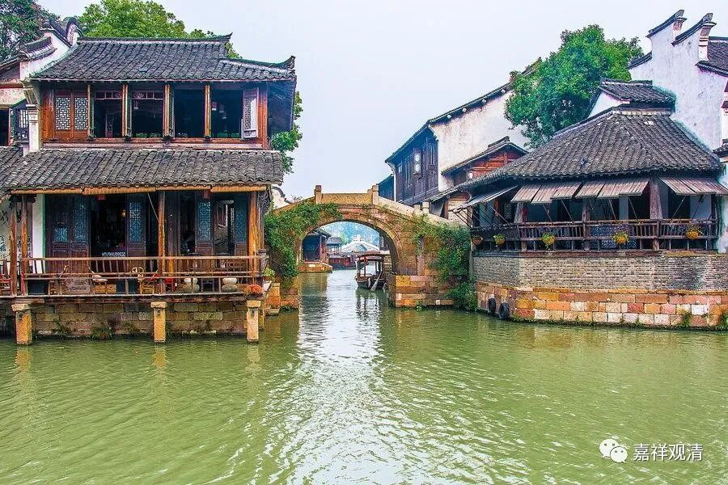

**《微课佛教史》177·1**

好，我们继续禅宗的历史。

关于六祖大师的历史基本上都讲完了，最后就只剩下他圆寂时候的故事了。我们之前讲过，实际上在弘忍大师的门下，六祖大师的年纪应该算是比较轻的，那么弘忍大师门下年纪比较大的或者说比较成熟的弟子是谁呢？是神秀大师。据有些说法，神秀大师到弘忍大师的门下拜师的时候已经五十岁了，不过他的寿命确实很长，都活了一百多岁了。那我们今天就讲一下神秀大师的故事。

神秀大师俗家姓李，“今东京尉氏人也”，尉是尉迟的尉，氏是氏族的氏。“尉氏”这个地方在河南，说起来和玄奘法师差不多可以算同乡，玄奘法师是在洛阳附近的偃师县。（现在的尉氏县是属于开封市。网上说这里的“今东京”，是说写《宋高僧传》的时候，宋朝的东京是开封。）神秀大师就是尉氏人，所以说他就是属于中原地带的人。而慧能大师是在韶阳，对吧？韶山的南面。所以后来有“南能北秀”这样的称谓，原因也在此，对吧？南北，兼有代表人的地域属性和弘化区域。

说到韶阳，大家要知道，山和水的阳面和阴面是不一样的。简单来说，阳就是太阳光可以照到的地方。因为中国是在北半球，所以山的阳面就是指山的南面，而水的阳面就是指水的北边。比如说我们以古代的淮河为例，淮阴就一定是在淮河的南面，如果有淮阳这个地方，那就是在淮河的北边。再比如襄阳这个地方，如果是根据襄水来表达的话，它就是在襄水的北边，如果是有襄山的话，它一定是在襄山的南边。所以说慧能大师在韶阳，就是在韶山的南边。

那么神秀大师呢，是“东京”人，就是今天的开封。我们还需要先补充一下当时的政治环境，大致讲一讲。在神秀大师的同乡当中，有一些和他年龄相仿的在当时都有做到宰相这一级别的官员，所以这也是后来为什么他能够受到皇家的推崇，这和上层当中他的同乡官员也有关系。

后来神秀大师就来到了湖北的东山，跟随弘忍大师学禅。在学习那之前他的学问也是很不错的，说他“少览经史，博综多闻”，然后“既而奋志出尘，剃染受法”。所以说，他在家的时候是有点学问的，因此才出家的，所以他的风格和慧能大师肯定是不一样的。

