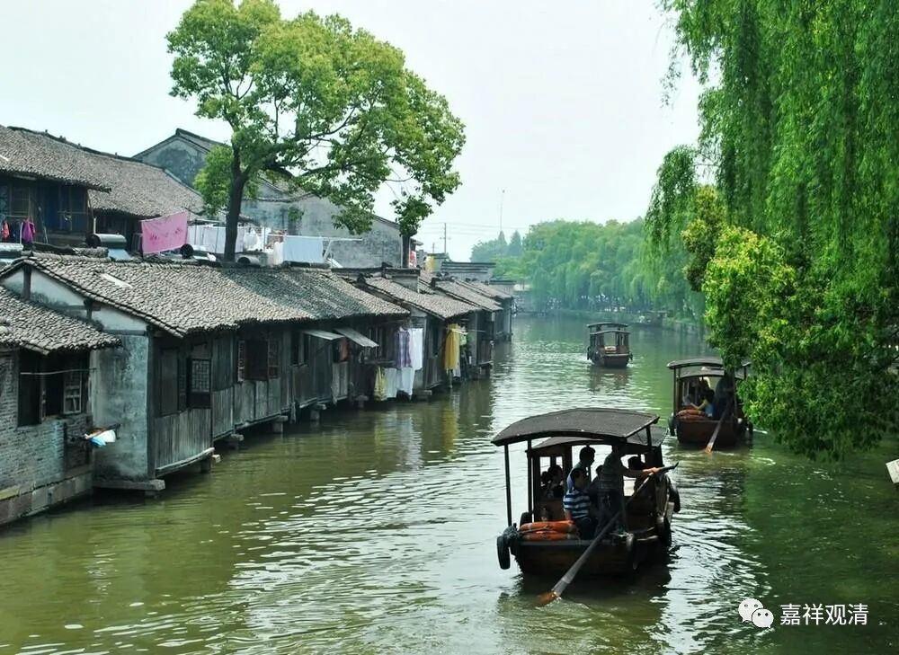

**《微课佛教史》177·2**

我们前两天讲了，即便慧能大师很有可能并不是我们所认为的那种文盲，但是要和神秀大师比起来，可能在文化方面还是欠缺一点的。所以他们两位在文化方面的差异就造成了禅风也不一样，这是有可能的，看起来好像是一个必然的现象。

还有一种说法，说神秀大师五十岁才来到弘忍大师的门下，在此之前肯定是已经学习了不少东西，到弘忍大师这里应该是来专门禅修的。实际上在弘忍大师的门下，他是挺器重神秀大师的。

这个情况很正常，因为总的来讲，当时的出家人虽然多，但是真正能够成为人才的其实并不那么多，至少不是像我们所想象的那么多，一千多个人当中能够出几个人才已经很不错了，而且这位神秀大师又是本身就具备了一定的素质。应该怎么说呢？弘忍大师还很明确地对他说：“吾度人多矣，”意思是我手下的弟子还是不少的，我度人很多。“至于悬解圆照，无先汝者。”这是夸奖的话了，总之就是在学修方面没有能够超过你的。当然，每位弟子给自己师父写的传记都肯定是很好的，反正都是夸奖的话，即使在《坛经》当中也会很明显地提到，那也是自己弟子给师父写的……

弘忍大师去世了以后呢，神秀大师就去了当阳的玉泉山。大家要知道，玉泉山在中国历史上是非常重要的一个地方，我这里还有一本《玉泉山志》呢。这个地方极其重要，有好几个宗派都和玉泉山有关，还和谁有关呢？和关羽有关。

我们就来讲讲关羽的故事吧。在《三国演义》里面就讲，关羽被杀了以后仍然魂魄不散，到处游荡，大呼“还我头来！还我头来……”最后，来到了玉泉山，因为是在荆州附近，然后就遇到了一位叫普静的老和尚……

