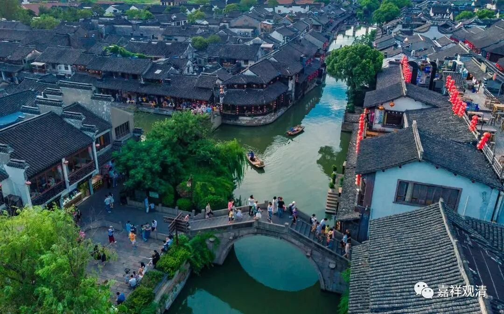

**《微课佛教史》178·1**

这位普静老和尚自述来自于镇国寺，云游至此，就碰到了关公的魂魄。关公在那儿嚷嚷“还我头来～～”普静老和尚就说了：“你在打仗的时候，被你杀掉的人有多少啊？也不少呢。你让别人还你头来，那么那些被你杀掉的人如果也要来找你报仇，怎么办呢？”据说关羽当时就被问得愣住了，后来还归依了这位普静和尚。

这个故事实际上是后出的，因为在关羽那个年代，虽然佛教已经进入中国了，但是还没有达到后来那么兴盛的程度，差不多是刚刚进入的状态。

那么这个故事实际上是谁的呢？实际上故事里面的普静老和尚的原型是智者大师，所以我们可以在智者大师或者天台系统的记载当中找到类似的故事，就是发生在当阳的玉泉山。后来说关羽就成为天台宗的一个护法，因为他后来在智者大师座下归依的。

当然，这是一个故事了。但是就我个人而言，我还是有自己的看法，因为关羽去世以后就不再是关羽了，是吧？但是关羽作为天台宗的护法，在湖北当阳玉泉山有这样一个故事是很明确的，是有的。

我们再看一下玉泉山，还和谁有关呢？就是和神秀大师有关。其实玉泉山和三论宗也有点关系，因为三论宗也是禅师系统，都是禅师，对吧？

神秀大师后来到了玉泉山，在那里领众。我们说“南能北秀”当中的北秀，就是神秀大师，他弘化的主要的两个地点，一个就是在东京，开封吧（宋代的传记里的东京），另外一个地点就是当阳的玉泉山。所以我们称神秀大师的弘化地在荆洛——荆就是荆州，指的就是玉泉山，洛就是洛阳、开封一带。

神秀大师在当阳住山了以后呢，因为他当时的名气比较大，大家要修禅的就都跟着他来了，从各地蜂拥而至。他所在之处是北方，在湖北和河南那一带。等到武则天当了皇上之后，也请他出山了，因为神秀大师在禅师当中是比较重要的人物。武则天当时是用类似滑竿的轿舆把神秀大师抬进上殿，而且是跪拜着去迎接的。哦，这个礼请的规格实在是足够到位啊！然后邀请神秀大师进入内道场，就是皇宫里面的寺院。

